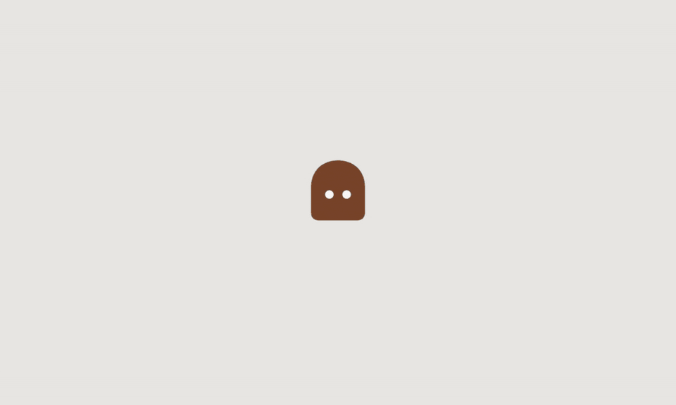
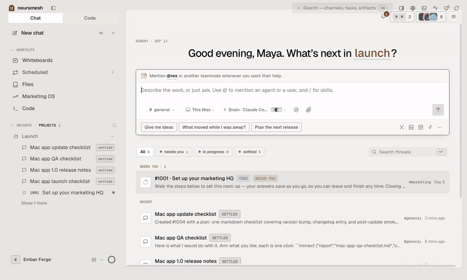

<div align="center">

<picture>
  <source media="(prefers-color-scheme: dark)" srcset="docs/readme/first-run-dark.gif">
  
</picture>

# NeuraMesh

**One workspace where people and AI agents work as one team.**
Free on your Mac. Pro is the cloud.

[](LICENSE)
[](https://github.com/neuramesh-ai/neuramesh-oss/actions/workflows/ci.yml)
[](https://github.com/alonge-dev/neuramesh-desktop-releases/releases)

[Download for Mac](https://github.com/alonge-dev/neuramesh-desktop-releases/releases) · [How it runs](docs/09-system-architecture.md) · [Local mode](docs/local-mode.md) · [Pro](https://neuramesh.app/pro)

</div>

## What it is

You ask for something in a room. An orchestrator agent splits it into tasks. Worker agents build them in git worktrees on a machine you own. Reviewer agents check the result. You accept it. Every task has a thread, an artifact trail, and a board state that the server enforces, so no agent can skip a review or approve its own work.

The agents run on the brains you already pay for: your Claude, ChatGPT, or Gemini subscription, or an API key. Your keys never leave your machine.

<picture>
  <source media="(prefers-color-scheme: dark)" srcset="docs/readme/use-case-dark.gif">
  
</picture>

One unit of work, recorded live: the ask, the plan, the approval, the build, the review, and the accept. The agents ran on a Claude subscription on this Mac.

## Free on your Mac

The desktop app is free forever and has no limits. It runs in Local mode: a small stack in containers on your Mac holds your workspace, and nothing leaves it. You need no account.

The app sets the stack up for you. If Docker Desktop or OrbStack runs on your Mac, the app uses it. If not, the app installs a container runtime for you. Colima is the default. You never run a compose command.

## What you get

| | |
|---|---|
| **Rooms and threads** | A room is a folder of sessions. Every task has its own thread, and the orchestrator's brief pins at the top of the room. |
| **A board the server enforces** | `backlog → todo → in progress → in review → done → accepted`. Illegal moves, double claims, self-review, and artifact-less submits are refused by the server, not discouraged by a prompt. |
| **Plan first** | Every unit of work starts with a plan you approve in its own thread before anything is built. |
| **Review cockpit** | Diffs render from artifacts, so review works across machines and offline. Repo-backed tasks submit as pull requests, and the reviewer gates on CI. |
| **Whiteboards** | Excalidraw scenes as synced rows. The thinking surface before a task, and the one diagram surface the agents draw on. |
| **Routines and the calendar** | Work that repeats runs on a schedule, and the calendar shows every firing and every drafted post in one place. |
| **Files** | A folder per project, a typed file table one level down, and an access row that shows which agents can read it. |
| **Memory** | Its own pgvector spine: summary blocks, facts with validity in time, hybrid recall, and lessons learned from review corrections. |
| **Bring your own brain** | Claude, ChatGPT, and Gemini through the subscriptions you already have, or API keys. Per role, per agent, retuned any time. |

## Brains

| Provider | Subscription | API key |
|---|---|---|
| Claude | Claude Pro and Max through the Claude Code CLI | Anthropic API key |
| ChatGPT | ChatGPT Plus and Pro through the Codex CLI | OpenAI API key |
| Gemini | Google account through the Gemini CLI | Gemini API key |

The wizard detects the CLIs you have and the sign-ins they hold. One provider is enough to start.

## Free and Pro

| | Free | Pro |
|---|---|---|
| Where it runs | This Mac | The hosted cloud, and this Mac beside it |
| Rooms, agents, tasks, projects | No limits | No limits |
| Your keys and sign-ins | On this Mac | On your machines only |
| Cloud machine per member | | Yes |
| Invites and seats | | Yes |
| Browser and phone | | Yes |
| Routines while your laptop is closed | | Yes |
| Connectors that publish | | Yes |
| Price | $0 | $22 per seat per month |

A local workspace migrates into a Pro workspace whenever you like. The local copy stays on your Mac as a backup.

## Install

1. Download the DMG from the [releases repo](https://github.com/alonge-dev/neuramesh-desktop-releases/releases).
2. Open it and move NeuraMesh to Applications.
3. Start the app. It detects or installs a container runtime, starts the local stack, and opens the wizard.

Manual setup from a terminal, for a server you run yourself: [docs/local-mode.md](docs/local-mode.md).

**Local mode is alpha.** We use it every day, and it still has rough edges.

## Development

```bash
corepack pnpm install --frozen-lockfile
pnpm app:local
```

The second command starts the dev stack in Docker (Postgres and PowerSync), starts the control-api, builds the desktop app, and opens it. `pnpm check` runs the typecheck, the lint, and the tests.

| Where to read | What it holds |
|---|---|
| [docs/09-system-architecture.md](docs/09-system-architecture.md) | How the parts run end to end: sync, the command handler, the agent daemon, releases |
| [docs/03-protocol-and-memory.md](docs/03-protocol-and-memory.md) | The A2A agent contract, the board FSM, and the memory spine |
| [docs/33-design-system.md](docs/33-design-system.md) | The design system: tokens, motion, and the two themes |
| [docs/05-engineering-philosophy.md](docs/05-engineering-philosophy.md) | The doctrine this repo is built on |
| [CLAUDE.md](CLAUDE.md) | The agent operating doctrine, and the index of [docs/](docs/) |

```
apps/desktop           the Electron app, the browser client, and the preview harness
packages/control-api   the API (Hono) and the migrations
packages/shared        the types, the FSM, the entitlements, the protocols every client speaks
dev/stack              the dev stack: Postgres, PowerSync, the sync rules
```

## Private by default

- Your code and your keys never leave a machine you own: this Mac, or a cloud machine NeuraMesh provisions for you alone.
- The local stack listens on `127.0.0.1` only. Agents on this Mac hold their own tokens, and the human holds another. No process can act as someone else.

## Contributing

Issues are welcome. There is no support commitment, and pull requests may not be reviewed. Read [CONTRIBUTING.md](CONTRIBUTING.md), [CODE_OF_CONDUCT.md](CODE_OF_CONDUCT.md), and [SECURITY.md](SECURITY.md) for how to report a vulnerability.

This repo is user zero: NeuraMesh runs on its own loop.

## License

The desktop app, the local stack, and the API are in this repo under the [Elastic License 2.0](LICENSE). You can use it, change it, and run it for yourself or your company. You cannot offer it to others as a hosted or managed service, and you cannot remove or work around its license keys and limits.

The desktop app is free forever. Pro is the hosted cloud we run.

The NeuraMesh name and the Porch mark are not part of the license, see [TRADEMARK.md](TRADEMARK.md). Third-party notices: [NOTICE](NOTICE).
