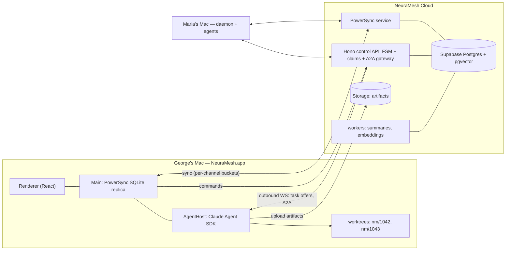

# 02 — Implementation Options & Recommendation

Three real architectures, not three brand-swaps. All three share the same **product foundation** (§1); they fork on the **data plane, vendor posture, and shell** (§2). Comparison in §3, recommendation in §4.

Constraint set: solo + agents, ~6-week alpha, macOS first, SaaS multiplayer, **offline-capable day one**, Claude Code first behind an adapter seam, A2A 1.0 agent contract, channel-scoped fleets with per-channel orchestrators, "Linear-fast" feel.

A key research finding shapes everything: **perceived speed comes from the sync/data architecture, not the shell.** Linear, Slack, Cursor, Claude Desktop, Notion all ship Electron; reads must hit a local store in <5ms, writes must be optimistic. The second finding: the **Claude Agent SDK is Node-native and bundles the Claude Code binary** — any shell must host a Node runtime for the agent layer, which makes Electron's `utilityProcess` the path of least resistance (Tauri requires compiled Node sidecars).

## 1. Shared foundation (identical across options)

```
┌────────────────────────── Developer's Mac ──────────────────────────┐
│  NeuraMesh.app (desktop)                                            │
│  ├─ Renderer: React UI (chat, board, fleet, memory)                 │
│  ├─ Main: local replica (SQLite) + sync + window mgmt               │
│  └─ AgentHost (isolated process): Claude Agent SDK                  │
│      ├─ one session per task → query() with cwd = git worktree      │
│      ├─ in-process MCP server: board/chat/memory/artifact tools     │
│      ├─ hooks → audit events; canUseTool → approval UI              │
│      └─ node-pty terminal panes                                     │
└──────────────────────────────────────────────────────────────────────┘
                 ▲ outbound-only WS + sync                ▲ same
┌────────────────┴──────────── NeuraMesh Cloud ───────────┴───────────┐
│  Auth · Postgres (+pgvector) · object storage (artifacts)           │
│  Control API: command writes, ENFORCED task FSM, claim arbitration  │
│  A2A gateway: Agent Card registry, task routing to daemons/external │
│  Workers: channel summaries, embeddings, digests (sleep-time)       │
└──────────────────────────────────────────────────────────────────────┘
```

- **AgentHost** = the "daemon". In v1 it lives inside the desktop app (a crashed agent never takes down the UI); later it also ships headless (`neuramesh-daemon`) for always-on machines. One `git worktree add .neuramesh/worktrees/<task>` + one `query()` per task — the pattern Conductor.build validates in production.
- **All writes that matter go through the Control API** (task transitions, claims, membership). The server — not prompts — rejects illegal transitions and double-claims. Chat messages ride the sync engine optimistically.
- **A2A-shaped internally from day one**: orchestrator↔worker contracts use A2A Task/Message/Artifact JSON and lifecycle states over our transport; phase 2 exposes real A2A endpoints + Agent Cards at `/.well-known/a2a/agent-card.json` per agent. Standards exposure becomes a config change, not a rewrite.
- **Memory spine**: pgvector + BM25 + RRF recall; per-channel rolling summary blocks (Letta pattern); extract→reconcile fact writes (mem0 pattern); bitemporal validity (Graphiti pattern). Detailed in [03-protocol-and-memory.md](03-protocol-and-memory.md).

## 2. The three options

### Option A — "Managed Rails" (recommended for the 6-week alpha)

Buy the undifferentiated infrastructure; spend all 6 weeks on the loop.

| Layer | Choice |
|---|---|
| Shell | **Electron** + React + Vite + TypeScript (electron-vite, electron-builder, notarized) |
| Local store + sync | **PowerSync Node SDK** in main process → SQLite replica; declarative **sync rules = per-channel buckets** (channel-scoped partial replication falls out for free); offline writes via PowerSync upload queue → Control API |
| Cloud data | **Supabase**: Postgres + pgvector, Auth (magic link + GitHub/Google), Storage for artifacts. First-class PowerSync↔Supabase integration (JWT verified natively) |
| Control plane | **Hono on Node** (Fly.io): command API + FSM enforcement, daemon WS broker, A2A gateway, pg-boss background jobs |
| Agents | Claude Agent SDK in `utilityProcess` (shared foundation) |



**Pros:** fastest credible path to the full loop; offline reads+writes out of the box; per-channel partial sync is configuration, not code; 2 vendors total; SOC2-certified sync vendor.
**Cons/risks:** PowerSync Node SDK carries a "beta" label (verified working in Electron main per their own Electron guide); vendor pricing at scale ($49→$599/mo tiers — self-host/Open Edition exists, verify licensing before scale); Supabase Auth is basic (orgs/invites are our own tables).
**Time to alpha: ~6 weeks.**

### Option B — "Own Rails" (all-Apache, zero lock-in)

Same product, vendor-free data plane. The architecture A migrates toward as revenue justifies ops.

| Layer | Choice |
|---|---|
| Shell | Electron (identical) |
| Local store + sync | **ElectricSQL** (Apache-2.0) read-path shapes per channel → **TanStack DB** optimistic mutations + outbox; SQLite/PGlite persistence; **writes through our own Hono API** |
| Cloud data | **Neon or Fly Postgres** + pgvector; **Better Auth** (own tables); S3/R2 for artifacts |
| Control plane | Hono on Fly (identical role, plus it owns the whole write path + conflict policy) |
| Agents | identical |

**Pros:** everything Apache-2.0/owned; cleanest unit economics at scale (Electric read fan-out proven to 1M clients off one Postgres; Electric Cloud ~$1/M writes if managed); write path fully ours = FSM/permissions enforcement is natural; no vendor in the hot path.
**Cons/risks:** you assemble what PowerSync gives free — offline outbox semantics, retry/conflict policy, replica lifecycle (realistically +2–3 weeks and the subtle-bug budget lands on you); Electric the company is repositioning toward agent platforms (core is stable, roadmap attention is a watch item).
**Time to alpha: ~8–9 weeks.**

### Option C — "Event-Sourced Maximalist" (the ceiling, not the start)

Own protocol end-to-end: commands → immutable event log (Postgres) → projections; clients replicate per-channel event streams into local SQLite over our WS protocol; replay-on-reconnect (the T3 Code-validated shape, plus cloud multi-tenancy). Shell: **Tauri v2** (Rust core, portable-pty, process supervision in Rust) with the Agent SDK as a compiled Node sidecar — or Electron with the same custom core. Backend: Rust Axum or Elixir/Phoenix for fan-out.

**Pros:** the event log *is* the product's audit timeline, replay, and compliance story; best performance ceiling (3–15MB installer, 20–100MB RAM if Tauri); zero licenses; protocol-native fit with A2A streaming; the strongest "fastest agent platform" claim.
**Cons/risks:** you are building a sync engine and a process supervisor before building the product; Tauri long-lived sidecar lifecycle is DIY (no lifecycle plugin yet); Node-sidecar packaging friction for the Agent SDK; multi-webview still unstable.
**Time to alpha: ~12–16 weeks solo. Not the 6-week pick.** Adopt its best idea cheaply: an append-only `events` table in A/B for the task/agent timeline from day one.

## 3. Comparison

| Axis | A — Managed Rails | B — Own Rails | C — Event-Sourced Max |
|---|---|---|---|
| Time to full-loop alpha (solo+agents) | **~6 wks** | ~8–9 wks | ~12–16 wks |
| Offline depth | Reads+writes OOTB | Reads OOTB; writes = our outbox | Native (log replay) |
| Perceived speed | Excellent (local reads) | Excellent | Best ceiling |
| License/lock-in | PowerSync svc + Supabase (moderate; exit = B) | None (Apache/own) | None |
| Ops burden on a solo founder | **Lowest** | Medium | Highest |
| Infra cost: alpha → ~100 teams | ~$0–100/mo → ~$700–1,000/mo | ~$20–50/mo → ~$300–600/mo | similar to B + own time |
| FSM/permission enforcement | Control API (clean) | Control API (cleanest — owns all writes) | Native (commands) |
| A2A / phase-2 external agents | Good (gateway) | Good | Best (protocol-native) |
| Biggest risk | Beta-labeled Node SDK; vendor pricing | Sync-write subtleties on you; +weeks | Timeline blowout; sidecar friction |
| Migration path | → B: swap sync+auth, keep Postgres schema, API, agent layer, UI | → C: absorb event log gradually | terminal state |

## 4. Recommendation — accepted by founder 2026-06-10

**Build Option A now, engineered so Option B is a swap and Option C's event log exists from day one.**

1. **A wins the only race that matters** — proving the unoccupied loop (orchestrator → claim → worktree → artifacts → review) before Slock adds a git story or an orchestrator. Every week spent assembling sync plumbing is a week not spent on the differentiator.
2. **The migration is real, not hopeful**: Postgres schema, Hono control API, A2A gateway, agent layer, and the entire React UI are identical in A and B. The swap surface is PowerSync↔(Electric+TanStack DB) and Supabase Auth↔Better Auth. Keep all client reads behind a thin `db.query()`/`db.mutate()` facade to keep that surface honest.
3. **Hedge the PowerSync-beta risk** in week 1 with a 1-day spike: replica + offline write queue + reconnect inside Electron main. If it wobbles, fall back to Electric+TanStack (accepting ~+2 weeks) before anything is built on top.
4. **Steal C's soul cheaply**: every command the Control API accepts also appends to an immutable `events` table (the task timeline UI reads from it). When scale justifies it, that table grows up into the event-sourced core.
