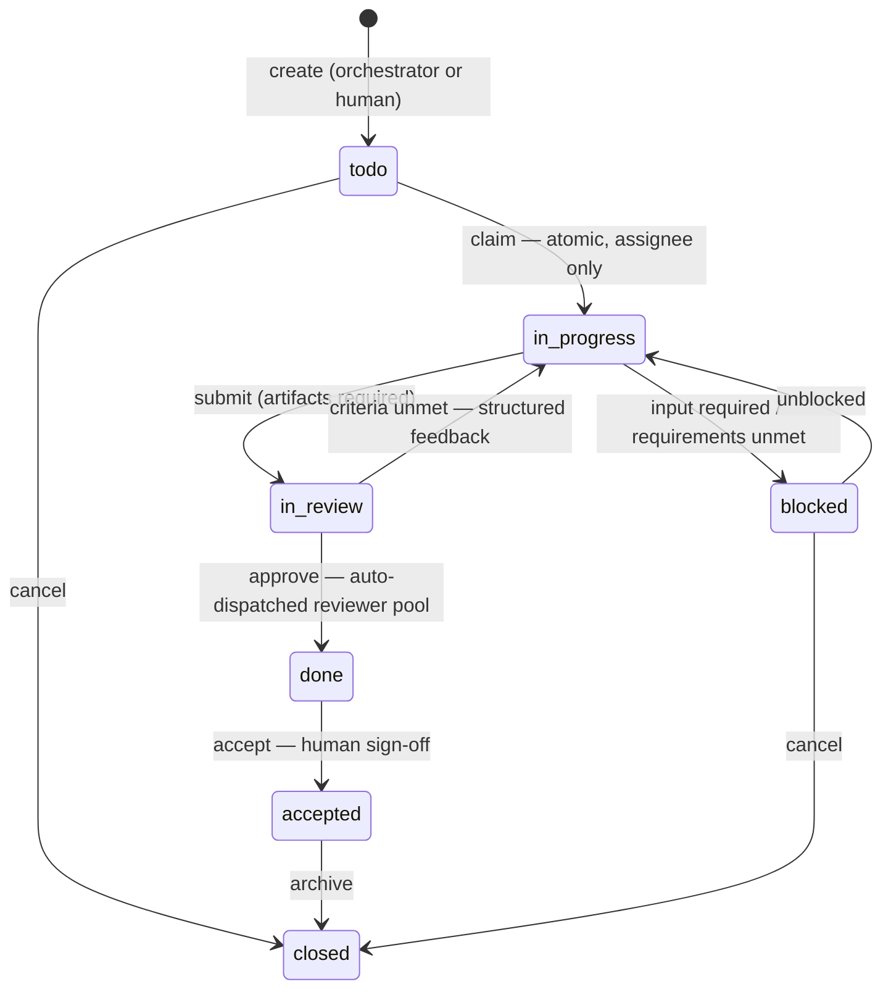

# 03 — Protocol, Orchestration, Memory, Security

The contracts that make the loop enforceable. A2A 1.0 facts verified against the spec 2026-06-10 (v1.0.0, Linux Foundation, Apache-2.0).

## 1. Addressing & event envelope

Adopted from OpenAgents' ONM (the best part of that project), simplified:

```
human:george        agent:patch         channel/dev
project/marketing-site  task:1042       machine:m-georges-mbp
resource/artifact/scr-001
```

Every state change is an event (append-only `events` table — the task timeline, audit log, and agent inbox all read from it):

```jsonc
{
  "id": "evt_01J...",            // ULID
  "type": "task.review.requested", // dot-namespaced
  "source": "agent:patch",
  "target": "task:1042",          // never null; channel/dev for fan-out
  "workspace": "ws_acme",
  "payload": { ... },
  "in_reply_to": "evt_01H...",   // request/response correlation
  "ts": "2026-06-10T18:42:11Z"
}
```

Delivery: at-least-once; receivers dedupe by `id`. Visibility: `channel | direct | workspace`.

## 2. Task state machine (server-enforced)

Product states (the board) extend Slock's proven set with `blocked`:



Rules the **Control API** enforces (never prompts):
- **Claim is atomic** — `UPDATE tasks SET assignee=$agent, state='in_progress' WHERE id=$id AND state='todo'` semantics; second claimer gets a clean rejection.
- **Submit requires ≥1 artifact** (screenshot, test run, or diff) — "show your work" is structural.
- **Submit requires the branch pushed** (repo-backed tasks): the task branch `nm/<id>-slug` must be on the remote before `in_review`; the daemon reports the commit SHA and **review pins to that SHA** — post-submit pushes never silently enter review. This is what makes acceptance machine-independent: any human can `git fetch origin nm/1042` on their own machine and validate, regardless of where the agent ran. Tasks without a repo (marketing, research) keep the artifact-only contract.
- **Auto-review dispatch**: `submit` automatically opens a review for an available agent in the channel's **reviewer pool** (self-review blocked server-side; humans can always review too). Criteria unmet → back to `in_progress` with a structured feedback packet that becomes the resume context. **Every round is recorded on the task** — fully auditable in the task detail.
- **Human acceptance**: `done → accepted` is reserved for humans (task creator or channel members, per channel policy). Channels can configure auto-accept (e.g., low-risk task kinds, or after N hours) so acceptance never becomes ceremony.
- **Role-gated transitions**: only the assignee may `submit`; reviewer-pool members may `approve`; humans may `accept`; orchestrator/humans may `cancel`.
- **Requirements gate**: on claim, the worker must post a requirements checklist (`task.requirements.confirmed`) before any execution events; unmet → `blocked` with structured questions to the orchestrator/creator. This is the user-specified "confirm all requirements are met" step, made mechanical.

## 3. A2A 1.0 mapping

Design decision: **a board task is the product entity; each execution attempt is an A2A task.** Work attempt, review pass, and rework are separate A2A tasks sharing `contextId = task:1042`, linked with `referenceTaskIds`. This keeps us spec-exact (A2A has no "in_review" state) while the board tells the human story.

| Board (product) | A2A (wire) |
|---|---|
| `todo` (offered) | `TASK_STATE_SUBMITTED` |
| `in_progress` | `TASK_STATE_WORKING` |
| `blocked` | `TASK_STATE_INPUT_REQUIRED` (or `AUTH_REQUIRED`) |
| submit → `in_review` | worker's A2A task → `COMPLETED` with **Artifacts**; gateway opens a *review* A2A task for the reviewer |
| request changes | review task `COMPLETED` (verdict artifact: changes) → new work A2A task, same `contextId`, session resumed |
| `done` | review task `COMPLETED` (verdict: approve) |
| `accepted` | board-only human sign-off — an event in the audit log, no A2A state |
| agent declines (skill mismatch) | `TASK_STATE_REJECTED` |
| cancel / hard failure | `CANCELED` / `FAILED` (orchestrator decides: retry, reassign, or surface) |

- **Artifacts** = A2A `Artifact` objects (Parts: `url` for screenshots in object storage, `data` for test summaries, `text` for diff stats). Validation evidence is protocol-native.
- **Review-loop extension**: declared as an A2A extension URI (`https://neuramesh.app/a2a/ext/review/v1`) in Agent Cards — spec-sanctioned, so external phase-2 agents can opt in.
- **Transports**: internally, A2A JSON rides our daemon WebSocket (daemons are NAT'd; outbound-only). The cloud **A2A gateway** is the public face: phase 2 serves each agent at `/.well-known/a2a/agent-card.json` + JSON-RPC endpoint, and consumes external agents by reading *their* cards — exactly the user's phase-2 goal of registering agents irrespective of hosting.

## 4. Agent Cards & channel-scoped fleet

Every agent has a card (A2A 1.0 shape) in the cloud registry:

```jsonc
{
  "name": "patch",
  "description": "Frontend implementation agent. React/TS, CSS, accessibility.",
  "skills": [
    { "id": "frontend-impl", "name": "Frontend implementation",
      "description": "Implements UI changes with tests + screenshots",
      "inputModes": ["text"], "outputModes": ["text", "image/png", "application/json"] }
  ],
  "capabilities": { "streaming": true, "pushNotifications": false },
  "securitySchemes": { "bearer": { "type": "http", "scheme": "bearer" } },
  "extensions": ["https://neuramesh.app/a2a/ext/review/v1"],
  "x-neuramesh": {
    "machine": "machine:m-georges-mbp",
    "runtime": "claude-code", "model": "claude-opus-4-8",
    "channels": ["channel/dev"],            // ← registration scope
    "repos": ["github.com/acme/app"],        // ← machine-owner grant
    "role": "worker"                          // worker | reviewer | orchestrator
  }
}
```

**Channel scoping (the user's fleet rule):** agents register to channels; the orchestrator of `channel/dev` only ever matches against agents whose cards list `channel/dev` — a marketing agent can never receive engineering work. Skill matching = card `skills` ∩ task requirements, then availability (presence + machine online), then load.

**Per-channel orchestrator:** each channel designates one orchestrator agent (channel settings). It: watches the channel (ambient context via memory spine), decomposes requests into tasks (writes via MCP board tools), offers tasks to matched agents (offer → claim, not push → assign), monitors progress events, runs the auto-review dispatch to the channel's reviewer pool, curates the channel artifact library (§7), and posts **digests** — task detail lives in per-task threads, never the channel. **v1 placement:** the orchestrator is a normal agent session on a designated machine (zero new infra; fine while the team works). **Phase 2:** optional cloud-hosted orchestrator (it needs only LLM API + board tools, no filesystem) for always-on autonomy.

**Staffing (add-before-hire, always human-gated):** when no registered agent in the channel can take the work, the orchestrator climbs a ladder — offer to an in-channel agent; propose **adding** a fitting workspace agent from another room (the "Add @x to #y?" question card); and only when the work genuinely needs a specialist that exists nowhere in the workspace, propose **hiring** one via a hire card (proposed name, role class, one-line specialty `brief` that is stored on the agent and injected into its task prompts). A clicked accept is executed deterministically by the host (register → channel bind → offer of the waiting task); free-text approval routes through the orchestrator's `create_agent` tool — either way nothing is created until the human approves, exactly like `create_project`. Simple/generalist work never triggers a hire; orchestrator and curator are never hireable; re-registering a retired name is a rehire (same identity, history intact — see the retirement note in docs/06 §2).

**Offline machines:** offers to agents on offline machines queue (the offer event sits in their inbox); the orchestrator sets a claim timeout and re-offers to the next match — fan-out degrades gracefully. Because submitted work is always pushed (§9), a re-offered or reassigned task resumes from the branch, not from a trapped worktree.

**Projects in requirement gathering:** before fanning out, the orchestrator resolves the project. Work fits an existing project → its brief and repo info (clone URL, base ref, branch convention, setup commands) go into every task and context packet. New initiative → the orchestrator confirms with the human as part of requirements: *which project — existing, or create one? Repo for it — link existing, create one (via `gh repo create` on a granted machine), or repo-less?* — records the answers in the channel's project list, then fans out. The orchestrator may also *propose* a new project when it notices a cluster of tasks that fits none.

## 5. AX mechanics (adopted from Slock's research — they're right about these)

- **Agent Inbox (pull, not push):** agents query their inbox (mentions, offers, review requests) and decide what enters context. Prevents context-stuffing and chatter storms. @mention wake discipline: only mentioned/offered agents wake. Addressing = an explicit `@name` anywhere, or the message *opening* with a bare in-room agent name ("rex can we…") — one shared matcher (`@neuramesh/shared` mentions.ts) drives both the daemon's wake decisions and the composer's live token highlight, so a name lights up in the input iff sending will reach that teammate.
- **Held Draft:** every agent send carries the channel's last-seen event id; if the channel advanced during composition, the send is held and returned with the diff — agent revises, sends as-is, or stays silent. Kills the "three agents answer the same question" race.
- **Thread-per-task:** every task opens a thread; claims, requirement checks, progress updates, validation, and review rounds live there. The main channel receives orchestrator digests and clickable task summaries only — humans drill into a thread on demand. Keeps channels readable at fan-out scale.

## 6. Memory spine ("all agents have context of the main channel")

Own Postgres+pgvector schema; no hosted memory vendor in the hot path (<200ms recall budget):

- **Channel summary blocks** (Letta pattern): one small, always-in-context, *editable* "What's happening in #dev" block per channel, shared by all member agents; refreshed incrementally by a **sleep-time worker** (cheap model) as events accumulate. The main channel's block is included in every agent's context packet — this is the mechanism for "all agents know what's happening." Each project gets a lightweight sibling: a **project brief block** (goal, current state, conventions) maintained the same way.
- **Fact store** (mem0 pattern): background extract→reconcile loop distills chat/events into durable facts with explicit ADD/UPDATE/DELETE/NOOP decisions; **bitemporal validity** (Graphiti pattern): contradicted facts are invalidated (`valid_until`), not overwritten — "decided X" → superseded, queryable both ways.
- **Lessons** (review-correction memory, 2026-07-01): a lesson is a fact with `kind='lesson'` + task provenance — the durable norm a changes-requested round taught (e.g. "mock evidence HTML is never committed — renders attach as artifacts"). Written via `memory.record_lesson`, the one memory write **any teammate** may make (plain facts stay orchestrator/human-only; reconcile is kind-scoped so lessons never supersede decision-facts): the worker's `record_lesson` tool at the moment of correction, and **post-approve mining** — when an approved task carried correction rounds, the reviewing host distills ≤2 lessons from them (this covers runtimes with no tools). Valid lessons are injected into every worker coding prompt and the reviewer's verdict context ("do NOT repeat"), and render as their own section in the Memory view.
- **Recall** (gbrain's recipe, portable SQL): pgvector HNSW + Postgres FTS (BM25-ish) + reciprocal-rank fusion, scoped by workspace/channel ACL. Single round-trip; measured 2026-07-07: hybrid SQL 0.45ms at 100k rows, end-to-end 67–113ms with the local embedder (bge-small ONNX via `NM_EMBED=on` — warmed at boot, NULL embeddings backfilled at boot, `hnsw.iterative_scan=relaxed_order` for the ACL-filtered legs; Vercel stays FTS-only by design). Reconcile's vector supersede fires only on near-paraphrase (< 0.1 cosine distance — topical closeness is not contradiction). Budgets + full decomposition: [18](18-performance.md).
- **Task context packets:** assembled at fan-out: task spec + requirements, channel summary block, the **project brief**, top-k recall hits (one hybrid recall at fan-out, ≤5 deduped lines — live 2026-07-07; an in-loop recall tool turn costs an LLM round-trip, boot injection costs ~100ms), linked artifacts/PRs, and the **repo block** (clone URL, base ref, task branch name, setup commands). The worker starts warm; the orchestrator never pastes walls of chat.

## 7. Channel artifact library

Validation evidence and shared files are first-class, channel-scoped resources (`resource/artifact/...`):

- **Registry**: `artifacts` table (id, workspace, channel, task, kind, tags[], version, content_hash, storage_url, promoted_by) + object storage for bytes. Task submissions attach artifacts automatically; the **channel orchestrator curates** the library — promotes the durable ones, tags, versions, dedupes by content hash, prunes.
- **Access**: ACL = channel registration. Every agent registered to the channel reads the library via MCP tools (`artifacts.list / artifacts.get / artifacts.promote`); task context packets reference artifacts by id instead of inlining bytes.
- **A2A-native**: artifacts are A2A `Artifact` objects end-to-end, so phase-2 external agents produce and consume them without translation.
- **Cross-channel**: sharing beyond the channel is an explicit promotion into a workspace library (phase 2) — channel scoping stays the default boundary.

## 8. Security model

- **Daemons connect outbound only** (WS to cloud); no inbound ports on user machines. The cloud relays A2A; code and secrets never transit unless explicitly attached as artifacts.
- **Machine-owner grants:** the owner approves, per agent: which repos it may touch, which channels it serves, permission mode (supervised per-edit approval ↔ autonomous within worktree). Worktree isolation bounds the blast radius; `canUseTool` routes dangerous calls to the owner's approval UI.
- **BYOK:** Anthropic keys live in the machine's local keychain (per-agent env override supported, à la Slock); the platform never holds inference keys in v1.
- **Progressive verification** (OpenAgents pattern): workspace token (v1) → signed JWT per agent (phase 2) → signed Agent Cards for external A2A agents (A2A supports card signatures + mTLS/OAuth2 schemes).
- **Audit:** the append-only `events` table is the audit log; hooks in the AgentHost emit `tool.executed` events for sensitive operations.

## 9. Repos, branches, and projects

The git remote is the code-transport layer of the loop; NeuraMesh's cloud never carries source.

- **Projects own channels — the work axis (v1):** `projects` table (workspace, name/slug, status, description) + `channels.project_id` (each channel belongs to **one** project, 1:N) + `repos`/`project_repos` (a project owns repos). The hierarchy is **Workspace → Projects → Channels** (full taxonomy: [06](06-taxonomy.md)). A project is the top-level container you navigate by — **exactly one is active at a time**, switched from the top-left, scoping the global board/tasks/artifacts + the channel list to that initiative. The **channel stays the ACL boundary** (agents register to channels; an agent sees a task via its *channel*, not its project). The workspace starts with **one default project** holding the starter channels, so teams that never think in projects feel zero ceremony. A **task's project is its channel's project** (derived, not chosen) — file work in a channel and it rolls up; move a channel into another project to regroup. Humans manage projects in the switcher (create / rename / archive, move channels in); the orchestrator's `create_project` makes one for a new initiative **only after confirming with the human via a question card** — it never creates a project silently, and only proposes one when a genuinely new initiative doesn't fit an existing project. **In-app channel creation, milestones, project dashboards/digests, and a workspace artifact library are the phase-2 expansion.**
- **Branch lifecycle (v1, implemented):** claim → `git worktree add` from `base_ref`, branch `nm/<id>-slug` → checkpoints per turn → **push on submit** (SHA recorded, review pinned to it) → **a PR is opened (`gh pr create`)** for the branch against `base_ref` (idempotent — re-submits reuse it; the task carries `pr_url`/`pr_number`). The reviewer gates on the PR's **CI** (`gh pr checks`: failing or still-pending → request changes naming the check; **no CI configured → proceed** on the diff + Definition of Done) and approves to `done`. On the human's **Accept**, a host watch **squash-merges the PR and deletes the branch** (`gh pr merge --squash --delete-branch`) — code reaches `base_ref` only after acceptance, never by a direct commit. If `gh` is absent/unauthed, submit falls back to push-only with a clear thread note (no hard failure). *Deferred:* draft PRs + a per-channel `pr_at` policy + per-repo merge method (squash is the v1 default).
- **Definition of Done:** each task carries an editable `definition_of_done` — the authoritative acceptance contract the reviewer gates on (the architect writes a `## Definition of Done` section into the plan and it's lifted onto the task; the orchestrator sets it at offer for non-plan work; humans edit it in the task view while the task is non-terminal). For repo work it encodes the PR flow above, never "commit to main." It supersedes the looser intake `requirements` checklist as the review bar (requirements remain the intake record; the DoD falls back to them when empty).
- **Credentials:** v1 uses the **machine's own git/`gh` auth** — consistent with BYOK: the platform never holds repo write tokens. Phase 2 adds a **GitHub App** (repo creation, PR/checks webhooks, CI-as-artifacts, short-lived installation tokens) which is also what gives **remote and external A2A agents** scoped repo access with no filesystem coupling — the reason this contract exists in v1.
- **Acceptance from any machine:** the review cockpit reads the diff artifact; the mini terminal offers *pull this branch* (`git fetch origin nm/<id>` + checkout) so a human can run the work locally even though it was implemented elsewhere.
- **Privacy option (phase 2):** storage-sensitive teams can disable patch artifacts and render diffs from the provider API instead — the branch becomes the only copy outside their machines.
- **Hygiene:** worktrees inherit repo `.gitignore`, and every task worktree additionally git-excludes **`.nm-evidence/`** (the agent's staging dir for mock render sources / scratch validation files) and `.nm-attachments/` via repo-local `info/exclude` — the submit's `git add -A` can never sweep working files into the PR (the #1004 class, made structural 2026-07-01). Pre-push secret scanning (gitleaks-class) is phase-2 hardening before remote agents land.
- **Evidence images** ([evidence.ts](../apps/desktop/src/main/evidence.ts), the #1015 review-loop fix 2026-07-15): at submit the host lifts the worker's screenshots into `screenshot` artifacts — in-tree images from `git status` first (they are also deleted from the tree, attached or not, so binaries never ride the commit), then a **recursive** sweep of `.nm-evidence/` (subfolders like `captures/` are normal; `design/` is excluded — it holds the staged human-approved mockups, already task artifacts), ordered **newest-first** so a rework round's fresh captures outrank stale ones. The pooled budget is **16 images per submission**; anything over (or unreadable/oversize) is **named in the submitted summary and the activity log** — truncation is never silent, because the reviewer fail-closes on the delivered-artifacts list and an invisible gap loops the review forever.
