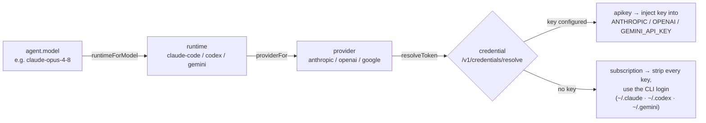

# Model routing

How an agent's **model** decides which **runtime**, **provider**, and **credential** it runs on. The model fully determines execution — pick a model and the rest follows.

## The chain

- **`MODEL_GROUPS`** ([apps/desktop/src/renderer/src/App.tsx](../apps/desktop/src/renderer/src/App.tsx)) is the catalog, ordered **Anthropic → OpenAI → Google**. Each model belongs to exactly one provider + runtime, so `runtimeForModel(m)` and `providerIdForModel(m)` are a lookup (fallback: `claude-code` / `anthropic`).
- **`providerFor(runtime)`** ([runtime/adapter.ts](../apps/desktop/src/main/runtime/adapter.ts)): `codex → openai`, `gemini → google`, else `anthropic`.
- **`resolveToken`** ([agents.ts](../apps/desktop/src/main/agents.ts)) fetches the workspace's stored credential for that provider (apikey or subscription) via control-api `/v1/credentials/resolve`, honoring the failover policy; falls back to local env keys offline.
- **`providerEnv`** builds the child env: with a key it **injects** it into the var the tool reads; with a subscription it **strips every provider key** (including stray inherited ones) so the CLI/SDK uses its own stored login — never silently billing an API key.

## Defaults at creation — model config packs

Per-role defaults come from a **model config pack** — a named role→model map curated from benchmarks (full design: [10-model-packs.md](10-model-packs.md); catalog: `packages/shared/src/model-packs.ts`). Onboarding picks the pack from the configured providers and materializes each agent onto its role's model.

| Agent | Default model | Rule |
|---|---|---|
| **Every role** (orchestrator · architect · developer · reviewer · designer · sales · curator) | the active pack's model for that role | `packModelForRole(activePack, role)`. The pack is `defaultPackForProviders(readyProviders)`: Anthropic+Gemini → `balanced`; a single provider → that provider's `*-core` pack; none → no pack (onboarding gates). The team no longer collapses to one model. |
| **Hired later** (`agent.register`) | `claude-opus-4-8` | The control-api command default ([commands.ts](../packages/control-api/src/commands.ts)) unless the caller passes a model — the Create-agent modal seeds it from the active pack's role model. |

**No free tier (v1):** there is no free-Gemini orchestrator default. Onboarding requires **≥1 configured provider**, and a pack is activatable only when its providers are enabled (`isPackActivatable`). A curated NeuraMesh-funded free pack is planned ("coming soon").

**Provenance & overrides:** every pack-materialized agent carries `model_source='pack'`; a human brain edit stamps `model_source='manual'`, so a later pack change skips it. Resolution precedence: **manual override > active pack > register default**. Switching the workspace pack (Workspace Settings → **Brains**) re-points every pack-managed agent at once via the `nm:apply-pack` IPC, writing `workspaces.active_model_pack` last.

> [!NOTE]
> Single source of truth: the model→runtime→provider mapping here, plus the pack catalog in `@neuramesh/shared`, drive the onboarding defaults, the Brains-tab pack picker, each agent's editable model, the **server-side model allow-list** (`agent.register`/`agent.update` reject unknown ids), and per-run credential resolution. "Which provider?" falls out of the model.
