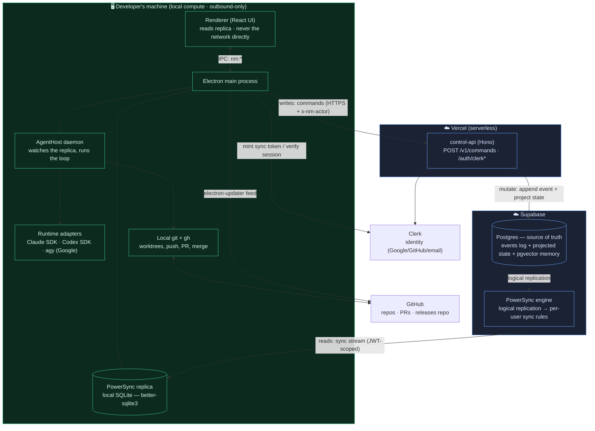
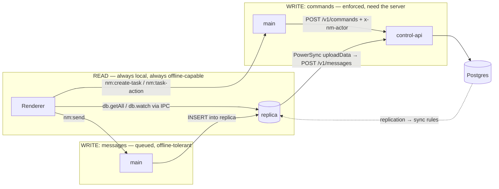
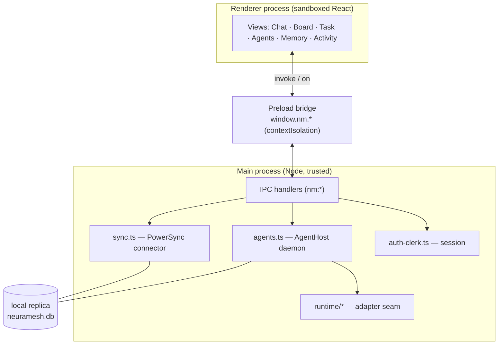
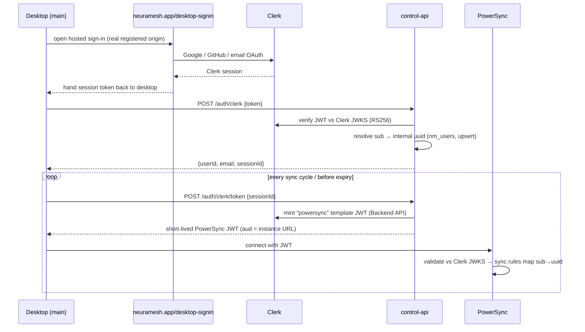
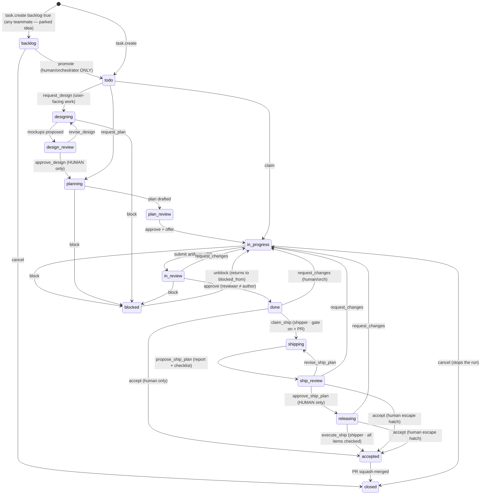
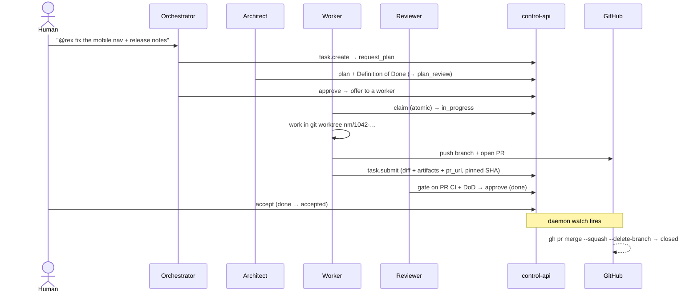
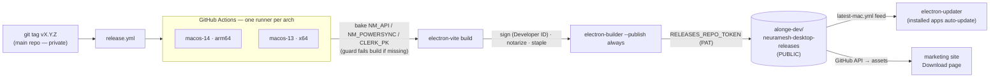

# 09 — System Architecture: how NeuraMesh runs, end to end

> **What this doc is.** A ground-truth map of the *running* system — desktop → PowerSync → Supabase/Postgres → control-api on Vercel → GitHub (repos + releases) — and the flows and invariants that tie them together. It is the "how it actually works" companion to [02-architecture-options.md](02-architecture-options.md) (which records *why* we chose Option A) and [03-protocol-and-memory.md](03-protocol-and-memory.md) (the event/FSM/memory contract). Read this before touching the sync path, the command handler, the agent daemon, or the release pipeline.
>
> **Amended 2026-08-30 — read [§14](#14-amended-2026-08-30--the-cloud-plane) with this doc.** Compute is no longer only the user's Mac: a workspace can run on a **cloud machine** in our GKE fleet, and a **browser** can drive it. The planes below are still correct; there are now more of them.
>
> **The one sentence that explains everything:** **local compute, cloud truth.** Your code, your model keys, and the agent runtimes live and run on *your machine*; the *team's state* (tasks, messages, agents, memory) lives in Postgres and is mirrored to every machine by PowerSync. Every rule that matters is **enforced in the schema and the server, never in a prompt.**

---

## 1. The mental model (one picture)



**The five planes** and the boundary between them:

| Plane | Lives on | Holds | Trust boundary |
|---|---|---|---|
| **Desktop app** | the user's Mac | UI, the local replica, the agent daemon, the runtimes, git | Daemons are **outbound-only** — nothing inbound; keys + code never leave |
| **control-api** | Vercel (serverless) | the *only* writer of truth — validates + authorizes every command | Holds **no** repo tokens and **no** model keys; verifies identity |
| **Postgres** | Supabase | append-only `events` + projected state + the pgvector memory spine | The schema **is** the rulebook (FSM guard, append-only, RLS) |
| **PowerSync** | Supabase | the sync engine: Postgres → per-user replicas | A client only ever sees rows its JWT scopes it to |
| **GitHub** | github.com | code repos (private) + the **public releases repo** | Code reaches `main` only via PR-on-accept; the platform never pushes |

---

## 2. Two write paths, one read path (the core data flow)

This is the single most important thing to internalize. **Reads are always local. Writes split by kind.**



- **Reads** never hit the network. The renderer asks the main process (over IPC channels like `nm:channels`, `nm:watch-tasks`, `nm:watch-thread`) and the main process queries the **local PowerSync SQLite replica** (`db.getAll`, live `db.watch`). This is why the board, channels, and threads render instantly and work offline.
- **Command writes** (`task.create`, `task.submit`, `task.accept`, `agent.register`, `repo.link`, `project.*`…) go as a **direct HTTPS POST to `/v1/commands`** carrying an `x-nm-actor` header (`{kind, id, role}`). Since #360 the desktop also sends a Clerk bearer, and on that lane the bearer proves the member while the header names the author: a member may write as an agent of a workspace they belong to, an illegitimate agent claim is refused with `403 FORBIDDEN` (never re-attributed to the human), and a human claim never overrides the verified bearer. They need connectivity *because the server is the enforcement point* — the command is validated, authorized, and turned into an event + a state change transactionally. The result syncs back down.
- **Message writes** take the **offline-tolerant path**: the renderer inserts into the local replica, and PowerSync's `uploadData` hook drains the queue to `/v1/messages` when connectivity returns. Hence "**offline reads + queued writes**" from the budgets.

> **For agents reading this:** if you're adding a mutation that must be *enforced* (a state transition, an ACL change, anything role-gated), it is a **command** (`/v1/commands`, server-authorized) — never a direct replica write. The replica is a read model plus the message outbox; it is not the source of truth.

---

## 3. Plane A — the desktop app (Electron)



**Process model.** Three boundaries, standard Electron hardening: the **renderer** is sandboxed React that can only call `window.nm.*`; the **preload** exposes that bridge under `contextIsolation`; the **main** process is the only trusted place — it owns the window, the replica, the daemon, auth, and every `nm:*` IPC handler. The renderer cannot reach Postgres, the control-api, or the filesystem directly.

**PowerSync on the client** (`apps/desktop/src/main/sync.ts`):
- `startSync()` opens a `PowerSyncDatabase` on `better-sqlite3` (rebuilt against Electron's ABI) at `neuramesh.db` in the userData dir, registers the machine, and starts the daemon.
- The connector's **`fetchCredentials()`** returns `{endpoint, token}`. In the default Clerk mode it calls the control-api `/auth/clerk/token` to mint a short-lived PowerSync JWT (see §5); it decodes `exp` and a reconnector re-mints before expiry so sync never silently dies at token rotation.
- **`uploadData()`** drains the local write queue (messages) to `/v1/commands`-adjacent endpoints, throwing on failure so the checkpoint holds and the queue survives a network partition.
- `connectStream()` (marker-wipe + connect) is called after onboarding creates the workspace and on re-login, so a brand-new user's replica binds to the *real* workspace generation rather than an empty one.
- **Boot gate:** `withSync = app.isPackaged || --sync || smokeSyncMode`. The packaged app always syncs at boot; without this a returning user's data IPC handlers never register and the app wedges on the splash. (The hard-won story: [decisions.md → the packaged-app boot contract](decisions.md).)

**The AgentHost daemon** (`apps/desktop/src/main/agents.ts`) is the engine of the loop. It runs in the main process and **watches the synced replica** (`db.watch`) for rows it should act on. Each concern is its own watch:

| Watch | Fires on | Does |
|---|---|---|
| **claim** | `todo`/`plan_review` task offered to a local agent, requirements confirmed | atomically claims (de-dupes across machines), runs `claimFlow → executeFlow` |
| **resume** | `in_progress` assigned to a local agent | re-attaches after a host crash/restart |
| **stop** | task → `closed` | aborts the live run's `AbortController`, bails without submitting half-work |
| **designer** | `designing` | studies the repo's design system (shallow read-only clone), drafts self-contained HTML mockups, proposes them (docs/14) |
| **design-review notify** | `design_review` | orchestrator announces the mockups + notifies the desktop — approval itself is human-only |
| **architect** | `planning` | drafts the implementation plan (mixture-of-agents) + writes the Definition of Done. Its planner stage runs **read-only inside a study workspace** — a shallow clone of the task's repo with the human-approved mockups staged into `.nm-evidence/design/` (`openPlanningWorkspace`; Read/Grep/Glob only, Write/Edit/Bash refused at the SDK), removed when the plan is proposed |
| **plan-review** | `plan_review` | orchestrator auto-approves or routes to a human, then offers to a worker |
| **remote-delegate** | task offered to a `kind='remote'` A2A agent | delegates over A2A JSON-RPC (no worktree → nothing to leak) |
| **shipper pool** | `done` with a `pr_number` (ship-gated project) | claims via `claim_ship`, studies the change (PR deploy notes, CI, shipscan, release docs, lessons, skills), proposes the release plan (docs/23) |
| **releasing executor** | `releasing` | host-verifies `auto:'ci'` items, fires `execute_ship` the moment the checklist clears (the server refuses an early merge) |
| **merge-on-accept** | `accepted` with a `pr_number` | squash-merges via the machine's own `gh` creds, deletes the branch |
| **reclaim** | `accepted`/`closed` | removes the workspace COMPLETELY — dir + git admin entry + local `nm/*` branch + subject brain (kills review PTYs first; worktree-berths round) |
| **berth sweep** | boot +2min · 6-hourly · debounced post-reclaim · footprint Reclaim-now | ONE owner for `cache/` (docs/40): dead/orphan berths removed, warm evicted under `NM_WARM_BERTHS`/`NM_CACHE_BUDGET_GB`, spare donors + idle clones dropped; appends the footprint history snapshot |
| **routine resume** | the same sweep ticks | a routine thread whose opener got no real answer — nothing after a 10-min grace, or only compute notices (`computenotice.ts`) — and that anchors no unit is re-asked AS THE OWNER into the same thread (`host/routineresume.ts`; bounded: 3 per thread, never while a newer run exists, only from the origin's machine holding a usable credential). A fresh human trigger rides the ordinary thread wake, so the unit is born anchored and hands-off ([docs/41 §6](41-plan-first-units.md)). **On Pro the routine's thread is born with the orchestrator on the Starter model** (server-stamped `brain_override`, [docs/10 §15.6](10-model-packs.md)), so the triage runs on credits, on the cloud runner, whatever vendor login is or is not signed in |
| **stall watchdog** | 5-min watchdog tick + the 15-min full sweep + ~90s after boot (timers, not watches) | deterministic scan (`stall.ts`) flags stuck work by **absolute age** — human feedback sitting on review gates, dead active phases, unclaimed offers, stale blocked/waits — then a stall-triage orchestrator turn acts (`revise_design`/`revise_plan`/`request_changes`/`offer_task`) or escalates via an `nmq` question card ([docs/19](19-stall-watchdog.md)) |

`executeFlow` resolves the agent's token, sets up a **git worktree** (`nm/<id>-slug`) or a scratch dir, runs the coding turn — deliberately with **no wall-clock cap**: the only abort is a human Stop via the `executing` AbortController registry (`TURN_BUDGETS.work` = 15 min is the *fan-out root budget* for spawned legs, not a turn timer) — collects artifacts (diffs, screenshots, ≤12), and POSTs `task.submit`. Daemons are **outbound-only** — there is no inbound socket on a user machine.

**Presence is a kept promise, not a hint** (`presence.ts`). The typing/working chip every client renders is the synced `agents.status` column; flows set a busy status at run start and clear it in a `finally`. A status write is never fire-and-forget: it flows through a per-agent **pump** — last-write-wins, retried with capped backoff until the server acks or a newer status supersedes — so one dropped clear (server blip, deploy) can no longer wedge "typing" while the machine keeps heartbeating. The recovery layers stack: chat turns run under the same 4-minute wall as orchestrator turns (a hung runtime can't hold `thinking`); renderers gate chips on the machine heartbeat (`agentLive`, 90s), so a dead host's stale row never paints; a relaunch resets every hosted agent to `online` and the boot dead-letter sweep re-answers anything unanswered. Wake replies post with the same discipline — bounded retry on 5xx/network (409 = the exactly-once reply index (0060) already holds an answer → stand down), and a reply that exhausts its retries re-arms its trigger (bounded) so the sweep regenerates the answer once the server is reachable again.

**The runtime adapter seam** (`apps/desktop/src/main/runtime/adapter.ts`) makes "which AI runs this turn" a per-agent choice without touching the loop. One interface — `streamTurn` (chat), `complete` (plan/verdict reasoning), `runQuery` (the agentic coding loop) — with three implementations selected by `runtimeFor(agent.runtime)`:

- **`claude-code` → Claude Agent SDK** (in-process, the reasoning-heavy default).
- **`codex` → OpenAI Codex SDK** (`@openai/codex-sdk`, in-process; ChatGPT login *or* key).
- **`gemini` → Google `agy`** (the Antigravity CLI, Google OAuth — no key needed); nm tools reach it over a loopback-MCP bridge (`runtime/orchmcp.ts`). Per-agent model routing is in [08-model-routing.md](08-model-routing.md).

Credentials resolve through `resolveToken` + `runtime/authpolicy.ts`: a workspace/agent **BYOK** key wins; else a local **subscription/OAuth login** detected by `runtime/detect.ts`; else **nothing** — the "no silent billing" policy refuses to fall back to a stub. Keys never leave the machine.

---

## 4. Planes C + D — Postgres (truth) and PowerSync (sync)

### Postgres is the rulebook, not just storage

The schema (`supabase/migrations/`, 46 migrations from `0001_core.sql`) encodes the invariants so they're **impossible to violate**, not merely discouraged:

- **`events`** — the immutable audit log. ULID ids, typed `payload jsonb`, `in_reply_to` chains. An `nm_events_append_only()` trigger **blocks UPDATE/DELETE**. Every command writes here first.
- **`tasks`** — the projected board state. An `nm_task_state_guard()` trigger rejects any `state` change that isn't a legal FSM pair (§6) — defense-in-depth behind the server's own check, so even a rogue writer can't make an illegal transition.
- **Tenancy:** `workspaces` → `workspace_members` → `channels` (the ACL boundary) → `projects` (the work axis; **1:N**, a channel belongs to one project via `channels.project_id`). `tasks.project_id` is derived from the channel.
- **Fleet:** `machines` (heartbeat), `agents` (role, model, runtime, A2A `card`), `agent_channels` (the fan-out + artifact ACL).
- **Code:** `repos` (metadata only — **no tokens**), `tasks.{repo_id, base_ref, branch, submitted_sha, pr_url, pr_number, definition_of_done}`.
- **Beats ([docs/17](17-beats.md)):** `beats` — the ordered, per-phase progress steps an agent declares and ticks off live (`beat_status` enum; a set grouped by `run_id`; role-colored in the UI). Its **own** synced table so a tick (~2×N per phase) doesn't churn the task row or re-render the board. **Descriptive only** — never an FSM gate.
- **Memory spine (pgvector):** `memory_blocks` (always-in-context summaries), `facts` (bitemporal: `valid_until IS NULL` = current, supersession preserves history; `vector(384)` + FTS), and `messages` (raw, also embedded). Recall is **hybrid RRF** — vector + full-text legs over facts and messages, fused by reciprocal rank. Embeddings are a **local 384-dim ONNX model** (no keys, runs on the box).
- **`provider_credentials`** (BYOK tokens) — **deliberately excluded from the PowerSync publication**, so secrets never replicate to any client; service-role reads only.

### PowerSync mirrors Postgres to each machine, scoped per user

PowerSync tails a Postgres **logical-replication publication** and applies **sync rules** ([`dev/stack/powersync/sync-config.yaml`](../dev/stack/powersync/sync-config.yaml) — the single source of truth: the dev stack mounts it, and [`powersync-sync-rules.yml`](../.github/workflows/powersync-sync-rules.yml) deploys it to the prod Cloud instance on merge to main, migrations first) to decide what each client gets:

```yaml
streams:
  workspace:
    with:
      # JWT sub (Clerk id, or dev uuid-as-text) → internal uuid → the user's workspaces
      my_workspaces: select wm.workspace_id from workspace_members wm
                     join nm_users u on u.id = wm.user_id
                     where u.clerk_user_id = auth.user_id()
    queries:
      - select * from channels  where workspace_id in (select workspace_id from my_workspaces)
      - select * from tasks     where workspace_id in (select workspace_id from my_workspaces)
      - select * from agents    where workspace_id in (select workspace_id from my_workspaces)
      # … projects, messages, machines, agent_channels, repos, artifacts, beats,
      #    memory_blocks, skills, skill_packs, workspace_members
```

The `my_workspaces` parameter query is the linchpin of the Clerk integration: PowerSync validates the auth provider's **own** token (the `sub` stays Clerk's), and the `nm_users` join maps that `sub` to our stable internal uuid — so a client only ever syncs the 14 workspace-scoped tables for **its** workspaces, and `provider_credentials` (not in the publication) never appears at all. A **new** synced table (like `beats`) needs its own publication entry + sync-rule query + a PowerSync **rule deploy** — the one manual step called out in a PR's `## Deploy notes`.

---

## 5. Identity & auth (Clerk → token mint → PowerSync)



**Why hosted-web, not a loopback.** Production Clerk rejects the desktop's `127.0.0.1` loopback origin, so the packaged app completes OAuth on **`neuramesh.app/desktop-signin`** (a real registered origin) and the session is handed back to the desktop. The desktop signs nothing itself: the control-api **verifies** the Clerk JWT (hand-rolled RS256 against Clerk's JWKS, no deps — `packages/control-api/src/clerk.ts`) and **re-mints** the short-lived PowerSync token from the live session via Clerk's Backend-API "powersync" template. PowerSync then validates *Clerk's own* token. (Gotcha baked into the code: Clerk's Backend API sits behind Cloudflare, which `1010`-blocks unfamiliar User-Agents — the fetches pin a browser-like UA.)

**Email/password never touches a browser.** The in-app form posts to `/auth/clerk/password` (sign-in: `verify_password`) or `/auth/clerk/signup` (account creation: Backend-API create-user, then signed straight in) — both server-mediated because the Electron `file://` renderer can't call Clerk's frontend API. The session itself is minted via a **sign-in token → Frontend-API native ticket exchange** (Clerk's Backend-API create-session is dev-instance-only — "Request only valid for development instances" — the trap that broke prod email auth until v0.19.x). Same `{userId, email, sessionId}` shape as `/auth/clerk`, so everything downstream (token mint, sync) is one path.

`NM_AUTH` selects the mode: `clerk` (default/prod), `supabase` (legacy), `dev` (a static HS256 key for the local stack). All three resolve to the same sync-rule shape because `nm_users` backfilled every legacy uuid as `clerk_user_id = uuid-as-text`.

**Boot identity is offline-first; only a verified-dead session signs you out.** A cloud-mode boot acts as the **last-synced workspace identity** persisted in `replica.json` (`{workspaceId, name, slug}` — `apps/desktop/src/main/wsident.ts`) from the first frame, then resolves `/v1/workspaces`. Resolution *failure* is never destructive: the app keeps the marker identity (cached data stays readable), retries in the background with backoff, and late success updates the header, re-registers the machine, and starts the agent host. The replica is **wiped only on an authoritative identity change** (resolved/onboarded/logged-in workspace ≠ marker) — an unreachable API must never wipe (the 2026-07-10 incident: a boot-time network blip fell back to the dev-seed "Acme Robotics" identity, wiped the replica, and hid the user's data until a re-login). Token semantics mirror this: `/auth/clerk/token` returns **401 `SESSION_EXPIRED` only after probing the session is truly dead** (the desktop drops the session and lands on sign-in) and **503 `AUTH_UNAVAILABLE` for everything transient** (Clerk outage, network, missing template/config) — the desktop keeps retrying and the user stays signed in.

---

## 6. The loop (the board FSM in motion)

The board state machine is the product. It's defined once in `packages/shared/src/states.ts` and enforced twice (server + Postgres trigger).





**What the FSM guarantees by construction** (enforced, not prompted):
- **No self-review** — the approver must differ from the submitter (`SELF_REVIEW_BLOCKED`).
- **Designs are approved by humans only** — `design_review → planning` rejects every agent actor (`HUMAN_ONLY`), and only the channel designer may propose mockups; nothing is planned or built from an unapproved design ([docs/14](14-design-stage.md)).
- **Blocked always resumes its own stage** — block is legal from every working stage (`in_progress`/`planning`/`designing`/`in_review`), the server stamps `tasks.blocked_from`, and unblock returns there — a task blocked mid-planning re-plans; it never "resumes" a build that never started.
- **No artifact-less submit** — a submission without evidence (and, for repo work, a pushed SHA) is rejected (`EVIDENCE_REQUIRED` / `PUSH_REQUIRED`).
- **Acceptance is human** — `done → accepted` is humans-only (`HUMAN_ONLY`); machines can't accept their own work.
- **Releases are gated on a human-approved plan** ([docs/23](23-shipping-stage.md)) — in a ship-gated project, a PR-backed task's merge runs through the shipper: `approve_ship_plan` rejects every agent (`HUMAN_ONLY`), and the shipper's `execute_ship` is refused until every checklist item is checked (`SHIP_ITEMS_PENDING`) — an agent can never tick a human item. The human accept stays legal from every ship state (the escape hatch).
- **Code reaches `main` only on accept** — the PR is squash-merged by a daemon watch that fires *only* on `accepted`, using the machine's own `gh` creds; `accepted` is reached by a human's accept, or by the shipper's server-verified `execute_ship` downstream of a human-approved release plan. The platform never holds a write token.
- **The Definition of Done is the contract** — an editable `tasks.definition_of_done` the reviewer gates against; for code work it encodes the PR flow, never "commit to main."
- **Parked ideas never self-start** — the `backlog` stage ([docs/15](15-backlog.md)) is the one place ANY teammate may create a task (`task.create backlog:true`; it can't be born offered), but its only exits are `promote → todo` (human/orchestrator, `NOT_PERMITTED` for every other agent) and cancel — no offer/claim/design/plan/block edge exists, so an agent can never turn its own idea into work.

---

## 7. Plane B — the control-api on Vercel

The control-api is a **Hono** app deployed as Vercel serverless Functions at `api.neuramesh.app`. It is the *only* writer of truth: `POST /v1/commands` parses (zod, 40+ command types), authorizes (role + FSM guards), then `store.mutate(...)` appends the event and projects state in one transaction. A **store seam** (`PostgresStore` for prod, `MemoryStore` for unit tests; selected by the DB env) keeps the handler testable. Auth endpoints (`/auth/clerk*`) are described in §5; billing (`/billing/*`, Stripe) and the public A2A discovery surface (`/.well-known/a2a/*`) round it out.

> **Deploy mechanics — read [`packages/control-api/README.md`](../packages/control-api/README.md).** `index.js` is a **committed esbuild bundle** that Vercel deploys *verbatim* (the `buildCommand` runs migrations, not a bundle rebuild). Two guards keep this honest: a PR that touches `src/`/`@neuramesh/shared` gets `index.js` **rebuilt and committed back automatically** ([`control-api-bundle.yml`](../.github/workflows/control-api-bundle.yml)), and the production `buildCommand` **applies pending `supabase/migrations/*.sql` before the new Function serves** ([`scripts/migrate.mjs`](../packages/control-api/scripts/migrate.mjs), production-gated + idempotent). This closes the stale-bundle drift behind PRs #17/#34 and the manual-migration step.

---

## 8. Distribution & release (GitHub + electron-updater)



**Why a separate releases repo:** the main repo is **private**, so it can't serve public downloads or an updater feed. A tag `v*` triggers `release.yml`, which builds **natively per architecture** (macos-14 arm64 + macos-13 x64 — no cross-compile, so `better-sqlite3`/`node-pty` link cleanly), pins **Python 3.11** (node-gyp needs `distutils`, removed in 3.12), **bakes** the publishable cloud config with a **guard that fails the build** if `NM_POWERSYNC` or `CLERK_PUBLISHABLE_KEY` is missing (a release can never point at localhost), then **signs + notarizes + staples** and publishes to the **public** `alonge-dev/neuramesh-desktop-releases` repo via a PAT. `electron-updater` reads `latest-mac.yml` from that repo's latest release; the marketing site reads assets via the GitHub API. The CI publishes a **draft** — un-drafting with `--latest` is the human go-live gate.

> **Release Definition of Done** ([decisions.md](decisions.md)): typecheck/build/local-`--sync` are *not* sufficient. **Run the shipped, signed `.app` as a returning user** (synced workspace, 0 `dlopen` errors, no "No handler" flood) before publishing. v0.4.0–0.4.2 all bricked on packaged boot; v0.4.3 was the first that passed this gate.

---

## 9. Environments

| Env | DB / sync | Auth | How it runs |
|---|---|---|---|
| **Local dev** | `dev/stack` Docker Postgres + PowerSync (HS256 dev key) | `NM_AUTH=dev` | `pnpm app` (cloud) / `pnpm app:local` (dev stack); `pnpm e2e` |
| **Cloud (test)** | prod Supabase + PowerSync | `NM_AUTH=clerk` | `scripts/cloud-app.sh` (runs control-api externally on :8788 so `/auth/clerk` is reachable at login) |
| **Prod** | prod Supabase + PowerSync | Clerk | the packaged signed `.app`; control-api on Vercel; config **baked** at build |

The desktop isolates state per variant via `NM_USERDATA` so installed + dev apps coexist (installed = default · dev = `~/.neuramesh-dev` · cloud = `~/.neuramesh-clerk-cloud`). Secrets live in **gitignored** `.env*` files locally and in the Vercel/GitHub Actions env — **never committed**; the pooler password contains `${}` chars, so `source .env.production`, don't parse it.

### 9.1 `NM_API_PORT` — and why a connector test must run on **8789**

A worktree may run its own control-api on a private port (`NM_API_PORT`), because the API has to
be the one built from *that* branch's source; the stack (pg + PowerSync) is shared, so the data is
identical whichever port serves it. **Except for OAuth.**

An OAuth connect only completes on a callback URI the provider has **registered**, and the
X / LinkedIn / Meta / TikTok apps carry exactly two: production, and
`http://127.0.0.1:8789/connect/<provider>/callback`. A branch on any other port can therefore do
everything *except* connect a real account — the authorize round-trip dies at the provider with
"You weren't able to give access to the App", which reads like a broken app and is really a port
nobody registered. (Seen live 2026-08-26: a branch harness on 8797 could not connect X, while the
same code on 8789 could.)

**So: any local run that must exercise a real connector — connecting an account, an OAuth
reconnect, a real `search_x` read, a publish — runs with `NM_API_PORT=8789`.** `dev-app-cdp.sh`
prints a warning at launch when the port is anything else and connector credentials are present,
so the mismatch is caught before the browser round-trip rather than after it. Registering a second
port in the provider portals is the alternative, and it is worse: every branch would need its own
entry in four external consoles.

---

## 10. The invariants that matter (memorize these)

1. **Enforced, not prompted.** Illegal FSM transitions, double-claims, self-review, artifact-less submit, role violations — all rejected by the server *and* the Postgres triggers. If you find a rule living only in a prompt, that's a bug.
2. **Local compute, cloud truth.** Code, model keys, and runtimes never leave the machine; daemons are outbound-only; `provider_credentials` are never synced. Team state is always cloud-consistent and locally replicated.
3. **Reads local, command-writes server.** The replica is a read model + a message outbox, never the source of truth. Enforced mutations are commands.
4. **The event log is append-only.** State is a *projection* of `events`; you never rewrite history.
5. **Code reaches `main` only via PR-on-accept**, merged by the machine's own creds on a human accept — never a direct commit, never a platform-held token.
6. **Offline is a feature.** Reads and queued message-writes work with no network; commands resume when connectivity returns.

---

## 11. Code map (where to look)

| Concern | Files |
|---|---|
| Board FSM + guards (single source) | `packages/shared/src/states.ts` |
| Event envelope + types | `packages/shared/src/events.ts` |
| Command validation + authorization | `packages/control-api/src/handler.ts`, `commands.ts` |
| Store seam (truth + tests) | `packages/control-api/src/pgstore.ts`, `store.ts` |
| Clerk verify + token mint | `packages/control-api/src/clerk.ts` |
| HTTP routes / Vercel entry | `packages/control-api/src/app.ts`, `vercel.ts` → [README](../packages/control-api/README.md) |
| Schema (truth) | `supabase/migrations/*.sql` (`0001_core.sql` first) |
| Sync rules | `dev/stack/powersync/sync-config.yaml` |
| Client sync + IPC | `apps/desktop/src/main/sync.ts` |
| Agent daemon (the loop) | `apps/desktop/src/main/agents.ts` |
| Runtime adapters | `apps/desktop/src/main/runtime/adapter.ts`, `detect.ts`, `authpolicy.ts` |
| Desktop auth | `apps/desktop/src/main/auth-clerk.ts`, `token.ts` |
| Release pipeline | `.github/workflows/release.yml` |

## 12. Further reading

- [02-architecture-options.md](02-architecture-options.md) — *why* Option A (the decision, with the rejected alternatives).
- [03-protocol-and-memory.md](03-protocol-and-memory.md) — the event envelope, A2A mapping, Agent Cards, the memory spine in depth.
- [06-taxonomy.md](06-taxonomy.md) — the nouns (workspace/project/channel/task/agent/artifact) and the two-axis model.
- [08-model-routing.md](08-model-routing.md) — how an agent resolves its provider/model.
- [42-browser-terminal-and-relay.md](42-browser-terminal-and-relay.md) — the browser terminal and `nm-relay`, and the four things about it that are not obvious.
- [decisions.md](decisions.md) — the running ADR log (newest first), including the desktop boot contract and the auth/sync history.
- [05-engineering-philosophy.md](05-engineering-philosophy.md) — the doctrine these invariants serve.

---

## 13. Amended 2026-07-30 — the code-surface boundary, said precisely

Written while specifying **workspace tabs** ([docs/36](36-workspace-tabs.md)), which puts a file
tab in the main content area and therefore had to answer what the boundary actually forbids.

**The sentence as it stands** (CLAUDE.md and §10's spirit): *NeuraMesh reads, reviews, and runs —
it never edits.* Read literally, that is already not true of the shipped product, and has not been
since v0.8.0: `fsWrite` → **`nm:fs-write`** is wired end to end (`renderer/src/App.tsx`,
`preload/index.ts`, `main/sync.ts`) and the bottom dock's editor saves files today.

**What the boundary was always about, and still is:**

1. **The agent path.** An agent's edits happen in **its own worktree, under its own runtime**, and
   reach the team only as a pushed branch + a PR reviewed against the Definition of Done. The
   platform does not edit code on a human's behalf, does not hold a repo write token, and code
   still reaches `main` only via PR-on-accept (§10.5, unchanged by anything here).
2. **The product is not an IDE.** We do not build language servers, refactoring, project-wide
   search-and-replace or a debugger. Quick fixes bounce to the agent or deep-link to a real editor.
3. **Review renders from artifacts**, so a diff reads cross-machine and offline. Unchanged.

**What it never meant:** that a human who opens a file in the app may not save it. docs/36 §3.5
therefore rules: **workspace files a human deliberately opens stay editable; artifacts are
read-only**, and the read-only-ness is a **capability on the tab record**, not a button the UI
declines to draw — the doctrine-§4 shape, because a capability the UI merely hides is still a
capability.

> **This needs an explicit founder ruling, and is flagged rather than silently resolved.** The
> behaviour is unchanged either way — docs/36 ships no new write path — but the doctrine sentence
> is now imprecise, and imprecise doctrine is how a future agent justifies the wrong thing in good
> faith. Either the sentence gains "the platform never edits **on an agent's behalf**", or Edit is
> removed from the file tab and the dock editor's existing save is removed with it. Half is worse
> than either.

**And one renderer-layering invariant, learned from a live defect.** `.sessionsurf` (an open task
or conversation) is `position: absolute; z-index: 55` and a **sibling** of `.main`, while the dock
panel lives *inside* `.main` with no `z-index`. So an open session painted over the dock, and the
task panel's own terminal pin opened a tab the task immediately buried — the app could not show a
terminal beside a task at all. docs/36 fixes it at the cause rather than with a bigger number:

> **A surface that occupies "the whole main region" must BE the main region's content, not an
> absolutely-positioned sibling of it.** The session becomes tab 0's body. Sibling-plus-`z-index`
> is for things that float *over* content — veils, popovers, the capacity fly-up — and every one
> of those is portalled to `<body>` per the docs/34 §11 rule, which is untouched.

Nothing in §§1–12 changes: no schema, no command, no sync rule, no plane boundary. This section
records a clarification and a fix, not a new architecture.

---

## 14. Amended 2026-08-30 — the cloud plane

§1's five planes assumed one shape of compute: an Electron app on a developer's Mac. That is still the paved road, and everything above it still holds. But a workspace can now run somewhere else, and a browser can now drive it, which adds **three planes** and changes exactly one sentence in the mental model.

| New plane | Lives on | Holds | Trust boundary |
|---|---|---|---|
| **Cloud machine** | a pod in the `nm-fleet` GKE cluster (gVisor, one namespace per workspace, XFS PVC) | the *same* daemon (`machined.ts` — the desktop main process minus Electron), its own replica, worktrees, and the agent runtimes | Still **outbound-only**. A machine pod has no inbound port; the sandbox and the namespace are the boundary |
| **Fleet operator** | `nm-fleet` Deployment in `nm-system` | reconciles workspace/machine **rows** into namespaces, StatefulSets, PVCs and token Secrets | Rows are truth; drift converges back. Machine tokens are provisioning-owned, never template-stamped |
| **nm-relay** | `nm-relay` Deployment in `nm-system`, public at `relay.neuramesh.app` | nothing — a stateless byte-forwarder joining a browser to its machine | Holds **no keys**: both credentials are validated by control-api over `RELAY_SECRET` |

**The sentence that changes.** "Local compute, cloud truth" becomes **"your compute, cloud truth"** — the machine is still *yours* (your keys, your code, your subscriptions, outbound-only), it simply may not be your laptop. What did not change is the part that matters: the platform still holds no repo tokens and no model keys, and a machine still never accepts an inbound connection.

**Reads and writes are unchanged.** A cloud machine is a PowerSync client like any other: local replica for reads, `/v1/commands` for writes. §2 applies to it verbatim.

**The phone is the third client** (mobile-cloud round, 2026-09-05). It reads the same replica
(PowerSync React Native), writes through the same `/v1/commands`, and dials the same relay, so the
planes above hold for it unchanged. What it never does is host: no agent daemon, no keys, no repo.
Two things are its own. A person can **sign up on it** and the workspace provisions a cloud machine,
so the phone is a first client rather than a companion to a Mac. And a session born on it carries
`origin='web'` with the runner as its machine, because a phone has no compute to offer. Its terminal
is a WebView over the relay, which is what lets a member who owns no computer complete a vendor
sign-in on a machine they own.

**The web client** (`hq.neuramesh.app`) is the same renderer over a different bridge: PowerSync Web for L1 reads, control-api for L2 writes, and `nm-relay` for L3 — anything that needs a machine (a shell, that machine's filesystem, live process streams). Lanes with no L3 answer degrade to a **named refusal** rather than a fake success (`renderer/web/webnm-local.ts`), which is why a browser says "No shell here" instead of rendering an empty terminal.

**The web client's two credentials, and the one rule between them** (2026-09-05). A tab authenticates twice: `/v1` calls carry a Clerk bearer read **live** from clerk-js on every call, and PowerSync's credential is minted server-side from a Clerk **session id**. That id used to be read from a `localStorage` snapshot written at sign-in, and a snapshot outlives the session it names — Clerk sessions expire, are revoked, and are replaced when the same person signs in elsewhere. The tab then stayed signed in on the bearer lane while the mint answered `401` forever, roughly every six seconds, so sync died silently and nobody was told. **Both credentials now come from the live client** (`liveClerkSessionId`, `webnm-auth.ts`); the stored id survives only as the fallback for a build with no Clerk at all. The policy lives in `webnm-credentials.ts`, and it honours a distinction the server always made and the browser ignored: `/auth/clerk/token` returns **401 only after probing Clerk and finding the session genuinely dead**, and **503 `AUTH_UNAVAILABLE` for anything inconclusive** precisely so the client keeps retrying. Retry the 503s forever; land a 401 on the sign-in screen, the way the desktop already does. The desktop keeps its stored id and its sign-out, correctly: the stored id is the only Clerk artifact it holds, so it has nothing live to re-derive from.

**Why the relay must exist**, in one line: machines never listen and Vercel cannot hold a stream, so both sides dial out to a rendezvous. The operational traps — one replica only, two health checks, a 30-second default WebSocket timeout, and bytes-not-strings — are in [docs/42](42-browser-terminal-and-relay.md), along with the reason the machine image now imports `machined` at build time.

## The release routine's tick branch (2026-09-17, docs/44)

A schedule whose payload carries `release` is a routine that watches a repository. In
`runDueSchedules` the branch is decided BEFORE the claim, beside `isRoutine`: the preflight
(`host/releasewatch.ts`) resolves the repository (the payload's id, else the room's project's
primary), its GitHub remote, and this machine's `gh` login, and leaves the row due when any is
missing (the attention bar says why after ten minutes). After the claim the fire reads releases,
merged pull requests and tags through `gh`, hands them to the pure scan, drops a key that already
heads a session of this schedule, and either opens one session with the digest (the owner's
message, `scheduleId` on the thread, the `‹release:owner/repo@key›` marker at the end) or leaves a
quiet ledger line. Then `schedule.set_cursor` moves the cursor, never before. `NM_GH_FAKE=1`
answers the read from `NM_GH_FAKE_RELEASES` (or one canned release), so the echo lane proves the
whole fire without GitHub.
