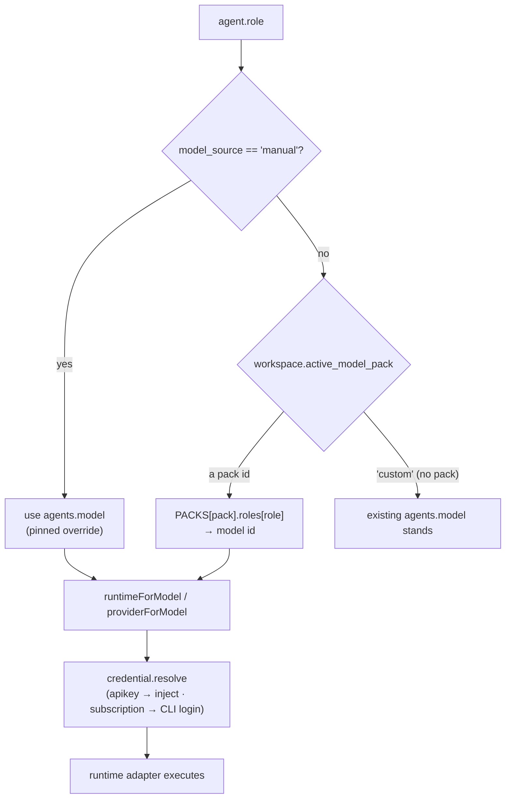
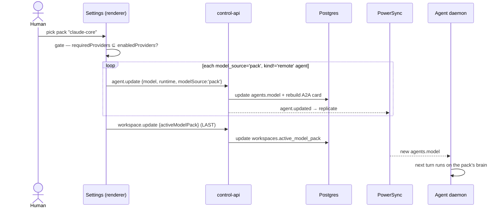
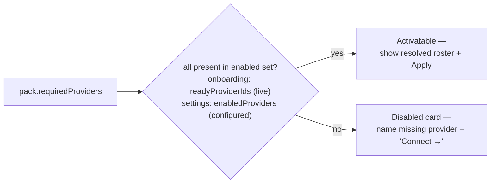

# Model config packs — plan (for review)

> **Status:** proposed, not built. Decisions locked with the founder 2026-06-27. This is the review artifact; the reference doc it feeds is [08-model-routing.md](08-model-routing.md).

## 1. Goal

Replace the "orchestrator always defaults to free `gemini-3.1-flash-lite`" behaviour with **quality-and-cost-tiered, provider-aware role defaults**, packaged as selectable **model config packs** — named bundles of `role → model` mappings, curated from market benchmarks.

- A workspace has an **active pack**. Choosing/changing it in Workspace Settings re-points the default model for **every agent role at once**.
- A user can still **override any individual agent's brain** (as today); overrides survive a pack change.
- A pack is **activatable only if the providers its models need are already configured** in the workspace; otherwise it is disabled with a one-click path to connect the missing provider.

**Litmus:** every starter agent today collapses to one `teamModel` regardless of role, and the orchestrator sits on the weakest brain. Packs make the loop *better* (right brain per role) and *cheaper* (cost-tiered) without ceremony — a clear yes.

## 2. How it works today (what we're replacing)

Model assignment is three hardcodes in onboarding, with **no pack concept anywhere**:

| Spot | Current behaviour | File |
|---|---|---|
| Orchestrator | hardcoded free `gemini-3.1-flash-lite` | [App.tsx:3986](../apps/desktop/src/renderer/src/App.tsx), [4007](../apps/desktop/src/renderer/src/App.tsx) |
| Team (architect/dev/reviewer) | **all collapse to one** `teamModel` = first ready provider's first model | [App.tsx:4044](../apps/desktop/src/renderer/src/App.tsx), [4056](../apps/desktop/src/renderer/src/App.tsx) |
| Hired-later / curator | separate hardcoded `claude-opus-4-8`; curator registered with **no** model and silently inherits it | [commands.ts](../packages/control-api/src/commands.ts), [sync.ts:1583](../apps/desktop/src/main/sync.ts) |

`agents.model` is a plain replicated text column; per-agent override already works via `agent.update`. The model→runtime→provider→credential chain is documented in [08-model-routing.md](08-model-routing.md). **The feature ships on existing seams — no new tables.**

### Reality check that shaped the plan

The "free orchestrator" **is not actually free in the packaged app**: the build bakes only `NM_API/NM_POWERSYNC/NM_WEB` — no `GEMINI_API_KEY` — and a new user has no `agy`/Google login, so the free brain resolves to an empty key and fails on the first real `@mention`. **Decision: drop the free tier from this feature.** Packs are gated on configured providers; a curated free pack ships later as **"coming soon"** (see §5).

## 3. The packs (v1)

Five packs over the **real** catalog (Gemini ids verified against Google's model docs 2026-06-27). The current Gemini lineup is `gemini-3.1-pro-preview` (Pro, **preview**), `gemini-3.5-flash` (GA — Google's best for agentic/coding, behind `gemini-flash-latest`), and `gemini-3.1-flash-lite` (GA, cheap); `gemini-2.5-pro` is previous-gen. **Packs default to GA ids**, so the Gemini workhorse is `gemini-3.5-flash`, not the preview Pro. Model picks are tunable as benchmarks move (that's the whole point of packs-as-data); rationale is grounded in how the daemon actually uses each role: **architect** runs the mixture-of-agents plan pipeline ([agents.ts](../apps/desktop/src/main/agents.ts) planner + 2 critics + synthesis), **developer** runs real code in a worktree, **designer** studies a codebase and drafts production-grade mockups (an FSM party since [docs/14](14-design-stage.md)), **reviewer** gates against the Definition of Done, **orchestrator** is high-frequency intake/routing, **sales/curator** are light chat/curation roles with no FSM party.

| Pack | orchestrator | architect | developer | reviewer | designer | shipper | sales | curator | marketer |
|---|---|---|---|---|---|---|---|---|---|
| **Ultracode** | gpt-5.6-sol | gpt-6-astra | claude-sonnet-5 | gpt-6-astra | claude-opus-5 | claude-fable-5-1 | claude-sonnet-5 | claude-haiku-4-5 | claude-opus-5 |
| **Balanced** | claude-sonnet-5 | gemini-3.8-flash | claude-sonnet-5 | gemini-3.8-flash | claude-sonnet-5 | claude-sonnet-5 | claude-haiku-4-5 | claude-haiku-4-5 | claude-sonnet-5 |
| **Fast** | gemini-3.8-flash | gemini-3.8-flash | claude-sonnet-5 | gemini-3.8-flash | claude-sonnet-5 | claude-sonnet-5 | claude-haiku-4-5 | claude-haiku-4-5 | claude-sonnet-5 |
| **Claude Core** | claude-sonnet-5 | claude-fable-5-1 | claude-sonnet-5 | claude-fable-5-1 | claude-sonnet-5 | claude-opus-5 | claude-sonnet-5 | claude-haiku-4-5 | claude-sonnet-5 |
| **OpenAI Core** | gpt-5.6-sol | gpt-6-astra | gpt-5.6-terra | gpt-6-astra | gpt-5.6-sol | gpt-5.6-sol | gpt-5.4-mini | gpt-5.4-mini | gpt-5.6-sol |
| **Gemini Core** | gemini-3.8-flash | gemini-3.8-flash | gemini-3.1-pro-preview | gemini-3.1-pro-preview | gemini-3.8-flash | gemini-3.1-pro-preview | gemini-3.1-flash-lite | gemini-3.1-flash-lite | gemini-3.8-flash |
| **NeuraMesh Starter** | gemini-3.5-flash-lite on every seat (the house brain; the metered proxy is where the spend rule lives) |||||||||

*(`worker` is a legacy alias of `developer` and maps to the developer model in every pack.)*

**Benchmark-driven update (2026-09-08).** Suite v1.1 re-measured 13 models over 5 roles at commit
`ee7195f1` ([docs/11](11-model-benchmarks.md), and the seat write-up in
[docs/design/model-benchmarks-2026-09](design/model-benchmarks-2026-09/seat-recommendation.md)).
Every working seat above is measured except the two marked directed below.

- **claude-sonnet-5 takes the developer seat in four packs.** Seven models tied at exactly 100% on
  coding, so the seat broke on speed and cost: Sonnet 5 was the fastest of them (11.8s) and the
  second cheapest. A role where everyone scores full marks has stopped measuring anything, which is
  the case for the private repo-derived fixtures parked in
  [docs/design/model-benchmarks-v2-2026-09](design/model-benchmarks-v2-2026-09/plan.md).
- **gpt-6-astra takes review and planning** in ultracode and openai-core. It posted the only perfect
  review score (F1 1.00, zero false approvals) with an interval clearing the runner-up, so it won
  outright rather than on value.
- **Ultracode's gate moved from anthropic+gemini to anthropic+openai.** It is the best-per-role pack
  and OpenAI won three of its four working seats. Workspaces on ultracode need an OpenAI credential.
- **The Gemini architect seat no longer needs the preview exception.** gemini-3.8-flash (GA) beat the
  3.1 Pro preview on planning, 87 to 84, at under half the cost and half the latency. The Gemini
  DEVELOPER seat still needs it: 3.1 Pro is the only Gemini model that reached 100% on coding.
- **Six ids retired** to `LEGACY_MODELS`: claude-fable-5, claude-opus-4-8, claude-sonnet-4-6,
  gpt-5.5, gpt-5.5-pro, gemini-3.5-flash. They stay routable so an agent already seated on one keeps
  working, and `FALL_FORWARD` carries each onto a current model so a capacity failover can never land
  an agent on a retired id.
- **The starter brain was benchmarked for the first time.** gemini-3.5-flash-lite scored 100 on review
  (perfect F1, zero false approvals) and 100% on coding, at a fiftieth of the cost of the models it
  ties with. Against the cheaper 3.1 Flash-Lite every interval overlaps, so there is no measured case
  for switching the free tier.
- **DIRECTED, not measured** (both founder decisions, 2026-09-08, revert with bench evidence):
  claude-sonnet-5 on the claude-core and balanced orchestrator seats, and claude-fable-5-1 on the
  claude-core architect seat against a measured claude-sonnet-5 at 88 to Fable's 78.
- **The rule that bit:** gpt-5.4-mini won research, planning AND orchestration outright. The founder
  no-mini-working-seats rule keeps it off every working seat, so it holds only sales and curator. It
  is the strongest argument the bench has produced against that rule, recorded rather than acted on.
- Every seated model was driven through its own production lane on a real query before this landed
  (11 of 11 answered); see the smoke log in
  [docs/design/model-benchmarks-2026-09](design/model-benchmarks-2026-09/serving-smokes.md).

**Benchmark-driven update (2026-07-02)** — seats are now MEASURED, not curated: see [docs/11-model-benchmarks.md](11-model-benchmarks.md) + neuramesh.app/model-benchmarks (10 models × 5 roles, verified pricing). Changes: **balanced** developer → `claude-sonnet-5` (equal 100% coding at $0.021 vs Sonnet 4.6's $0.034); **claude-core** reviewer → `claude-haiku-4-5` (F1 **1.00**, 0% false-approves, ⅓ the cost of Sonnet 4.6's 0.91); **openai-core** architect → `gpt-5.4-mini` (planning **98 vs gpt-5.5's 57**); **gemini-core** developer → `gemini-3.1-flash-lite` (coding **96% vs 3.5-flash's 60%**) and architect → `gemini-3.1-pro-preview` (planning 94 vs 71 — the one deliberate exception to the GA-defaults policy, superseded by evidence). **ultracode is unchanged** — Opus 4.8 held orchestration (100) outright and tied/led everywhere else; `claude-fable-5` earned **no seat** (ties Opus on planning at 2.3× the cost, behind on review/orchestration — revisit when harder suites differentiate the top end).

**Designer reseat (2026-07-02, curated)** — the design stage ([docs/14](14-design-stage.md)) promotes the designer from "light chat, no FSM party" to a working role that studies a codebase and drafts the mockups a build is gated on, so the old cheap seats undershoot it. New seats: ultracode → `claude-opus-4-8`, balanced/claude-core → `claude-sonnet-5`, openai-core → `gpt-5.5`, gemini-core → `gemini-3.5-flash` — each pack's strongest frontend/aesthetic brain (mixed packs stay Anthropic: Claude leads on design taste). These are **curated, not measured** — the bench suite has no designer dimension yet (visual grading needs its own harness; tracked in docs/14 §8). They flip to measured when it lands.

**Flagship reseat (2026-07-10, founder-directed)** — Anthropic shipped **Claude Fable 5** GA and OpenAI released **GPT-5.6 Sol** (the Sol/Terra/Luna line §12.6 had excluded as partner-limited). Per founder direction: **ultracode** and **claude-core** move orchestrator + architect to `claude-fable-5`; **openai-core** moves orchestrator to `gpt-5.6-sol`, and `gpt-5.6-sol` joins the codex catalog (manual picker + server allow-list + bench PRICING/LABELS, $5/$30 per MTok verified on OpenAI's official pricing page). These seats are **directed, not measured** — the 2026-07-02 bench predates both GAs (it had fable-5 tying Opus on planning at 2.3× the cost) and Sol is unbenched; re-run the docs/11 suite to confirm or revert. openai-core's **architect stays on `gpt-5.4-mini`** (measured planning 98 vs gpt-5.5's 57) until Sol is benched; **Terra/Luna are not added** anywhere yet.

**Fast pack (2026-07-17, sixth pack — measured under a founder rule)** — a speed-identity pack:
the fastest **full-strength** seat per role. Founder rule: mini/lite-tier models
(`gpt-5.4-mini`, `gemini-3.1-flash-lite`) hold **no working seats** — they sprint the bench but
aren't trusted for real work; Haiku 4.5 stays on the support roles only (sales/curator, same as
balanced). Measured picks at floor q≥90 ([docs/11](11-model-benchmarks.md), 2026-07-02 run):
orchestrator + reviewer `gemini-3.5-flash` (6.6s q97 / 2.1s q92 — the reviewer stays cross-family
vs the Anthropic developer; Haiku's 1.4s F1 1.00 was rejected as same-family), architect
`gemini-3.1-pro-preview` (25.8s q94 — rides the existing gemini-core preview exception), developer
`claude-sonnet-5` (10.2s, 100% pass); designer/shipper curated to `claude-sonnet-5` per the
standing EXCEPTIONs. Working-loop turns sum to **44.7s vs 79.0s (ultracode) / 80.7s (balanced)** at
$0.044/loop. Gate = anthropic + gemini (no OpenAI model is fast-and-strong on evidence: `gpt-5.5`
measured q57 architect / q86 reviewer; Sol/Luna unbenched). Fast is opt-in — never an onboarding
default. Its card renders the measured per-seat latency toks (`ModelPack.latency`). Research +
seat derivation: [docs/design/fast-pack-2026-07/plan.md](design/fast-pack-2026-07/plan.md).
*Side observation for the next bench pass: `gemini-3.5-flash` dominates balanced's orchestrator
seat (`claude-sonnet-4-6`) on both axes (6.6s q97 vs 23.1s q88) — a balanced reseat candidate.*

**Why these picks**

- **ultracode** — unapologetic best-per-role. Opus 4.8 for the three reasoning/code-heavy roles; the reviewer deliberately runs a **different model family** (`gemini-3.5-flash` — GA, Google's best for agentic/coding) so review is independent judgment, not a same-blindspot rubber-stamp (the reviewer pool already excludes the assignee, [agents.ts](../apps/desktop/src/main/agents.ts)). Needs Anthropic + Gemini configured.
- **balanced** — the cost-aware cross-provider default. Architect stays on Opus (planning is leverage), but orchestrator + developer drop to Sonnet 4.6 and the chat/curator roles to Haiku — materially cheaper on the highest-frequency turns while keeping a strong cross-family reviewer.
- **claude-core / openai-core / gemini-core** — single-provider packs so quality-first isn't multi-provider-only. Each needs just its one provider. `openai-core` runs the demanding roles on `gpt-5.5` (the current Codex default and OpenAI's strongest for complex coding — the legacy `-codex` line folded in, and `gpt-5.3-codex`/`gpt-5.1-codex` are now **deprecated**) and the light/curator roles on `gpt-5.4-mini` (strong mini, cheaper). Both are **subscription-safe** — served to ChatGPT Plus/Pro/Business/Enterprise via Codex sign-in — sidestepping the silent-downgrade trap where an API-only id falls back to the account default ([codexsdk.ts](../apps/desktop/src/main/runtime/codexsdk.ts)). `gpt-5.5-pro` is a manual-picker opt-in for max reasoning. `gemini-core` runs the demanding roles on GA `gemini-3.5-flash` and the light/curator roles on GA `gemini-3.1-flash-lite`; `gemini-3.1-pro-preview` is offered in the manual picker as a max-reasoning opt-in but is **not** a default (preview).

**Naming** is internal-id-stable (`ultracode`, `balanced`, `claude-core`, `openai-core`, `gemini-core`); display names can be polished without touching the `active_model_pack` column.

**Catalog refresh required first.** `RUNTIME_OPTS.gemini` ([App.tsx:137](../apps/desktop/src/renderer/src/App.tsx)) is currently `['gemini-2.5-pro','gemini-2.5-flash','gemini-3.1-flash-lite']` — stale. Update it (and `MODEL_LABELS`) to the current generation: add `gemini-3.5-flash` (GA) and `gemini-3.1-pro-preview` (preview, manual-pick only); keep `gemini-3.1-flash-lite`; retire `gemini-2.5-pro`/`gemini-2.5-flash` from the picker (or keep one as a labelled legacy option). Anthropic ids (`claude-opus-4-8`/`claude-sonnet-4-6`/`claude-haiku-4-5`) match the current line. **OpenAI** `RUNTIME_OPTS.codex` is likewise stale (`['gpt-5.5','gpt-5.1-codex','gpt-5']`): `gpt-5.1-codex` and `gpt-5` are **deprecated** (verified 2026-06-27). Refresh to `gpt-5.5` (GA frontier + Codex default), `gpt-5.5-pro` (max reasoning, manual-pick), and `gpt-5.4-mini` (GA, cheap/subagents); ~~`gpt-5.6` "Sol/Terra/Luna" is a partner-limited preview not yet in the API/Codex model docs, so excluded.~~ **2026-07-10: Sol GA'd** — `gpt-5.6-sol` (verified on OpenAI's official pricing page, $5/$30 per MTok) joins the codex catalog; Terra/Luna still excluded (see the §3 flagship reseat).

**Keeping packs current (process).** Provider lineups churn fast — Gemini and OpenAI were each a *generation* stale within weeks of the prior check. **Before every NeuraMesh release, re-verify the newest GA model per provider** (Anthropic · OpenAI · Google) against each provider's official model docs, and **surface the findings** — what's new, what's deprecated, what should change in the packs — so `PACKS` (packages/shared) and `RUNTIME_OPTS` never ship stale. A provider shipping a new flagship is the trigger to revisit the affected pack roles. Keep a dated "verified" line here on each pass.

**Last verified: 2026-09-07.** A full generation had shipped since the previous pass. Added to
`CURRENT_MODELS`: `claude-fable-5-1` and `claude-opus-5` (Anthropic), `gpt-6-astra` and
`gpt-5.6-terra` (OpenAI), `gemini-3.8-flash` (Google). Their predecessors stay listed until the
benchmark re-run moves the seats off them, because a pack may never seat a model the catalog does
not offer, so ids retire in the same change as the reseat and never before it.

Three findings from this pass worth carrying:

- **`gpt-6-astra` needs codex-cli 0.153.0 or newer.** This is the `gpt-5.6-luna` trap from the
  2026-07-17 pass, and it is now closed rather than avoided: `CODEX_MIN_VERSION` in
  `apps/desktop/src/main/runtime/cli.ts` makes `ensureCli` probe `codex --version`, upgrade the CLI
  when it is below the floor, re-probe, and fail loudly if the machine is still too old. Before
  this, an old PATH binary would have rejected the model and `runResilient` would have retried the
  turn on the account default, silently. Smoke evidence for all three OpenAI ids is in
  [docs/design/model-benchmarks-2026-09/serving-smokes.md](design/model-benchmarks-2026-09/serving-smokes.md).
- **`gpt-5.6-luna` stays out**, now on the founder rule rather than on serving: a lite-tier model
  holds no working seat, so offering it would only invite a bad manual pick.
- **There is still no Gemini 3.5 Pro or 3.8 Pro in the API.** The 3.5 line shipped Flash and Live
  Translate only, and 3.8 shipped Flash. The Pro tier therefore remains `gemini-3.1-pro-preview`,
  which is why the one preview-as-default exception in this doc still stands. Google now lists
  `gemini-3.5-flash` as legacy. (The 2026-07-17 line above saying "no Gemini 3.5 Flash-Lite exists"
  was overtaken by the starter-brain round, which catalogued exactly that model as the house brain.)

Prices audited the same day against each vendor's own page. Three were wrong in the benchmark
harness: Sonnet 5 was listed at $3/$15 after its price settled at $2/$10, Sol was at its launch
price rather than the current $4/$20, and Flash-Lite was low. A stale price moves the cost axis and
the value tiebreak, which is how a seat gets decided, so `costUsd` now throws on an unpriced model
instead of quietly returning zero.

Prior passes 2026-07-17, 2026-07-10, 2026-07-02, 2026-06-27.

## 4. Default pack selection (onboarding)

Derived from the **configured/ready** providers, replacing the three hardcodes:

- Anthropic **and** Gemini ready → **balanced** (cost-aware default; ultracode is the one-click upgrade)
- Only Anthropic → **claude-core** · Only OpenAI → **openai-core** · Only Gemini → **gemini-core**
- Mixed but not the balanced pair (e.g. Anthropic + OpenAI) → the richest single-provider `-core` pack, Anthropic-first to match catalog order
- **No providers ready → no activatable pack.** Onboarding gates Launch with a "connect a provider to continue" affordance (reuse `.obbuildgate`, [App.tsx:4228](../apps/desktop/src/renderer/src/App.tsx)) and shows a disabled **"Free pack — coming soon"** teaser.

> **Consequence to confirm:** onboarding will now require **≥1 configured provider** to launch a runnable workspace (today it lets you finish with zero keys on the — already broken — free orchestrator). This is the honest version of the current behaviour.

## 5. The free tier (deferred)

No functional free pack in v1. A **"Free pack — coming soon"** placeholder appears (disabled) in both onboarding and Settings, reserved for a future NeuraMesh-curated, NeuraMesh-funded model set. This keeps the door open without shipping a silently-broken zero-key path.

## 6. Data model

One additive migration, **no new tables, no PowerSync sync-rule edits**:

```sql
-- supabase/migrations/0047_model_packs.sql
alter table workspaces add column active_model_pack text not null default 'custom';
alter table agents     add column model_source     text not null default 'pack'
  check (model_source in ('pack','manual'));
```

- **`workspaces.active_model_pack`** — the chosen pack id, or the `'custom'` sentinel meaning "no pack is managing this workspace; current per-agent models stand." Mirrors `auto_failover`/`plan` exactly: rides `GET /v1/workspaces` (the `workspaces` table is **not** in the PowerSync publication), so the picker re-reads on focus rather than expecting a sync push. No `check()` constraint — pack ids are a fixed enum validated in shared/Zod, so adding a pack stays a code-only change. Migration default is `'custom'` so **existing workspaces are never retroactively re-pointed**.
- **`agents.model_source`** — `'pack'` (set by the active pack, eligible for re-materialization) vs `'manual'` (human-pinned via the Brain editor; pack-apply must skip it). Plain `agents` column like `emoji`; needs adding to the desktop client `Table` ([sync.ts](../apps/desktop/src/main/sync.ts)) + the agents SELECTs so the renderer can render a "pinned" badge. Default `'pack'` so a freshly-picked pack normalizes existing agents (with an explicit before/after preview in the UI).
- **Catalog lives in `packages/shared/src/model-packs.ts`** (new) as the single source both renderer and control-api import: `PACKS` (id → name → tagline → `roles` → `requiredProviders`), `MODEL_IDS` (closed valid-id set + `providerForModel`), `DEFAULT_PACK_ID`, and `packRequiredProviders(packId)` *derived* from the role→model map so the required set can't drift from the actual models. A module-load assert throws in dev if any pack model ∉ `MODEL_IDS`.

## 7. Resolution precedence & availability

**Precedence:** per-agent manual override (`agents.model` where `model_source='manual'`) **>** active workspace pack (`role→model`) **>** register-time default (`commands.ts` opus, the final safety net).

**Availability rule** — a pack is activatable iff every provider in `packRequiredProviders(pack)` is **CONFIGURED** (a `provider_credentials` row exists — *not* presence-of-token, since subscription rows are tokenless; *not* live CLI usability, so it never flaps when a login expires). The predicate differs by context **by design**:

- **Onboarding** (no server creds yet) → offerable iff required ⊆ `readyProviderIds` (the live set: subscription needs `detection.authed`, apikey needs a non-empty key).
- **Settings** (workspace exists) → activatable iff required ⊆ `enabledProviders` (server-configured set = `creds.some(c => c.scope==='workspace' && c.provider===X)` client-side, or a new `store.enabledProviders(workspace)` helper server-side).

Transient unusability (configured but the subscription is momentarily down) is **not** an activation concern — the existing auth-card/failover path handles it at run time, backed by the two enforced guards below.

## 8. Enforced run-time guards (prerequisite — slice 0)

Quality-first packs route the highest-value roles to real paid models on possibly-different providers, which makes two latent bugs *routine*. Both must be closed first, per non-negotiable #4 (illegal states must be **impossible**, not discouraged):

1. **Claude echo-stub fabricates work.** [agents.ts:1900](../apps/desktop/src/main/agents.ts) exempts `claude-code` from the no-credential block, so a Claude agent with a missing/rotated key runs `echoTurn` and emits a **fake `RESULT`**. → Drop the `agent.runtime !== 'claude-code'` exemption; any runtime in `echo` mode (outside the global `NM_AGENT_MODE=echo` dev gate) posts the auth card + `task.block`.
2. **Reviewer fails *open* to approve.** [agents.ts:2210](../apps/desktop/src/main/agents.ts): when the reviewer's credential resolves to `none`, the LLM review is skipped and control falls through to `task.approve` — **unreviewed work auto-accepted.** → When `cred.authMode==='none'`, post the auth card and **hold** `in_review` (mirror the subscription-down branch), never approve.

These ship independently and are valuable regardless of packs.

## 9. Implementation surface (file-level)

**Shared** — `packages/shared/src/model-packs.ts` (new): `PACKS`, `MODEL_IDS`, `providerForModel`, `DEFAULT_PACK_ID`, `packRequiredProviders`, module-load validity assert.

**control-api**
- `commands.ts` — `workspace.update` Zod gains `activeModelPack?`; `agent.register`/`agent.update` swap `model: z.string()` → `model: z.enum(MODEL_IDS)` (server-side allow-list — a typo'd pack id becomes impossible to persist); `agent.update` gains `modelSource?: 'pack'|'manual'`.
- `handler.ts` — thread `activeModelPack` into `workspace.update` (human-only gate already correct); on a human `agent.update` that changes model, stamp `model_source='manual'`.
- `pgstore.ts` / `store.ts` — `updateWorkspace` adds per-column `coalesce(active_model_pack)`; `listWorkspaces` returns it; `updateAgent`/`registerAgent` carry `model_source`; new `enabledProviders(workspace) → Set` helper (scope='workspace', presence-of-row incl. tokenless subscriptions).

**desktop main**
- `agents.ts` — the two slice-0 guards.
- `sync.ts` — pass the pack's **curator** model explicitly at registration (stop the silent opus inherit); add `model_source` to the client `Table`; surface/forward `active_model_pack` in workspace settings IPC; new **`nm:apply-pack`** IPC: loop `agent.update` over `model_source='pack'` **and** `kind!=='remote'` agents with the pack's role→model, then write `workspace.update {activeModelPack}` **last** (so a persisted id always means fully-applied; partial failure leaves the old id + retry).

**desktop renderer (`App.tsx`)**
- Import the shared catalog; keep `RUNTIME_OPTS`/`MODEL_GROUPS` as the picker source; add a unit-tested invariant that `MODEL_IDS` equals the flattened `RUNTIME_OPTS` set (drift guard).
- **Onboarding** — replace the three hardcodes with pack resolution; per-role starter models (the central fix); add curator to the onboard payload; in-onboarding pack picker gated on **live** readiness; provider-gate Launch when nothing is ready.
- **WorkspaceSettings** — new "Team brains" section in the Providers tab, built from the `FailoverPolicy` template ([App.tsx:357](../apps/desktop/src/renderer/src/App.tsx)): one card per pack with its resolved roster preview + provider-logo readiness strip; activatable on the **configured** set; disabled cards name the missing provider with a `focusProvider` deep-link CTA; re-read on focus. Verify both themes (Claude-warm dark / cream-oak light) — reuse tokenized cards, no new CSS.
- **AgentDetails** — "Pinned (overrides pack)" badge when `model_source='manual'` + a "Reset to pack default" affordance that flips back to `'pack'` and re-materializes.
- **Create-agent modal** — seed the new agent's default from `active_model_pack[role]` so hired-later honors the pack; build the role list off `AGENT_ROLES`, **not** the stale `ROLES` const ([App.tsx:3870](../apps/desktop/src/renderer/src/App.tsx), which omits `architect`).
- `preload/index.ts` — widen `workspaceSettings`/`workspaceUpdate`; new `applyPack(packId)`; widen `agentUpdate` with `modelSource?`.

**Cleanups this naturally fixes:** the stale `ROLES` const, the curator opus-inherit leak, and the model-validity gap (client-only → server `z.enum`).

## 10. Phased slices

| # | Slice | Evidence |
|---|---|---|
| 0 | **Enforced honesty guards** (echo-block + reviewer-hold) | two red→green daemon invariant tests; manual: Claude dev with key removed posts `task.block` not a fake `RESULT`; reviewer with no cred holds `in_review` |
| 1 | **Shared catalog + server `z.enum` allow-list** | shared unit tests pass; PG test: bad model id rejected 400. No UI change |
| 2 | **`model_source` flag + override-safe writes** | PG test round-trips provenance; "Pinned" badge renders |
| 3 | **`active_model_pack` state + `nm:apply-pack`** | PG tests pass; e2e: apply re-materializes agents + persists id; a pinned agent survives a pack apply |
| 4 | **Settings pack picker** | e2e: ultracode disabled with only Anthropic → enabling Gemini activates it + re-points reviewer to `gemini-2.5-pro`; both-theme screenshots |
| 5 | **Onboarding pack-driven defaults** | e2e: Anthropic-only onboard yields atlas=Opus, scout=Sonnet (role-differentiated, not one model); zero-provider onboard shows the connect gate |

## 11. Test strategy

PG suite (authoritative store; add `0047` to `scripts/test-pg.sh`'s explicit list): pack id round-trips and `autoFailover` doesn't clobber it; `model_source` transitions (register→`pack`, human edit→`manual`, reset→`pack`); bad model id rejected; `enabledProviders` includes a tokenless subscription row. Daemon invariant tests: the two slice-0 guards. Shared unit: every pack model ∈ `MODEL_IDS`; `packRequiredProviders` derives from the map. Renderer unit: `MODEL_IDS` == flattened `RUNTIME_OPTS`; default-pack selector returns the right pack per provider set. Manual e2e per the dev-stack recipe, both themes for the picker.

## 12. Open decisions (remaining)

1. **Onboarding now requires ≥1 configured provider** (was: free gemini default). Confirmed in spirit by "packs based on configured providers" — flagging the UX consequence explicitly.
2. **Provider removed after a pack is applied** → recommendation: **surface, don't auto-mutate.** With slice-0 guards the affected agents block honestly and the picker flags the pack as no-longer-fully-activatable; we do **not** silently re-point brains behind the user's back.
3. **Default pack when multiple providers are configured** → recommendation: **balanced** (cost-aware), with ultracode as the visible one-click upgrade.
4. **Existing agents at migration** default to `model_source='pack'` (pack-manageable) rather than `'manual'`, so a first pack pick actually takes effect — with a before/after preview so nothing is a surprise.
5. **Gemini heavy roles: GA `gemini-3.5-flash` vs preview `gemini-3.1-pro-preview`** → recommendation: **default to GA `gemini-3.5-flash`** (it's Google's stated best for agentic/coding, it's GA, and it's Flash-priced); expose `gemini-3.1-pro-preview` in the manual picker only. Revisit when a GA Gemini 3.x Pro ships.
6. **OpenAI catalog (resolved 2026-06-27; updated 2026-07-10)** — `gpt-5.1-codex`/`gpt-5` are deprecated; `openai-core` now uses GA `gpt-5.5` (heavy roles) + `gpt-5.4-mini` (light roles), both subscription-safe via Codex sign-in. `gpt-5.5-pro` = manual opt-in. ~~`gpt-5.6` (Sol/Terra/Luna) is a partner-limited preview to watch but not GA.~~ **2026-07-10: Sol released** → `gpt-5.6-sol` added to the catalog + the openai-core orchestrator seat (see §3 flagship reseat); Terra/Luna still excluded.

## 13. Diagrams

**Resolution chain** (per-agent override short-circuits the pack):



**Pack activation** (Settings → apply, agents-then-workspace ordering):



**Availability** (context-specific enabled set):



## 14. Custom brains (shipped v0.28.0)

Packs stopped being a closed set: a workspace can save **custom brains** — named role→model maps of its own — and activate them exactly like curated packs. Everything below rides the existing pack machinery; nothing forked.

- **Storage:** `custom_model_packs` (migration 0065) — workspace-scoped config rows, deliberately **not** in the PowerSync publication (the `/v1/workspaces` doctrine): clients read them on demand via `GET /v1/model-packs`. Ids are `custom:<uuid>`, so they can never collide with builtin pack ids or the `'custom'` sentinel — which the UI now renders as **Manual** ("no brain manages this workspace; per-agent models stand").
- **Commands:** `modelpack.save` (create when `packId` is omitted — the server mints the id — or in-place update) and `modelpack.delete`. Human-only, like every workspace setting. The roles map must seat **all 8 roles** with allow-listed model ids and `worker === developer` (zod-enforced, so a new AgentRole can't ship unseated — the `satisfies` lock fails the build). Names are unique per workspace (case-insensitive index → a clean 409, never a mystery twin).
- **Activation:** the same `workspace.update {activeModelPack}` + `nm:apply-pack` path as curated packs. The handler verifies a custom id references a saved row before persisting, and **deleting the active brain resets `active_model_pack` to `'custom'` in the same transaction** — a dangling active id is impossible by construction (NeuraMesh #4).
- **Resolution:** shared `resolvePackRoles(packId, customPacks)` / `resolvePackName` are the one seam. Pack apply, the orchestrator's hire defaults (`planAgentHire`), the designer boot-seed (`planDesignerSeed`), and the pinned-badge/reset-to-pack UI all take the resolved roles map, so a custom brain drives every consumer exactly like a curated pack. The pure seed/hire decision tables now take `packRoles` (the resolved map) instead of a pack id.
- **Surfaces:** the composer **Brain pill** (`project · Brain · Threads` on the `.cfoot` row) opens a split-pane popup — every brain on the left (curated, then yours, then "＋ New custom brain"), the selected brain's full roster + provider gate + one Apply on the right, so height never changes while browsing. The **builder** (same modal from the pill and Settings → Brains) prefills from the active brain; **Save** always works, **Save & activate** is gated on the providers the picks need (derived from the models, never hand-maintained). Settings → Brains gains custom-brain cards (Apply/Edit) and the New-custom-brain card. Mockups: `mockups/brain-pill.html`.
- **Preview roles:** card rosters everywhere (settings, onboarding, the pill popup) preview the five **working** roles via shared `PACK_PREVIEW_ROLES` — the designer seated at last (docs/14 made it a working role; the old previews still showed four) — plus a muted `shipper · sales · curator` support line (`PACK_SUPPORT_ROLES`). `worker` never previews; it aliases developer.
- **Shipper seats (docs/23, EXCEPTION 3 — curated 2026-07-15):** release-readiness judgment is low-volume, one plan per approved task, but risk-weighted — a flimsy plan ships a bad deploy. Seated one tier above the reviewer: ultracode `claude-fable-5` · balanced/claude-core `claude-sonnet-5` · openai-core `gpt-5.5` · gemini-core `gemini-3.1-pro-preview`. Old custom brains predate the seat and resolve via the developer-seat fallback; `modelpack.save` requires the key on new saves. Re-seat when the bench grows a release-planning dimension.

## 15. The conversation's brain — a thread override (shipped 2026-07-31)

> **Compressed 2026-08-10** (the shell round R6, George live — direction C off
> [mockups/brain-picker-compact.html](../mockups/brain-picker-compact.html)): **same shape, half
> the footprint** — 340px wide (was 560), the fixed body 296px (was 372), roles as one-liner rows
> (18px avatar, 68px kicker, compact model tok), the Packs split narrowed to a 118px list with the
> detail rows tightened, scoped to `.brainpop` so the pack builder keeps its own measures. Every
> §15 ruling below survives at the smaller scale: ONE fixed height both tabs share (the panes
> scroll inside it, which is what keeps a many-seat room from ever growing the popup), the picker
> still takes over the body with its back row, Esc still unwinds one layer, the pill is never
> recoloured. Evidence: `scripts/capture-brainpop-evidence.mjs` (both themes, tab-flip height
> asserted equal).
> **R7, same day:** the prose stripped to the controls — the popup's project headline, the
> resolver sub-line, the consequence paragraph, the packs support-roles line, the "Needs X"
> sentence and the catalog footer all left (each folded into a word-stack at 340px, and each
> restated a control two inches away; the consequences live in the segment tooltips now). The
> scope segment reads **This thread · Project-wide**; the roles footer speaks only when it has a
> dirty/changed count to report; the packs footer keeps only the apply confirmation ("Re-pointed
> N · pinned kept" — the one state no button carries).

> **Status:** BUILT. Approved by George off [mockups/brain-config.html](../mockups/brain-config.html),
> **which is the visual contract**, with three corrections taken during the live review (§15.5).

The ask: from the composer pill, see the agents running each role, and switch the model behind any
role for **this conversation**. Before this, the pill named a pack and nothing else, and finding out
what `patch` actually runs meant leaving the conversation.

### 15.1 One narrow layer, not a new system

Models are already materialized per agent (`agents.model`, v0.44.0) and resolved per run through
`seatModel`. This adds **one layer** to that chain and nothing else:

```
thread  >  pin  >  project  >  workspace        (since 2026-09-17; was pin > thread)
```

- **thread** — `threads.brain_override`, jsonb `role → model`, nullable. It outranks a pin
  (reversed 2026-09-17): a pin is the seat's default everywhere, the conversation's word is THIS
  conversation's, and the live harness caught the old order running a routine on the human's
  ChatGPT login while the thread said Starter, because the orchestrator was pinned. The roles table
  says "set for this conversation · pinned by you" on such a seat, and Reset returns it to the pin.
- **pin** — a human's `model_source='manual'`. It still beats every pack: a project or workspace
  pack change never moves a pinned seat.
- **project / workspace** — unchanged (`projects.model_pack`, the materialized `agents.model`).

**An override is a list of exceptions, not a pack.** It names only the roles it changes and does
**not** fall back to the developer seat the way a pack does: a pack is a complete opinion about
every seat, and spilling one role's exception onto another would be a change nobody asked for.

**Resolution happens at the seat, per wake** (`seatFor` in `apps/desktop/src/main/agents.ts`),
which is what makes *"a running turn finishes on the model it started with"* true **by
construction** rather than by a guard: a seat is taken once, at the start of a run.

### 15.2 Storage and the gate

| piece | where |
|---|---|
| `threads.brain_override` | migration **0101**, jsonb, nullable, `jsonb_typeof = 'object'` check |
| `thread.set_brain` | **HUMAN_ONLY**. An agent that could choose its own model could choose the most expensive one in the catalog |
| the allow-list | enforced in the **handler**, against the same `MODEL_ID_SET` the packs use. Restating the catalog in zod or in Postgres is the drift the check exists to avoid |
| `parseBrainOverride` | the ONE reader, shared by the handler, the store and the daemon, so what is stored and what is honoured cannot disagree |

**Reset is the whole override** (ruling 7). There is no per-role clear, so there are no partial
states to reason about, and an emptied override is stored as **NULL, never `{}`** — an empty object
would read as "this conversation has an override" everywhere that tests for absence.

**It belongs to the THREAD** (ruling 5), so a task moving rooms cannot separate the two: there is
nowhere else for it to live. It covers **every role including the orchestrator** (ruling 6) — rex
answering in a thread is exactly when you might want a heavier brain.

### 15.3 The surface

**One pill, everywhere.** A message sent from Home or a room becomes a conversation too, so the
switcher does not change shape depending on where you are standing. It carries the seated crew's
avatars and, when the conversation has moved a seat, says so **in words** (`2 changed here`) — the
control is never recoloured to indicate state.

The popup is **two tabs over one fixed height**: **Roles** (the front page: role, who holds it,
what it will run) and **Packs** (the picker, unchanged). Switching tabs cannot resize a surface the
cursor is already on. A scope segment names the blast radius as a place — *This conversation* or
*Project-wide* — and a sentence under it says the consequence before anything applies. Nothing
moves until **Apply**.

Picking the model a seat **already** runs is a clear, not a change: storing it would leave a
permanent "1 changed here" on a conversation that changed nothing.

### 15.4 Evidence

`docs/evidence/brain-config/` — the live app over CDP, both themes. The whole chain, proven rather
than assumed: the command → a jsonb **object** in postgres (`jsonb_typeof = 'object'`) → the client
through PowerSync → the pill and the roles table → **the daemon's own log line**:

```
agent_seat agent=rex thread_brain claude-opus-4-8 → claude-sonnet-5
```

rex is materialized on opus; the conversation moved it to sonnet for that wake only, and
`thread_brain` is the reason string, so the line proves the **thread** layer decided it.

**`threads` syncs as `select *`, so this column needs no PowerSync deploy** (the 0098/0099
precedent). That was verified empirically, not taken from the precedent's word: a value written
straight to postgres reached the running client with no sync-rule change. What it **does** need is
the **client schema mirror** (`packages/client-core/src/schema.ts` + `apps/desktop/src/main/sync.ts`)
— PowerSync drops any column the local schema does not declare, so an unmirrored column syncs to
nothing and the feature would silently never apply.

### 15.4b Before a conversation exists

At Home, and in a room before its first send, there is no thread to hang a choice on. The pill is
still **editable**: it edits a **sticky, machine-local draft** (`nm:brainDraft`), and **the send
that births the thread carries it** — `birth_brain` on the local message row → `/v1/messages` →
`threads.brain_override`, written on INSERT only.

That is the **same contract `birth_mode` has** for the composer's Tasks toggle (docs/34), and for
the same reason: the composer's state at the moment a conversation starts is what the conversation
starts with, and a later message cannot re-brain it — that move is `thread.set_brain`, and only a
human's. A stale client's junk draft is dropped by `parseBrainOverride` at birth rather than stored.

It is **sticky** so "every new conversation starts on opus" is something set once. It is
machine-local and never synced, like the theme and the nav fold.

### 15.5 Corrections taken during the live review (George, 2026-07-31)

1. **No colour or border difference on the pill**, and the same pill in the thread and the
   home/room composer. An override is stated in words.
2. **Packs became a tab** rather than a link at the bottom of a list, and the popup's height is
   fixed so switching tabs does not move the surface. Copy cleaned; no em dashes.
3. **The app's own motion**: the popup enters on `--dur-enter`, role rows stagger a beat apart
   (docs/33 §7's entrance idiom), and the picker pops on the signature ease.
4. **The chips were disabled at Home** because no conversation existed yet. They are editable now,
   the choice is sticky, and the conversation your next message starts is born with it (§15.4b).

### 15.6 Limits, named

- **A thread override does not re-materialize anything.** It is resolved per wake, so an agent
  mid-run keeps the model it started with, and a project-wide change is still the v0.44 pack path.
- **The roles table shows one agent per role** (the first registered). Swapping *who* holds a seat
  stays the add/hire ladder; this surface changes what a seat runs, not who sits in it.
- **A model with no connected provider is greyed and says so**, rather than failing at run time —
  but the workspace-level "connect a provider" flow is unchanged and lives in Settings.

### 15.7 Starter is the fallback brain (2026-09-17, replaces the 09-16 routine stamp)

George, 2026-09-16: *"routines, when a workspace is on Pro, should always run: on the cloud, using
the neuramesh Starter model, which is always available based on credits."* The first cut read that
as a birth-time stamp: every routine's thread on Pro was born with the orchestrator on Starter.
George, one day later: *"I didn't mean all routines should automatically run on starter; starter
should be a fallback brain that's available, if credit allows, to run any workflow that other roles
run if the configured brain is unavailable, usage expired, etc; the reason verbose to the user in
the thread; the decision to switch auto for routines and scheduled items, manual, as is today, for
everything else, where users click a button to switch the brain."* The stamp is gone. This is what
stands.

- **One door** (`apps/desktop/src/main/host/starterfallback.ts`). Every site that finds a seat
  unable to run calls `starterFallback` instead of posting its own card: the chat and task wakes
  (`host/wake.ts`), the claim and every role flow (`claimflow`, `flows`, `architect`, `designflow`,
  `reviewflow`, `shipflow`), the wake ladder's "nobody can serve" point (`wakerouting.ts`) and the
  claim ladder's (`claimflow.ts`). Unavailable means: the login expired or was never made
  (`resolveToken` blocked, or no credential at all), no awake machine can serve the runtime and no
  sleeper is worth waking, or the turn came back capped.
- **The decision is the conversation's.** The door reads the thread that OWNS the turn: the thread
  itself, a task's own thread, else the conversation that owns the unit (`tasks.origin_thread_id`).
  A **routine's** conversation (`threads.schedule_id`) re-seats the failing ROLE on the house model
  by itself: the move is written as the thread's brain override by the owner (`thread.set_brain`
  stays HUMAN_ONLY, and the routine already speaks as the owner), the reason is posted, and the turn
  continues on the new seat. A **human's** conversation gets the reason and the card; nothing moves
  until they click. One role at a time: the seat that failed, never the whole cast.
- **The reason is said, in full, where the person looks.** *"@rex cannot run on OpenAI / Codex here.
  This machine has no OpenAI / Codex login. Your cloud machine has no OpenAI / Codex login either.
  This routine continues on the NeuraMesh brain, on credits. Reset the brain in this
  conversation to go back."* A human conversation's version ends *"Sign in to OpenAI / Codex again
  on this machine, or run this conversation on the NeuraMesh brain, on credits."* followed
  by the card. Out of credits, both say so and the card offers no switch (`/v1/usage` is asked
  first; an unknown answer lets the proxy be the judge, since its 402 reads as a refusal).
- **The button moves THIS conversation's seat** (`cards/AuthCard.tsx`, "Use NeuraMesh brain here · N"). The
  card carries `why`, `starter` and `scope { threadId, role }`; the tap merges that one role into the
  thread's override (`nm:thread-brain-role`, main-process merge from the replica), so a pinned seat
  moves too (§15.1) and Reset returns it. After a reload the card reads the row (`nm:thread-brain`)
  and shows the switch as done rather than inviting a second click. A card with no conversation
  keeps the 09-08 behaviour: the workspace-wide Starter pack.
- **A cap arrives after the turn ran**, and a second run for the same (agent, trigger) loses the
  wake lease by construction (the runs index), so on a routine the reason is posted as the OWNER,
  mentioning the agent: a fresh trigger, a fresh wake on the new seat. A human's conversation keeps
  its failover card.
- **An offered unit nobody can serve** used to sit unclaimed and silent until the stall watchdog
  noticed. The claim door speaks for the member who opened the owning conversation (a unit the
  orchestrator created has no human creator, its conversation does), claims a re-seated unit right
  there, and looks at an offered one again every minute until the seat moves or a machine that can
  serve it comes online. The offer watch fires on task rows, and neither the re-seat nor the click
  touches one.
- **Legs ride the parent's adapter** (`host/legs.ts`): a leg's seat is taken by role through the
  same path a level-1 agent takes, then checked against the parent's runtime. A model of another
  provider cannot ride, so the leg keeps the parent's model. Seen live before the rule: a parent on
  Starter spawned a developer leg on the room's codex specialist, and the Google CLI was asked to
  run a codex model.
- **Live, 2026-09-17** (evidence in `docs/design/routine-handsoff-2026-09/evidence/live-*.png`): a
  once-routine in a room whose orchestrator was pinned to a codex model, on a machine with no codex
  login: born on the configured brain, the reason posted 400 ms after the opener, the seat moved,
  the unit created on the metered proxy (credits 114 906 → 129 429). Its developer, pinned to the
  same model: the claim door's reason in the unit's thread, the seat moved, the build leg on the
  Starter worker lane, `onboarding.md` delivered in nine seconds, the unit done. A human message in
  the same room: the reason and the card, nothing moved; the tap on "Use NeuraMesh brain here" moved the
  seat, and the re-mention was answered on the proxy in twelve seconds.
- **The notice that cannot be missed** (George, same evening: *"the message '@rex cannot run…' is
  easily missed"*). Two things, both enforced. The server mints a **needs-you row** from an agent's
  auth card, in the one choke point every card flows through (`POST /v1/messages`, beside the nmq
  extraction), so the thread pill, the Home queue and the bell count it; it leaves the queue on the
  person's next reply, as a prose-answered question does. A card that records a switch a routine
  already made (`switched: true`, which the auto path now posts) mints nothing. And **a docked bar
  above the composer** in both threads (`thread/BrainNotice.tsx`) reads ONE pure derivation
  (`packages/shared brainnotice.ts`) over the newest auth card and the conversation's brain override:
  `needs` wears the amber rule (nothing moved, the conversation waits on you), `switched` is quiet
  (the seat runs on the NeuraMesh brain here, by a routine or by your tap). Expanded, it says what happened, what
  to do, and carries the same card the transcript shows plus **Reset the brain here** on a switch.
  It stands while the condition stands and leaves on its own. Artboard F, both themes.
- Tests: `host/starterfallback.test.ts` (twelve cases against a replica-like fake whose `get` throws
  on an empty result, as PowerSync's does: routine auto · human offer · anchored unit's owning
  thread · out of credits · already moved · the cap re-ask · a seat already on Starter · the
  conversation's origin · the closed door), `packages/control-api/test/thread-brain.test.ts` (a
  routine is born with NO stamp on Pro or Free · an explicit opener override rides · the owner's
  `thread.set_brain` records the fallback · birth-only).

### 15.8 Starter for the whole thread — the worker lane (2026-09-16)

George: *"build the starter worker lane too; ideally we should be able to switch the active brain
config to starter at any point, which should reseat all the agents in that thread to use the starter
agent config — that's the whole point."*

- **The Starter worker lane** (`apps/desktop/src/main/runtime/starter.ts`). Until now the metered
  proxy served one transport, the orchestrator's. Every worker-shaped turn — the execute loop, a
  spawned leg, the designer's round, the reviewer's verdict, the architect's draft, a chat reply —
  went through the Gemini adapter, which drives the `agy` CLI on the user's Google login, so a seat
  on the house model failed on the runner and posted an auth card on a laptop. The lane runs the
  SAME function-calling loop the orchestrator runs on the proxy (`geminiOrchestratorTurn`, now with
  a worker turn cap and a Stop signal), over the SAME tool bus a Claude or Codex worker gets
  (`toolsForTurn` → the loop's shape, no bridge), plus three file tools jailed to the workspace
  (`write_file` · `read_file` · `list_files`, through the permission gate). **No shell**, and the
  prompt says so: a Starter-seated worker writes the deliverable directly and names what it could not
  run. Repo-backed work that needs git, a build or a test run keeps a runtime with a login.
- **The routing rule is the adapter's** (`runtime/gemini.ts`, `isStarterSeat`): the house model with
  no key of the user's own goes to the proxy — never the user's Google login, which agy would have
  used silently with its own default model. The rule `geminiDispatch` applied to the orchestrator now
  holds for `streamTurn`, `complete` and `runQuery`. The lane's coordinates (the API, the workspace,
  the actor the daemon signs as) are set once at boot (`setStarterLane`), so the adapter's signatures
  do not grow (docs/harness/06 R1).
- **The seat is the opt-in to credits** (`runtime/authpolicy.ts`): a lapsed vendor login on the
  user's own laptop no longer blocks a house-model seat. This REVERSES the 2026-09-08 ruling that
  kept the block on a machine you own, and the test that pinned it says so with the date. The block
  stands for every seat that is not the house model.
- **The ladder judges the seat, not the base runtime** (`host/claimflow.ts`): a unit in a
  conversation switched to Starter is servable by any awake machine, so the claim verdict runs on the
  re-seated agent. The wake already did (seatFor precedes the gate).
- **One brain per conversation, inherited.** `threadBrain({ taskId })` reads the task's own thread,
  else the conversation that OWNS the unit (`tasks.origin_thread_id`, docs/41); a spawned leg is
  seated under the same thread or task as its parent's turn (`resolveSeat` takes the scope, by the
  leg's ROLE, then keeps the parent's model when the wanted one belongs to another provider, since
  a leg rides the parent's adapter — §15.7). The renderer points an anchored unit's chip at that
  owning thread. Switching the conversation therefore re-seats the unit's legs and its subagents on
  their next turn; a turn already running finishes on the model it started with (§15.1, unchanged).
- **The switch.** The Roles view gains **Use NeuraMesh brain here** (`brain/StarterHere.tsx`): every seat in
  the cast, pinned ones included since 2026-09-17, moves to the Starter model in one apply, on the
  thread (or the sticky draft before a thread exists). The per-seat picker lists the house model as enabled with "runs on us" — it needs
  no provider connected. A pinned seat stays pinned and the roles list says so.
- **Named limits.** No shell on the lane (a Starter-seated developer cannot run a build); the proxy
  is non-streaming, so a chat reply on the lane arrives whole; chat mode's tool loop is still the
  Claude runtime's — a Starter chat reply is conversational (docs/34 §6's honest degradation).
- Tests: `runtime/starter.test.ts` (the seat rule, the workspace jail, the bus shape per kind, the
  loud failure without a lane), `runtime/authpolicy.test.ts` (the reversal, dated).
