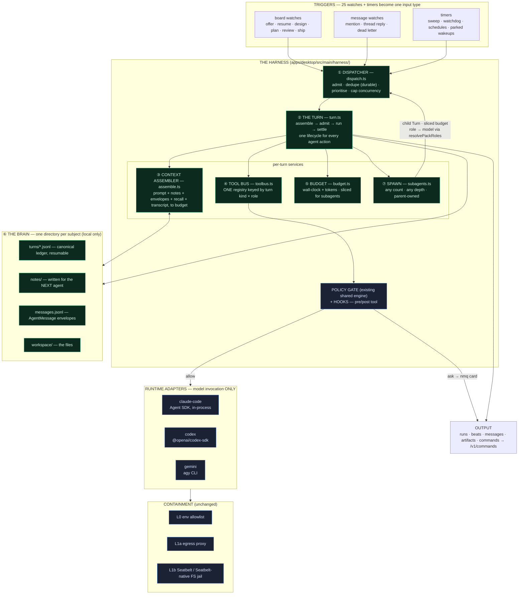
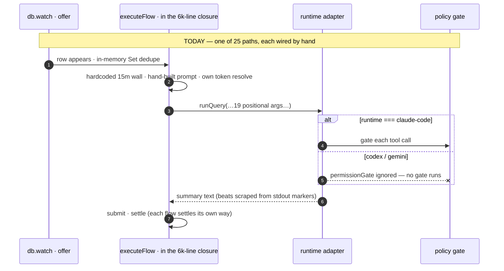
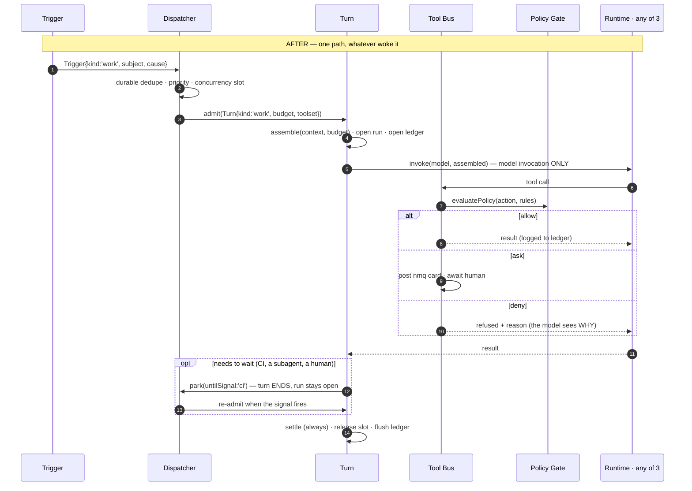
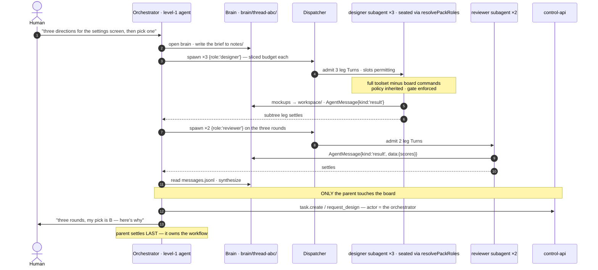

# 37 — The NeuraMesh Harness: one execution contract for every agent turn

> **What this doc is.** A design + implementation plan for making NeuraMesh's agent execution layer
> **first class**: one coordinated harness instead of ~30 independently-wired reactive paths. It is a
> **one-way-door decision** ([docs/05 §7](05-engineering-philosophy.md)) — it changes the security
> boundary, the tool contract, and the shape of `agents.ts` — so it is written down before it is
> built, and needs founder acceptance on §12's open rulings.
>
> Read [docs/09](09-system-architecture.md) first (how the system runs today). This doc changes only
> **Plane A**, the desktop daemon: no schema plane boundary moves, no write path changes, the board
> FSM is untouched.
>
> **The one sentence that explains everything:** today an agent's abilities, its limits, its
> permissions, and its dedupe depend on **which code path happened to wake it and which runtime it
> happened to be seated on**; the harness makes all four properties of **the turn**, declared once
> and enforced structurally.

**Prior art studied:** Google Antigravity's agent harness (7 subsystems: UI event bridge · brain ·
security policy · tool & subagent engine · extensibility · scheduler · provider matrix). We take its
*decomposition* — which is genuinely better than ours — including three things this doc's first draft
wrongly dismissed or under-scoped, and which were **founder-ruled in on 2026-07-31**: first-class
**subagents** (§7.0), a structured **brain directory** per subject (§6.1), and **structured JSON**
inter-agent messages (§7.2). What we still decline is narrower and listed in §8.

> **Revision note.** §§6.1, 7.0 and 7.2 replace the first draft's position that subagents should be
> capped at depth 1 and that the board is the only legitimate fan-out. That position confused two
> different things: *how work is assigned and accepted* (the board — unchanged) with *how an agent
> decomposes its own work* (unlimited, and not ours to cap). The correcting principle is the founder's:
> **if an agent fans out subagents, it owns that workflow** — and ownership gives us every invariant a
> depth cap was protecting, without the cap.

---

## 1. The honest audit: we are not starting from zero

Mapping Antigravity's subsystems onto what NeuraMesh ships **today**:

| Antigravity subsystem | NeuraMesh today | Verdict |
|---|---|---|
| **1. UI surfaces** | desktop · mobile · web; sessions shell + workspace tabs (docs/35, docs/36) | ✅ **ahead** — we have a whole collaboration surface, not a chat pane |
| **2. UI event bridge** | `emitStream` IPC ghosts + **`runs`** (docs/29, synced + cross-machine) + **`beats`** (docs/17) | ✅ **ahead** — their aux pane is machine-local; our runs sync to every teammate |
| **3. Brain & state** | `agent-logs.db` (run-scoped, local-only, 7-day) + pgvector memory spine + `memory_blocks`/facts/lessons | ⚠️ **partial** — richer *team* memory, but **no per-subject brain**, no canonical resumable transcript, no context budget (§6.1) |
| **4. Security & sandbox** | `packages/shared/src/policy.ts` (capabilities · scopes · locked rules) + `policygate.ts` (cards, risk tiers, intent elicitation) + L0 env allowlist + L1a egress proxy + L1b Seatbelt jail | ⚠️ **excellent engine, applied to 1 of 3 runtimes** — see §2.1 |
| **5. Tool & subagent engine** | per-runtime tool sets; `deepWorkQuery` legs — max 6, one level, parent's model for all, research tools only, gate bypassed; `runDueSchedules` (marketing only) | ❌ **the gap** — no unified registry, subagents crippled (§7.0), **no scheduler** |
| **6. Extensibility** | skills + skill packs (`load_skill`, `propose_skill`), MCP via `orchmcp.ts` loopback bridge (agy only) | ⚠️ **partial** — skills are strong; MCP is one-runtime; **no hooks**, no sidecars |
| **7. Provider matrix** | `runtime/adapter.ts` → `claude-code` · `codex` · `gemini`, BYOK + subscription auth policy | ✅ **shipped seam** — but the seam **leaks** (§2.2) |

**So the harness is not a new capability. It is the coordination layer that makes six existing
capabilities uniform.** That reframing matters for scope: this is mostly *extraction and
enforcement*, not greenfield — which is what lets it respect the wrapping-tax budget (§11).

---

## 2. What "left to chance" actually means — five concrete failures

Not adjectives. Each of these is in `main` today, with a citation.

### 2.1 The permission gate protects one runtime out of three

`packages/shared/src/policy.ts` is a genuinely good deterministic engine — capabilities, scopes,
`locked` workspace invariants, ReDoS-free selectors, "an agent's *intent* is governed by rules the
agent cannot talk its way past."

It is invoked from **two** call sites, both on the Claude path (the worker exec loop and the chat
turn). The other two runtimes:

- `runtime/gemini.ts:121` — `_permissionGate?: PermissionGate` — accepted and **discarded**.
- `runtime/codexsdk.ts:107` — the parameter is **not in the signature at all**.

So a workspace rule saying `shell.exec / destructive → deny` is **law on Claude and fiction on
Codex and Gemini**. Same for every `fs.read` deny on a credential path, every `net.egress` host
rule, every `ask` that should have posted a card to a human. The kernel sandbox (L1b) still holds
the structural floor — a Codex agent can't read `~/.ssh` — but *policy* is not enforcement today, it
is enforcement-if-you-drew-the-Anthropic-seat.

This is a doctrine §1.3 violation and, by §5.4 ("agent access = explicit machine-owner grants…
permission mode"), a **stop-ship-class** one. It is the single reason this work is P0.

### 2.2 An agent's abilities depend on its runtime, not its role

`RuntimeAdapter.runQuery` takes **19 positional parameters** (`runtime/adapter.ts:86`). Six of them
are tools, and the non-Claude adapters ignore all six. The comments say so plainly:

- `record_lesson` — "Claude-tool only today; CLI runtimes get their lessons mined host-side after approval instead."
- `add_backlog_item` — "Claude-tool only today, mirroring record_lesson."
- `declare_beats` / `advance_beat` — "CLI runtimes ignore it in v1."
- `propose_skill`, `screenshot`, `load_skill` — Claude only.

A Codex-seated worker therefore **cannot** park an out-of-scope discovery on the backlog, cannot
record a lesson, and cannot declare its plan — silently, with no error and nothing in the thread.
The human sees a worse teammate and has no way to know why.

Worse, the *workaround* is prompt etiquette: beats on CLI runtimes are driven by asking the model to
**print `NM_BEAT_DONE` markers into stdout**, which the daemon scans (`beats.ts` → `beatMarkerSink`,
`stripBeatMarkers`). That is a progress-tracking system whose reliability is the model's willingness
to echo a magic string. §1.3 exists to forbid exactly this.

### 2.3 There is no dispatcher — there are 29 independent triggers and 5 in-memory Sets

`agents.ts` is **7,798 lines**; `startAgentHost` opens at line 1721, so ~6,077 of them are a single
closure. Inside it: **25 `db.watch` registrations** and **4 `setInterval` timers**, each its own
reactive path, coordinated by process-local `Set`s — `claimed`, `reviewed`, `merged`, `reclaimed`,
`markedOnline`, plus `wakeStarted`/`wakeEnded` gating.

Consequences that are structural, not bad luck:

- **Dedupe dies with the process.** Only two real guards survive a restart: the server's atomic
  claim and the `0060` partial unique reply index. Everything else is memory. We have already paid
  for this twice — the wake-vs-sweep double-triage race (v0.32.1) and the cross-process wake-reply
  duplicate (v0.20.2), each fixed with a *durable* guard after an in-memory one proved blind.
- **No concurrency ceiling.** Five offers landing in one sync tick start five flows, each able to
  spawn a ~220 MB runtime CLI. Nothing in the system says "this machine runs at most N turns."
- **No priority and no fairness.** A human's chat message and a stall-watchdog re-offer compete by
  arrival order. The human should win; nothing encodes that.
- **A flow cannot be tested.** Every flow closes over `db`, `post`, `apiUrl`, `agents`, and 40 sibling
  functions, so there is no unit test of `executeFlow` — only of the pure helpers beside it.

### 2.4 No budget authority

**Eleven distinct hardcoded wall-clock caps** across call sites: 60s (channel block, checklist), 4m
(chat, orchestrator, thread), 6m (deep-work synthesis), 7m (research legs), 8m (deep-work leg), 10m
(decision await), 12m (chat-mode turn, CI wait), 15m (worker exec), 25m (release verify). They were
each locally reasonable and collectively describe no policy. **Token budgets do not exist at all.**

Context assembly has the same shape: each flow hand-rolls its own transcript with an arbitrary SQL
row cap — `limit 8` (chat), `limit 14` (orchestrator), `limit 24` (chat mode) — chosen per call site,
with no notion of what actually fits or what it costs.

### 2.5 A turn cannot outlive itself, and we tell the model so

From the shipped worker prompt (`runtime/adapter.ts:281`):

> *"YOUR TURN IS THE EXECUTION. Nothing you start survives it: there are no background agents that
> keep working after you stop, no scheduled check-in that calls you back, no later turn to finish
> in."*

That paragraph is **true**, correctly written, and the clearest possible statement of a missing
capability. It is why a worker that needs to wait 6 minutes for CI either blocks a 15-minute wall or
gives up, and why `waitForCi` had to be re-implemented as host-side polling outside the model's
reach. Antigravity's `schedule(DurationSeconds, Prompt, TimerCondition)` — go idle, be woken
reactively, never poll — is the missing primitive, and we already own every piece needed to build it
(`runs` rows, the sweep tick, the wake path).

---

## 3. The harness in one picture



**Note the loop:** `spawn` re-enters the **dispatcher**, not the runtime. A subagent is an ordinary
Turn — it queues for a slot, gets a sliced budget, passes the same gate, and writes to the same brain.
That is what makes unbounded fan-out safe rather than a new privileged path.

**The load-bearing claim:** every arrow into a runtime passes through the tool bus and the gate.
A runtime adapter shrinks to *model invocation only* — it can no longer choose to ignore a tool or a
permission check, because it never receives them as optional parameters again.

---

## 4. ② The Turn — the unit that replaces nine bespoke flows

Today there are nine hand-written flows with nine shapes: `claimFlow`, `executeFlow`, `reviewFlow`,
`architectFlow`, `designerFlow`, `shipperFlow`, `wake`, `orchestratorTurn`, `chatTurn`. They share
concepts (a run, a budget, a token, a status, a log, a settle) and share **no code**.

A **Turn** is that shape, declared:

```ts
// packages/shared/src/harness.ts — shared so the server can validate a kind's tool set
export type TurnKind =
  | 'chat'        // a conversation reply (docs/34)
  | 'triage'      // an orchestrator turn
  | 'design'      // mockup round (docs/14)
  | 'plan'        // architect + Definition of Done
  | 'work'        // the coding/deliverable loop
  | 'review'      // reviewer verdict
  | 'ship'        // release plan (docs/23)
  | 'sweep'       // digest / watchdog triage
  | 'deep'        // researched long-form work (docs/29 `work` run)
  | 'leg';        // a spawned subagent (§7.0) — any count, any depth, parent-owned

export interface Turn {
  id: string;              // === run_id. The run IS the turn, made durable (docs/29)
  kind: TurnKind;
  agent: HostedAgent;      // seat already resolved (project/thread brain — docs/10)
  subject: { workspaceId: string; channelId: string; threadId?: string; taskId?: string };
  trigger: Trigger;        // what woke it, retained for the ledger and for re-arm
  budget: Budget;          // §6 — never a literal at a call site
  toolset: ToolName[];     // §5 — resolved from kind × role, not from runtime
  brain: string;           // §6.1 — the subject's brain dir; SHARED with subagents + siblings
  parentTurnId?: string;   // §7.0 — set on every subagent, to any depth (runs.parent_run_id)
}
```

And exactly one lifecycle, in `turn.ts`:

| Phase | Does | Fails how |
|---|---|---|
| **assemble** | resolve seat + credential; build context to budget (§6); open the `runs` row; open the ledger | credential blocked → auth card, no run opened |
| **admit** | dispatcher already reserved the slot; stamp presence via the existing pump | never fails here (admission happened upstream) |
| **run** | `runtimeFor(agent.runtime)` × the bus-provided toolset, under one `AbortController` and one wall | timeout / abort / cap → settle `failed`/`stopped`, ledger retains the partial |
| **settle** | terminal state on the run, clear presence, flush ledger, release the dispatcher slot | **`finally`, always** — an unsettled run is an eternal spinner on every machine |

**What this buys immediately:** the `finally`-settle discipline that `wake` gets right today
(agents.ts:7789) becomes structural for all ten kinds, instead of nine separate chances to forget.

---

## 5. ④ The Tool Bus — abilities belong to the turn, not the runtime

One registry. A tool is declared once, with the kinds and roles that may call it:

```ts
// harness/toolbus.ts
registerTool({
  name: 'add_backlog_item',
  kinds: ['work', 'review', 'chat', 'triage'],   // NOT 'design' | 'plan'
  roles: '*',
  capability: null,                               // an nm command, not a machine action
  schema: z.object({ title: z.string(), description: z.string().optional(), parent: z.boolean().optional() }),
  run: (ctx, input) => ctx.command('task.create', { ...input, backlog: true }),
});
```

Resolution is `toolsFor(kind, role)` — **the runtime is not an input.** Delivery differs by runtime,
and that is the adapter's only remaining job:

| Runtime | Delivery |
|---|---|
| `claude-code` | in-process SDK tools (as today) |
| `codex` | per-thread MCP config → the loopback bridge |
| `gemini` | the existing `orchmcp.ts` stdio shim → the loopback bridge |

**`orchmcp.ts` already proves this works** — it exposes the orchestrator's in-process tool closures
to `agy` over a per-turn secret-guarded loopback HTTP endpoint. The harness generalises it from *one
turn kind on one runtime* to *every turn kind on every runtime*. That is the single highest-leverage
piece of reuse in this plan: the mechanism is shipped, tested, and understood; only its scope is new.

**Three enforcement properties fall out of the bus, structurally:**

1. **Every tool the bus mediates is gated**, for all three runtimes — by construction, since there is
   no parameter left to ignore. **Correction (2026-07-31, from building it):** per-call policy over a
   runtime's *own* Read/Write/Bash needs a vendor hook, and only `claude-code` has one — `codex`
   exposes `approvalPolicy` as a policy string with no approval event to answer, and `agy` admits no
   hook at all. So §2.1's capability drift closes completely, while its *policy* gap narrows and is
   now **declared** (`capabilities.gatesNativeTools`) instead of silently absent. Full verification:
   [docs/harness/03](harness/03-tools.md).
2. **Beats stop being prompt etiquette.** `declare_beats` / `advance_beat` become ordinary bus tools
   available to every runtime; `NM_BEAT_DONE` stdout scanning and `stripBeatMarkers` are **deleted**.
3. **Chat mode's guarantee generalises.** docs/34's "the chat turn is built from a registry with no
   `create_task` in it" stops being a special case and becomes how every kind works. A `design` turn
   physically has no `submit`; a `review` turn physically has no `task.accept`.

**Hooks** ride the same choke point — `pre_tool` / `post_tool`, machine-local, from workspace config
(`lint after Edit`, `deny on secret-shaped diff`). Deferred to P4, but the seam is the bus, so it
costs nothing to add later.

---

## 6. ⑤⑥ Budget, context, and the brain

**Budget** — one table, replacing eleven literals. Wall-clock stays roughly where the current numbers
sit (they were individually sane), so this is codification, not re-tuning:

| Turn kind | Wall | Context tokens | Notes |
|---|---|---|---|
| `chat` | 12m | 40k | may research + write + run code |
| `triage` | 4m | 24k | a triage budget, deliberately tight |
| `design` | 20m | 32k | mockup rounds are generative |
| `plan` | 15m | 48k | read-only study workspace |
| `work` | 15m + **park** | 64k | park (§7.1) removes the reason to raise this |
| `review` | 10m | 48k | diff + DoD + CI |
| `ship` | 10m | 32k | |
| `sweep` | 4m | 16k | |
| `deep` | 30m | 64k | the parent of a fan-out |
| `leg` | **a slice of the parent's remaining** | slice | §7.0 — budget is the recursion terminator, not a depth cap |

**Context assembler** — `assemble(turn, budget)`, one function, replacing per-call-site `limit N`
SQL. Fills in priority order until the token budget is spent: system contract → task/thread facts →
Definition of Done + requirements → rework notes → lessons → recall hits → transcript tail →
skills → attachments manifest. Transcript is the **first** thing trimmed, because it is the only
input that degrades gracefully. Pure and unit-testable: given rows + a budget, the output is fixed.

### 6.1 The brain directory — one per subject, shared by every agent on it *(founder ruling, 2026-07-31)*

The gap this closes is the one an earlier draft under-weighted: **there is no place where the shared
working state of a conversation or a task lives.** Today a thread's state is scattered across
`agent-logs.db` (keyed by agent + run), `~/.neuramesh/chats/nm-<threadId>` (files only), a task
worktree (files only), and a SQL transcript tail with an arbitrary `limit 24`. So when a second agent
is woken in a thread — or the orchestrator hands a designer a conversation, or a subagent needs to
know what its parent already established — the arriving agent gets a truncated transcript and
nothing else. Not what the previous agent *learned*, *decided*, or *wrote down*.

**One directory per subject, not per agent and not per turn.** That is the whole idea, and the reason
it is per *subject* is that a subject outlives every agent that touches it:

```
~/.neuramesh/brain/<subject>/          # subject = thread-<id> | task-<number>
  subject.json        # identity, kind, participants so far, created/updated
  turns/<turnId>.jsonl  # the canonical per-turn ledger — every assembled block, tool
                        # call, gate verdict, model event; replayable and resumable
  notes/*.md          # durable notes an agent writes FOR THE NEXT AGENT
  messages.jsonl      # the AgentMessage envelope log (§7.2) — subagent results,
                      # handoffs, the causal chain
  workspace/          # the files (today's chats/ dir and scratch deliverables)
  index.json          # the assembler's manifest: what exists, how fresh, how big
```

The ledger stops being a separate concept: **`turns/` *is* the ledger, filed under the subject it
belongs to** instead of scattered. Same for a subagent — its ledger lands in its parent's brain,
which is precisely how the parent collects results and how a sibling reads them.

**What only a brain can do:**

- **A new agent on a thread starts warm.** `assemble()` reads `index.json` → notes, recent envelopes,
  the transcript tail. An arriving designer inherits what the orchestrator established.
- **Resume.** A turn killed by a crash, a quit, or a runtime hang resumes from its last committed
  ledger step. Today `resumeFlow` re-runs the whole attempt.
- **Swap mid-turn.** A capped Claude turn (the docs/22 capacity-failover path) continues on Codex from
  the same ledger, rather than re-seating and starting over.
- **Subagents share context without a network.** A parent's spawn hands a subagent a brain path, not a
  copied prompt.

**The brain is portable, and credentials are not.** The brain is the machine's **single local state
root** (`~/.neuramesh/`), absorbing the databases that live in Electron's `userData` today — which is
also what makes a headless harness possible. It is tiered by durability, so it can be exported and
restored on another machine:

| Tier | Contents | In an export |
|---|---|---|
| **A — irreplaceable** | `subjects/` (ledgers, notes, envelopes, produced files), `attachments/`, settings | **yes — the point of the feature** |
| **B — rebuildable** | the replica, the activity log | optional (a warm start) |
| **C — machine-bound** | worktrees + clones (absolute-path bound), sessions, keychain credentials, runtime CLI logins | **never** |

Two things this must be precise about. **Projects, conversations, agents, artifacts and memory are
already restored by signing in** — that is cloud truth via PowerSync, and needs no file transfer; the
brain carries what sync *cannot*, which is your agents' memory of doing the work. And **credentials
never travel**: sessions and keys stay machine-bound ([doctrine §5.4](05-engineering-philosophy.md)),
which is exactly why the restore flow is *copy → **sign in** → adopt agents → re-authenticate providers*.
Since Tier A contains turn ledgers, there is **no unencrypted export path**.

Durable learning still promotes to the memory spine (`facts`, lessons) rather than depending on someone
having remembered to run an export. Full specification, including the machine-adoption step and the
migration off today's split roots: **[docs/harness/01-brain.md](harness/01-brain.md)**.

`agent-logs.db` stays exactly as it is: it remains the **human-readable summary feed** the runs UI
reads. The brain is the **machine-readable canonical record**. Retention matches (7 days + a hard
cap), and a brain is reclaimed with its worktree on `accepted`/`closed`.

---

## 7. The capabilities we don't have

### 7.0 `spawn` — subagents, owned by their parent *(founder ruling, 2026-07-31)*

**An agent may fan out as many subagents as the work needs, to any depth. If it fans them out, it
owns that workflow.** Ownership is the invariant that makes unbounded fan-out safe — not a depth cap,
which is what an earlier draft of this doc proposed and which was wrong.

**Roles are configuration, not a permission tier.** A role already means two things in this codebase
and neither is a boundary: *which model* (`resolvePackRoles(packId) → Record<AgentRole, string>`, with
per-thread `BrainOverride` exceptions — docs/10) and *which system prompt*. So
`spawn({ role: 'designer' })` means "seat this subagent with whatever model the active pack assigns
to `designer`, and the designer's prompt." The orchestrator spawning three designers, two reviewers,
and five developers is seating five model configurations — it is not granting anyone authority.

**This needs no new config surface at all**, which is the strongest evidence the design is right: it
reads the exact same seat-resolution path a level-1 agent reads.

#### What a subagent is, precisely

| | Level-1 agent (a teammate) | Subagent (a unit of execution) |
|---|---|---|
| row in `agents` | **yes** — rostered, registered to channels, offerable, retireable | **no, by design** |
| appears in a room roster | yes | no |
| can be offered board work | yes | no |
| issues board commands | yes, as itself | **never** — the parent is the actor |
| lives in | the workspace | its parent's run tree (`runs.parent_run_id`) + brain (§6) |
| accountable for its output | itself | **its parent** |

Keeping subagents **out of the `agents` table** is what preserves every board invariant for free. A
subagent has no `agents` row, so it cannot be a command actor, cannot be an assignee, cannot be a
reviewer, cannot appear as `offered_agent_id`. The FSM does not need a single new guard: there is no
identity for it to guard against.

#### The ownership rule, stated so it can be enforced

1. **The parent's turn does not settle until its whole subtree settles.** Already the de-facto pattern
   in `startDeepWork` (agents.ts:1983–2027): `mapCapped` over legs → synthesis → `parent.settle`. The
   harness makes it structural for every kind.
2. **The parent inherits authorship.** If the orchestrator spawns developer-subagents that write code,
   the *orchestrator* is the author of that code — and authorship still owes the board everything it
   owed before: a task, a submit with artifacts, a reviewer who is not the author, a human accept.
   Subagents make an author faster. They do not make one exempt.
3. **A subagent's policy is its parent's, and can only narrow.** The effective rules are inherited;
   `spawn` may pass a *more* restrictive set, never a broader one. A `locked` workspace rule is
   locked all the way down.
4. **A subagent's toolset is its parent's minus every board command.** Resolved by the bus (§5) as
   `toolsFor('leg', role)`. There is no `task.submit` in a `leg` turn's registry to call.
5. **A failed subagent is reported, never hidden.** Today's leg failure path already does this
   ("a dead leg is REPORTED, not hidden") and it becomes the rule.

#### Budget is the recursion terminator

Unbounded *count* must not mean unbounded *resource*, or one runaway orchestrator spawns 200 CLI
processes and the machine dies. So depth and breadth are bounded by **budget, not by a literal**:

- A subagent's budget is a **slice of its parent's remaining** wall-clock and context (§6).
- `spawn` fails when the parent's remaining budget cannot fund a viable child — the same shape as the
  token-budget loops in our own tooling: recursion terminates because budget is finite.
- **Concurrency is a machine resource**, owned by the dispatcher's slot pool (§4), not by a per-feature
  constant. `MAX_LEG_CONCURRENCY = 3` becomes the dispatcher's cap; `MAX_LEGS = 6` is **deleted** —
  it is a count limit standing in for a resource limit.

This is the honest limit, and it is worth saying why it is better than a depth cap: a depth cap says
"you may not decompose further," which is a statement about *permission* and is not ours to make. A
budget says "this is what the machine has," which is a statement about *physics* (§2 doctrine).

#### What changes to build it

| Piece | Today | Change |
|---|---|---|
| leg count | `MAX_LEGS = 6` | deleted — budget-bounded |
| leg concurrency | `MAX_LEG_CONCURRENCY = 3` | becomes the dispatcher's slot pool |
| leg model | **the parent's own model for every leg** | per-subagent, via `resolvePackRoles(role)` |
| leg tools | research only (`WebSearch/WebFetch/Read/Grep/Glob`) | full bus toolset for its kind, minus board commands |
| leg permissions | **`permissionMode: 'bypassPermissions'`** (agents.ts:1946) | the gate, inherited from the parent — this is a §2.1 instance |
| leg depth | 1 | unbounded, budget-bounded |
| runs UI | `legsBy` is a **one-level** map; `!parent_run_id` = root (App.tsx:1944–1950) | recursive grouping, collapsed beyond depth 2 |

Note the fifth row: **today's legs bypass the permission gate entirely.** That is the same failure as
§2.1 wearing different clothes, and it is another reason P0 comes first.

### 7.1 `park` — the scheduler (Antigravity §4, and our §2.5)

```ts
park({ afterSeconds?: number, untilSignal?: 'ci' | 'subagents' | 'reply', prompt: string })
```

The turn **ends cleanly**. The run settles into a new descriptive state — `parked` — and a durable
row records the wake condition. The dispatcher's tick (already running: `stall.ts`'s 5-minute
watchdog and 15-minute sweep) re-admits it as a fresh turn whose assembled context is its own
ledger plus the wake reason.

Why this matters more than it sounds: **it is the difference between a 15-minute ceiling and work
that takes as long as it takes.** A worker waiting on CI parks for 6 minutes at zero token cost
instead of burning a wall. And the payoff is a *deletion*: when park ships, the "nothing you start
survives it" paragraph comes out of the worker prompt, because it stops being true.

`RUN_STATES` gains `parked` and `RUN_TERMINAL_STATES` does **not** — parked is open, so every
existing `isRunOpen` consumer keeps painting the run as live, which is exactly right.

### 7.2 The message envelope — structured, not scraped *(founder ruling, 2026-07-31)*

Antigravity's typed inter-agent communication is the right call, and adopting it is the cure for a
problem §2.2 only half-named. Agent-to-agent communication today runs over **six ad-hoc text
protocols**: ` ```nmq ` fences (cards), ` ```nms ` fences (suggestions), `NM_BEAT_DONE` stdout
markers (beats), `SKILL_MARKER` (attached skills), mode-divider markers, and `**question** → answer`
reply lines. Each was reasonable alone; together they are a parser surface with no schema.

One envelope, in `packages/shared/src/harness.ts`:

```ts
export interface AgentMessage {
  id: string;
  from: { kind: 'agent' | 'subagent' | 'human'; id: string; turnId?: string };
  to:   { kind: 'agent' | 'subagent' | 'parent' | 'thread'; id?: string };
  kind: 'request' | 'result' | 'progress' | 'question' | 'handoff' | 'failure';
  subject: { workspaceId: string; channelId: string; threadId?: string; taskId?: string };
  body: { text?: string; data?: unknown };  // prose for humans, data for machines
  refs?: string[];       // artifact ids, brain-relative file paths, turn ids
  causedBy?: string;     // the message this answers — the causal chain
}
```

**The human-readable thread message is a *projection* of the envelope, not a separate thing.** A
human reading the thread sees prose; the harness reads `body.data`. This is the same discipline as
`events` → projected `tasks`, and it means adopting the envelope does not change what anyone reads.

**Scope, stated tightly so we don't invent a second messaging plane.** The envelope is the
**in-turn / in-brain** transport: subagent → parent, parent → subagent, turn → brain. Cross-team,
cross-machine communication stays exactly what it is today — synced `messages` plus board commands,
enforced server-side. We are not building a second network. A subagent result never travels the
wire; it travels the parent's brain directory (§6).

What this replaces, concretely: `beatMarkerSink` / `stripBeatMarkers` (deleted in P0), the leg-result
string concatenation in `startDeepWork` (`findings.push(\`### ${leg.name}\n\n...\`)` — prose today,
`AgentMessage[]` after), and the reply-line answer parser.

---

## 8. What we deliberately do not take from Antigravity

Being explicit, because a future agent will read their doc and wonder.

**Not on this list any more:** subagents (§7.0) and structured messages (§7.2) — an earlier draft
rejected the first and under-scoped the second. Both were founder-overruled on 2026-07-31, correctly.
The boundary that survives is narrower and sharper: **subagents are how an agent does its own work;
the board is how work is assigned and accepted.** A subagent can write code, but the code still
reaches `main` only through its parent's PR, a reviewer who is not the parent, and a human accept.
Nothing about §7.0 touches the FSM.

1. **Sidecars** (harness-managed dev servers / watchers). The human already has the dock and the
   Browser pane; agents run in disposable worktrees where a long-lived server is a leak, not a
   feature. No demo story (§4 doctrine) → not built.
2. **An "HTML auxiliary pane."** We have runs, beats, tabs, and the needs-you queue, all synced to
   every teammate rather than local to one IDE. Adopting their surface would be a downgrade.
3. **A full context compressor.** Their window-compressor is real engineering we do not yet need. We
   ship the **budget** and the **assembler seam** now; compression lands behind that seam if and when
   measurements demand it (§8 doctrine: build for the next order of magnitude, not the hypothetical).

---

## 9. The new flow, once the harness is live

### 9.1 What the human sees

Nothing changes about the board, the FSM, the rooms, or the tabs — and that is the point. What
changes is that **the experience stops depending on which runtime an agent is seated on**:

- A Codex-seated worker declares beats, records lessons, and parks backlog items — like a
  Claude-seated one. The phase spectrum and beats ticker fill in for every agent.
- A permission card appears for **any** agent about to run something risky, on any runtime, at any depth.
- **An agent that needs help gets it.** Ask for three design directions and three designers run in
  parallel, on the model the pack assigns to `designer`, nested under the run that asked. The rail shows
  the tree; the parent reports once, and is answerable for all of it.
- **A conversation stops losing what it knew.** A second agent woken in a thread arrives with the first
  one's notes and results, not a truncated transcript.
- Long work stays visibly alive: a parked run keeps its ring, with "waiting on CI" as its step line.
- An agent that dies mid-turn resumes where it stopped instead of restarting from zero.

### 9.2 Before → after, on one worker turn





### 9.3 A fan-out, owned end to end

The case George named: the orchestrator spawns designers, reviewers and developers, each seated on the
role's configured model, and **owns the whole workflow**. Note what does *not* happen — no subagent
touches the board.



Depth is not special: any of those subagents may spawn its own, and the same four things hold — sliced
budget, inherited policy, no board tools, parent settles last.

### 9.4 What an agent can newly do

| Capability | Today | With the harness |
|---|---|---|
| declare/advance beats | Claude only (stdout markers elsewhere) | every runtime, as a real tool |
| record a lesson | Claude only | every runtime |
| park a backlog item / create a subtask | Claude only | every runtime |
| be permission-gated | Claude only (and **legs bypass it**) | **every runtime, every depth** |
| **fan out subagents** | deep-work only · max 6 · one level · parent's model for all · research tools only | **any count, any depth**, per-role models, full toolset, budget-bounded (§7.0) |
| **inherit what the last agent learned** | a `limit 24` transcript tail | the subject's brain — notes, envelopes, ledger (§6.1) |
| **report a subagent result** | prose string concatenation | `AgentMessage` envelopes (§7.2) |
| wait on CI / a human / a subagent | ✗ (burns the wall or gives up) | `park` — zero-cost, re-woken |
| survive a crash mid-turn | ✗ (restarts the attempt) | resume from the brain's ledger |
| continue after a usage cap | re-seat + restart | swap runtime, same ledger |

---

## 10. Enforcement map — where each invariant actually lives

Doctrine §1.3 says invariants live in the server and the schema. The harness runs on the machine, so
being precise about this is non-negotiable:

| Invariant | Enforced where | Why there |
|---|---|---|
| a turn kind's tool set | **bus registry** (built without the tool) **+ server rejects the command** | the docs/34 double-enforcement pattern, generalised: a tool you were never handed *and* a command the server refuses |
| FSM legality, self-review, artifact-less submit, human-only gates | **server + Postgres trigger** (unchanged) | the harness never becomes an enforcement point for board rules |
| policy verdict (allow/ask/deny) | **machine**, from **synced** rules; `locked` rules unoverridable | the action happens on the machine; the *rules* are team truth |
| the gate cannot be skipped **for bus tools** | **structural** — the bus is the only path to a bus tool | not a parameter a runtime may drop (that was the bug) |
| per-call policy over **native** tools | **the vendor SDK** — `claude-code` only, declared via `capabilities.gatesNativeTools` | a limit we do not control; declared rather than hidden |
| containment floor | **kernel** (L0/L1a/L1b, unchanged) | a `deny` must be physically binding, not merely decided |
| concurrency + dedupe | **machine** (durable `harness.db`) **+ server atomic claim** | slots are a machine resource; cross-machine truth stays the server's |
| **a subagent cannot act on the board** | **absence of an `agents` row** — no identity to be an actor, assignee, or reviewer with — **+ no board tool in the `leg` registry** | the strongest kind of enforcement: not a rejected attempt, an impossible one |
| **a subtree cannot exceed its root** | **budget slicing** in the harness | recursion terminated by physics, not by a permission a model could argue with |
| **the parent answers for its subtree** | **turn lifecycle** — parent settles last; parent is the command actor | ownership made structural, per the 2026-07-31 ruling |

---

## 11. Phasing — six slices, each shippable alone

Ordered by *risk closed per line changed*. No slice depends on a later one.

The three founder rulings of 2026-07-31 reorder this. Subagents (§7.0) are the headline capability, but
they are **worth building only on top of hierarchical budget (P1) and the shared brain (P2)** — without
budget they are a fork bomb, and without the brain a subagent gets a copied prompt instead of context.
So subagents land at P3, and everything before them is what makes them safe.

### P0 — Close the gate hole *(the stop-ship fix; no new surface)*
Tool bus + universal policy gate. `codex`/`gemini` tool calls route through the bus; the gate runs for
all three — **and for legs**, whose `permissionMode: 'bypassPermissions'` is removed.
`declare_beats`/`advance_beat`/`record_lesson`/`add_backlog_item` become bus tools; delete
`beatMarkerSink` + `stripBeatMarkers`.
**Evidence:** a test per runtime proving a `deny` rule blocks and an `ask` posts a card; the same test
for a leg; a Codex worker's beats visible in the tracker; the marker-based beat tests deleted with
their mechanism.

### P1 — Dispatcher + Turn + hierarchical Budget *(extraction, behaviour-preserving)*
25 watches become trigger producers; `dispatch.ts` owns admission, durable dedupe, priority, and the
**slot pool** (absorbing `MAX_LEG_CONCURRENCY`). Nine flows become ten turn kinds. The budget table
replaces eleven literals — and budgets become **sliceable**, because that is the mechanism that
terminates subagent recursion in P3.
**Evidence:** `agents.ts` under 2,500 lines; unit tests for `nextTurn()` (priority, cap, dedupe across
a simulated restart) and for budget slicing (a subtree cannot exceed its root); loop-level test that N
simultaneous triggers run at most `cap`; **measured wrapping tax before/after** (§12).

### P2 — The brain + ledger + the message envelope *(George's #2 and #3)*
`~/.neuramesh/brain/<subject>/` with `turns/`, `notes/`, `messages.jsonl`, `workspace/`, `index.json`.
`assemble()` reads the brain instead of five ad-hoc SQL queries. `AgentMessage` replaces the leg-result
string concatenation and the reply-line parser. `resumeFlow` resumes from the last committed ledger step.
**Evidence:** a second agent woken in a thread demonstrably starts with the first agent's notes (not a
`limit 24` tail); kill the daemon mid-`work` turn → the resumed turn does not repeat committed steps;
a brain is reclaimed with its worktree on `accepted`.

### P3 — Subagents *(George's #1 — the headline)*
`spawn({ role, prompt, model?, budget? })` opens a child Turn of kind `leg` that re-enters the
dispatcher. `MAX_LEGS` deleted. Per-subagent seating via `resolvePackRoles`. Unbounded depth. Parent
settles only when its subtree settles; parent is the command actor throughout. Runs UI grouping becomes
recursive (App.tsx:1944), collapsed beyond depth 2.
**Evidence:** an orchestrator turn spawning 3 designers + 2 reviewers on different models, nested
correctly in the runs tree; a subagent that tries a board command finds no such tool AND is rejected
server-side; a subtree that exhausts its budget fails its parent cleanly instead of hanging; a depth-4
tree renders without breaking the rail.

### P4 — `park`
`RUN_STATES += 'parked'`; the durable wake row; the dispatcher tick re-admits. **Then delete the
"nothing you start survives it" paragraph** from the worker prompt. Independent of P2/P3 — it can land
any time after P1 if it is wanted sooner.
**Evidence:** a worker parks on CI and resumes on the pass, total wall > 15m, tokens spent while
parked = 0.

### P5 — Hooks
`pre_tool` / `post_tool` on the bus, from workspace config.
**Evidence:** a post-`Edit` lint hook firing; a `deny`-on-secret-shaped-diff hook blocking.

**Deliberately out of scope:** sidecars, context compression, an aux pane (§8).

---

## 12. Budgets, risks, and the open rulings

**The budget that governs this work** is §6's *agent wall-clock overhead vs raw Claude Code < 10%* —
the wrapping tax gate, and our named cautionary tale (T3 Code's 3×). A harness is exactly the shape
of change that breaks it.

How the design respects it:

- The bus is **in-process for Claude** (no transport added on the default path) and reuses the
  already-measured loopback bridge for the CLIs.
- Assembly and dispatch are **pure functions over rows already in the replica** — no new network hop,
  no new vendor in the hot path (§8 doctrine).
- **P1's evidence gate is a measured before/after**, not a claim. If the tax regresses, P1 does not
  land.

**Risks, named:**

| Risk | Mitigation |
|---|---|
| A 7.8k-line refactor breaks the loop | P0 adds no structure; P1 is behaviour-preserving with loop-level tests; slices land separately |
| The loopback bridge adds per-tool-call latency on CLIs | measure in P0; CLI runtimes already pay CLI-spawn cost that dwarfs a loopback call |
| **Unbounded subagents become a fork bomb** | budget slicing (P1) is a hard precondition for P3, and concurrency is the dispatcher's slot pool — a subtree cannot exceed its root's wall or context, and cannot outrun the machine's slots |
| **A subagent smuggles work past review** | it has no `agents` row, so it cannot be a command actor, an assignee, or a reviewer; the parent is the author and owes the board a PR, a reviewer ≠ itself, and a human accept (§7.0) |
| **The brain becomes a second source of truth** | it is a local working set with 7-day retention; the thread stays cross-machine truth and durable learning is promoted to `facts`/lessons (§6.1) |
| `park` invites agents to defer instead of finish | park needs an explicit signal or duration; the stall watchdog (docs/19) already flags stale waits — a parked turn with no progress is a stall |
| Brain/ledger grows without bound | same retention discipline as `agent-logs.db` (7 days + hard cap), same privacy rule, reclaimed with the worktree |

**Settled by founder ruling, 2026-07-31:**

- ✅ **Subagents are first class**, unbounded in count and depth, owned by their parent (§7.0). Roles are
  model/prompt configuration, never a permission tier.
- ✅ **A structured brain directory per subject**, so an arriving agent inherits what the last one
  learned (§6.1).
- ✅ **Structured JSON for inter-agent and subagent communication** (§7.2), replacing the six ad-hoc
  text protocols.

**Still open — needed before the phase named:**

1. **Should the orchestrator author code at all?** (before P3) §7.0's ownership rule makes it *legal*:
   an orchestrator that spawns developer-subagents becomes the author and still owes the board a PR, a
   reviewer, and a human accept. Legal is not the same as wanted — a room where the orchestrator writes
   code is a different product from one where it routes. This is a product call, not a harness call, so
   the harness will permit it and the *prompt* will decide.
   *Recommendation: permit structurally, and keep the orchestrator's own prompt pointed at routing —
   revisit once we have watched it happen in this repo.*
2. **Turn budgets fixed, or a workspace setting?** (before P1) Fixed keeps the product honest and the
   support surface small; configurable is what a team with a 40-minute test suite will ask for. Now
   load-bearing for subagents, since the root budget is what bounds a subtree.
   *Recommendation: fixed in P1, per-project overrides only when asked for.*
3. **Does `park` need a server-side row?** (before P4) Machine-local is simpler and respects "local
   compute"; server-side lets **another** machine resume a parked turn.
   *Recommendation: `runs.state='parked'` is already synced (descriptive) + the wake condition local.
   Cross-machine resume is a later question, not a P4 blocker.*
4. **Does the brain change the docs/09 §13 code-surface ruling?** (before P2) It records file contents
   and command output per subject. It is local-only under the existing locked 2026-06-13 privacy
   decision, so we believe not — but it is adjacent enough to say out loud rather than assume.

---

## 13. Code map (target shape)

| Concern | File |
|---|---|
| Turn + trigger types, turn kinds, `AgentMessage` (shared with server) | `packages/shared/src/harness.ts` |
| Dispatcher: admit · dedupe · priority · slot pool | `apps/desktop/src/main/harness/dispatch.ts` |
| Turn lifecycle: assemble → admit → run → settle | `apps/desktop/src/main/harness/turn.ts` |
| Tool registry + gate + hooks (the one choke point) | `apps/desktop/src/main/harness/toolbus.ts` |
| Context assembly from the brain, to budget | `apps/desktop/src/main/harness/assemble.ts` |
| Budgets per turn kind + **slicing for subtrees** | `apps/desktop/src/main/harness/budget.ts` |
| Brain directory: layout, ledger, notes, envelopes, reclaim | `apps/desktop/src/main/harness/brain.ts` |
| **Subagents: spawn · seat by role · subtree settle** | `apps/desktop/src/main/harness/subagents.ts` |
| Park: wake conditions + re-admission | `apps/desktop/src/main/harness/park.ts` |
| Runtime adapters (**model invocation only**) | `apps/desktop/src/main/runtime/*.ts` |
| Role → model seating (**reused, unchanged**) | `packages/shared/src/model-packs.ts` (`resolvePackRoles`) |
| Policy engine (unchanged) | `packages/shared/src/policy.ts`, `main/policygate.ts` |
| Containment (unchanged) | `apps/desktop/src/main/sandbox/*.ts` |
| Watches → trigger producers; flows → turn kinds | `apps/desktop/src/main/agents.ts` (shrinking) |
| Recursive run-tree grouping | `apps/desktop/src/renderer/src/App.tsx:1944` |

---

## 14. The engineering handbook

This document is the **decision record** — the audit, the rulings, the phasing, the risks. The
component-level specification lives in **[docs/harness/](harness/README.md)**, which is written to be
published externally and is updated as each phase lands:

| | Doc | Covers |
|---|---|---|
| 00 | [Overview](harness/00-overview.md) | architecture, subsystems, invariants, glossary |
| 01 | [Brain & State](harness/01-brain.md) | the state root, the ledger, **portability**, migration |
| 02 | [Communication](harness/02-communication.md) | the `AgentMessage` envelope, projections |
| 03 | [Tools](harness/03-tools.md) | the bus, the registry, the gate, hooks |
| 04 | [Subagents](harness/04-subagents.md) | `spawn`, ownership, seating, budget slicing |
| 05 | [Execution](harness/05-execution.md) | dispatcher, turn lifecycle, budgets, `park` |
| 06 | [Runtimes](harness/06-runtimes.md) | the provider matrix, the narrowed adapter contract |
| 07 | [Security](harness/07-security.md) | policy, containment, the credential boundary |
| 08 | [Observability](harness/08-observability.md) | runs, beats, activity log, ledger |
| 09 | [CLI](harness/09-cli.md) | the headless harness (exploratory) |

When the two disagree, this document wins on *why* and the handbook wins on *how* — and the disagreement
is a bug to fix in the same change.

---

## 15. Further reading

- [09-system-architecture.md](09-system-architecture.md) — how the system runs today (Plane A is what this doc changes).
- [05-engineering-philosophy.md](05-engineering-philosophy.md) — §1.3 enforced-not-prompted and §6 the wrapping tax, the two constraints that shaped this.
- [17-beats.md](17-beats.md) · [29-runs.md](29-runs.md) — the progress + live-work primitives the harness makes uniform.
- [19-stall-watchdog.md](19-stall-watchdog.md) — the existing sweep tick `park` rides.
- [34-chat-mode.md](34-chat-mode.md) — the registry-plus-server double enforcement the tool bus generalises.
- [10-model-packs.md](10-model-packs.md) · [08-model-routing.md](08-model-routing.md) — how a seat resolves, unchanged.

---

## 16. Shipping record (2026-08-02)

The plan above was **built**: P0–P5 shipped as **v0.73.0 (PR #226)**, with the field regressions
hardened in v0.74.0–v0.74.2. The handbook ([docs/harness/](harness/README.md)) carries per-component
as-built status and change logs; when this section and a handbook doc disagree, the handbook wins.

What the field added to the design, worth recording here because each one is a class, not an incident:

- **A capability can be granted in one layer and undelivered in another.** `TOOL_KINDS.spawn` listed
  `triage` while `buildOrchestratorTools` never delivered it — the orchestrator could not fan out
  until both layers were fixed. Granting = checking every registry between the matrix and the model.
- **A path decision must live in ONE function, enforced by a tripwire.** v0.73.0 collapsed every
  `NM_USERDATA` profile onto one brain root (two apps, one replica, the SYNCING… flicker); four call
  sites had also hand-spelled the root. `brainRoot()` now owns resolution and a source-grep test
  fails on any hardcoded `.neuramesh` outside `brain.ts`.
- **A missing directory must not be a silent hang.** Neither better-sqlite3 nor PowerSync mkdirs;
  a swept-clean profile died before IPC registration and the splash spun forever. The state dir is
  created before open, and a boot that cannot reach the API says so on the splash after ~5 tries.
- **Honesty beats symmetry in the capability matrix.** Per-call gating of a runtime's native tools is
  `claude-code` only (codex: policy string, no event; agy: no hook) — declared as
  `capabilities.gatesNativeTools`, not implied away.

What remains is §17 — the completion contract, kept current as items land.

---

## 17. Remaining work to completion (as of 2026-08-02)

**Definition of complete.** The harness is done when every agent turn — any flow, any runtime — is
built, budgeted, policed and recorded by the ONE lifecycle, and the brain root is genuinely portable.
Concretely: the seven items below land, each with evidence per doctrine §1.2. The CLI (09) is
**explicitly out of scope for completion** — it fronts the harness, it is not part of it.

| # | Item | Doc | Where today | Done means |
|---|---|---|---|---|
| 1 | **Brain export/import** | [01 §4](harness/01-brain.md) | tiers + migration ship; no exporter exists | an encrypted export from machine A restores projects, conversations, agents and artifacts on machine B after sign-in; Tier-C never rides the archive. **Blocks #6, and the CLI.** |
| 2 | **`park` proven live** | [05](harness/05-execution.md) | fully wired (`planPark` in the turn, `runDueParks` on a 60s sweep) — never observed with a real model | one real worker turn parks on a condition and on a duration, the sweep wakes both, `resumeNote` reads correctly in the next turn; run row `parked → resumed` + screenshot in `docs/evidence/harness/` |
| 3 | **Reply path onto `assemble()`** | [05 §3.7](harness/05-execution.md) | chat + triage assembled; the reply/echo path still hand-rolls `limit 8` (`agents.ts:8257`) | no transcript cap outside a generous SQL ceiling; the budget decides what survives; the adoption tripwire extended so a new hand-rolled cap fails CI |
| 4 | **Ledger = flight recorder** | [08](harness/08-observability.md) | class ships; only leg results append (`agents.ts:1843`); `assemblyLine()` is written nowhere | every turn appends its assembly line, tool calls and outcome; `nm brain ledger <subject>` (or the log) can replay a subject's history |
| 5 | **Run rows for architect/designer** | [08](harness/08-observability.md) / [10](harness/10-ui.md) | both flows feed beats only — the seat shows **no live status text** (the atlas report, 2026-08-01) | every model-calling flow opens a run and streams `onPhase` into `run.step`; no seat is invisible while working |
| 6 | **Move-machine flow** | [10](harness/10-ui.md) | designed, unbuilt | the 10 §7 flow ships on top of #1 |
| 7 | **Policy reaches every seat** | [07 §2](harness/07-security.md) | enforcement-if-you-drew-the-Anthropic-seat: gemini discards its gate (`runtime/gemini.ts:121`), codexsdk never takes one (`codexsdk.ts:107`), `deepWorkQuery` legs run `bypassPermissions` (`agents.ts:1946`) | nm-tool calls pass `evaluatePolicy()` on every runtime (T2 covers the bus already); native-tool gating stays declared per `gatesNativeTools` — codex/agy per-call gating is **out of scope** until the vendors expose a hook |

Adjacent but not harness-completion: the **nine flow spines** behind one turn lifecycle (board task #1
— the spines consume the harness; finishing them is how #5 and #7 land naturally) and the Design
Studio deletion (board task #2, docs/33 §8).

Recommended order: **#5** (cheapest visible win, already reported as a bug) → **#3 + #4** (finish
what is started, small) → **#2** (one live afternoon) → **#7** → **#1 → #6** (the strategic pair).
