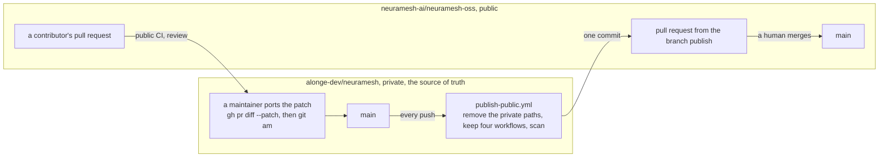
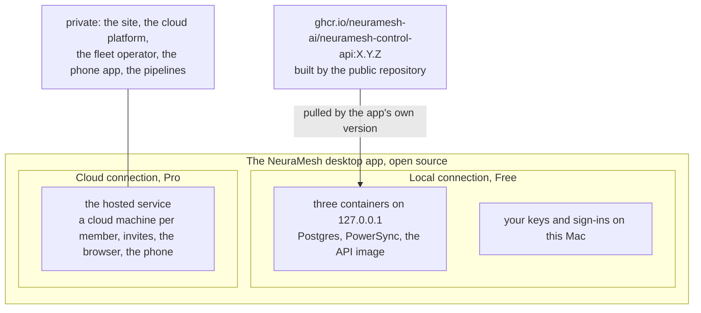
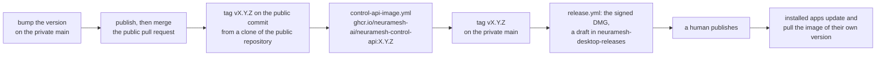

# The public repository

NeuraMesh has two repositories. The private one, `alonge-dev/neuramesh`, is the source of truth and
holds everything: the desktop app, the site, the cloud platform, and the pipelines that deploy it.
The public one, `neuramesh-ai/neuramesh-oss`, is a **publish** of it: the desktop app and what it
needs to run, open source under the [Elastic License 2.0](../LICENSE). This page is how a change
travels from one to the other, how a contribution comes back, how the app relates to Pro, and how a
release reaches an installed app.

The rule (2026-09-14): **the public repository is the desktop app and what it needs to run.** The
site, the phone app, the cloud platform, the pipelines that deploy it, and their identifiers stay
private. `scripts/public-tree.sh` is the one list of what stays out, and the two scripts below read it.

## 1. What is public

| Public | What it is |
|---|---|
| `apps/desktop` | The Electron app, the browser client, and the preview harness |
| `packages/control-api` | The API (Hono), the command handler, and the migrations |
| `packages/shared` | The types, the FSM, the entitlements, and the protocols every client speaks |
| `dev/stack` | The dev stack: Postgres, PowerSync, and the sync rules |
| `docs` | The design docs, less the evidence and the runbooks of the hosted service |

| Private | Why |
|---|---|
| `apps/web` | The site and the cloud web app at neuramesh.app |
| `apps/mobile` | The phone app. It is Pro only and carries the App Store and production ids |
| `infra`, `packages/fleet` | The cloud platform and the operator that runs the cloud machines |
| `packages/bench/suite` | The held-out benchmark task set |
| `docs/evidence`, the rollout log, the publish runbook, the audits | Dev data, production identifiers, and the adversarial review |

Only four workflows ship: `ci.yml`, `control-api-bundle.yml`, `control-api-image.yml`, and
`local-stack-smoke.yml`. Every other workflow deploys, signs, or publishes with a secret or an
identity only the private repository holds, and the snapshot removes it. A new workflow is private
until it is named in `PUBLIC_WORKFLOWS`.

## 2. How a change reaches the public repository

Nobody develops in the public repository. Every push to the private `main` runs
[`publish-public.yml`](../.github/workflows/publish-public.yml), which runs
`scripts/public-snapshot.sh`:

1. Clone the private repository at the pushed commit.
2. Remove every path in `PUBLIC_EXCLUDE` and every workflow not in `PUBLIC_WORKFLOWS`.
3. Scan the tree that ships with `scripts/public-scan.sh`: gitleaks, the generic patterns, and the
   private patterns the job receives from a secret. A hit fails the publish.
4. Commit the tree as one commit on top of the public `main`, on the rolling branch `publish`,
   force-pushed.
5. Open the pull request from `publish` to `main`, or update the one that is open.

Merging that pull request is a human act. Nothing lands on the public `main` on its own, and the
public CI runs on the pull request first. Without the token, the job builds and scans the snapshot
and the publish happens from a maintainer's Mac with the same script.



## 3. How a contribution comes back

A pull request in the public repository is not merged there. A maintainer ports it into the
private `main`, and the next publish carries it out. The commit message and the author travel with
it:

```bash
gh pr diff <n> --repo neuramesh-ai/neuramesh-oss --patch | git am --committer-date-is-author-date
```

The port lands through the normal private pull request. `scripts/pr-land.sh` takes `NM_PR_REPO`
for landing in either repository. Once the publish that carries the change is merged, the
maintainer closes the public pull request with a comment that names the commit. A public pull
request that touches a private path cannot exist: the path is not in the tree.

## 4. One app, two connections

The desktop app is one app with two kinds of connection. **Local** is Free: the app starts three
containers on this Mac, bound to `127.0.0.1`, and the person's keys and sign-ins stay on this Mac.
No account. **Cloud** is Pro: the same app connects to the hosted service at hq.neuramesh.app, with
a cloud machine for every member, invites, the browser app, and the phone.

The local stack's API is the image the public repository builds,
`ghcr.io/neuramesh-ai/neuramesh-control-api`, and the app pulls the tag of its own version. The code
behind Pro stays private: the site, the cloud platform, the fleet operator, the phone app, and the
pipelines. The entitlements that separate the two live in `packages/shared` and are public:
`hostedGateFor(connection, plan)` shows Get Pro to a Free plan on any connection that is not local.
A local workspace migrates into a Pro workspace whenever the person likes, and the local copy stays
on the Mac as a backup.



## 5. Two release lanes

A version lives in two places, and the order matters. The image must exist before the desktop that
pulls it is published: an installed app that updates to `X.Y.Z` pulls the image `X.Y.Z` at once, and
a missing tag is a boot failure on every Mac.

1. Bump the version on the private `main`. The publish runs, and a human merges the public pull request.
2. Tag `vX.Y.Z` on the **public** commit, from a clone of the public repository.
   [`control-api-image.yml`](../.github/workflows/control-api-image.yml) builds
   `ghcr.io/neuramesh-ai/neuramesh-control-api:X.Y.Z`.
3. Tag `vX.Y.Z` on the private `main`. `release.yml` builds the signed DMG as a draft in
   `alonge-dev/neuramesh-desktop-releases`.
4. A human publishes the release. Installed apps update, and each pulls the image of its own version.

A tag never rides the publish. The private tag is never pushed to the public remote: it points at
private history, and a push of it would publish that history.



