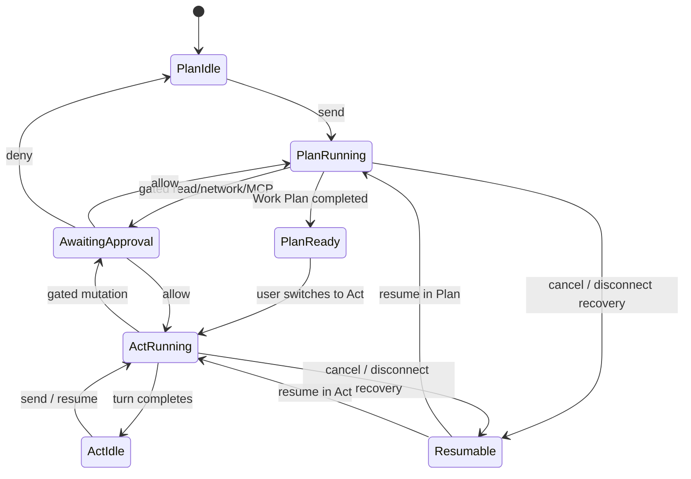

# Engineering OS — Cline harness follow-up

Status: revised product and implementation recommendation
Date: 2026-08-29
Neuramesh baseline: `origin/main` at `70b1cdef`
Cline baseline: `48d63852745460ff0fa3dfcc0457bbe2493841de`

## Revised verdict

Engineering OS should expose Cline's control model as a first-class part of the product:

- Plan/Act beside the composer;
- an expandable auto-approval bar immediately above it;
- approval, cancel, resume, retry, and queued-guidance controls derived from authoritative turn state;
- pre-approval diffs and checkpoint restore;
- a model choice that can differ between Plan and Act.

This changes the first review's UI recommendation. Do not rename the modes Explore/Build. Engineers who already understand Cline should get the same fast and explicit control. Resolve the collision with Neuramesh's existing plan concept by using two precise terms:

- **Plan**: the current Cline execution posture. It may inspect and reason but cannot mutate.
- **Work Plan**: the durable Neuramesh artifact that can be reviewed, approved, linked to work, and audited.

The larger boundary is unchanged: Cline proposes and executes the inner coding loop; Neuramesh owns the thread, machine, worktree, policy, audit, review, and acceptance.

## What the current Cline extension actually does

This review traced the extension, shared prompt package, and core SDK at the pinned commit rather than relying only on documentation.

| Area | Observed implementation | Engineering OS implication |
|---|---|---|
| Footer composition | Auto-approve bar, contextual action buttons, queued prompts, then the composer | Preserve this vertical order; permission posture remains visible at the point of action |
| Mode control | Plan/Act is a segmented toggle in the composer footer | Adopt directly and keep it conversation-local |
| Live switch | Switching mode rebuilds the same session with a new prompt, model, and tool preset; running work is fenced and resumed | Model mode change as a durable session event, not a cosmetic UI flag |
| Plan completion | A completed Plan can continue automatically after the user switches to Act | Treat the toggle as the user's approval gesture and record the current Work Plan version |
| Tool presets | Plan omits editor tools and Act enables the full set | Enforce a second machine-side capability ceiling; a prompt is not a security boundary |
| Shell in Plan | Current code permits read-only investigation but blocks state-changing commands | Match the code's useful behavior, despite older documentation implying no commands at all |
| Turn state | Backend owns `idle`, `streaming`, `awaiting_approval`, `awaiting_followup`, `resumable`, `completed`, and `error` | Add a coding-session state machine; never infer state from the last transcript message |
| Resume | Cancel and history reopen create or recover a resumable task | Persist engine session identity and cursor so browser close/reopen is an attach, not a copy |
| Permission categories | Read files, Edit files, Execute commands, Fetch web content, Use MCP servers | Use these simple categories in the collapsed UI, with safer detail under Advanced |
| Diff approval | Manual edits open a read-only virtual diff before approval | Show the proposed patch before `Allow once` or `Allow for this session` |
| Checkpoints | Files and task transcript can be compared/restored independently or together | Preserve independent restore, but use Neuramesh-owned worktree refs rather than a competing Git authority |

Primary source references:

- [AutoApproveBar](https://github.com/cline/cline/blob/48d63852745460ff0fa3dfcc0457bbe2493841de/apps/vscode/webview-ui/src/components/chat/auto-approve-menu/AutoApproveBar.tsx)
- [ChatTextArea and Plan/Act footer](https://github.com/cline/cline/blob/48d63852745460ff0fa3dfcc0457bbe2493841de/apps/vscode/webview-ui/src/components/chat/ChatTextArea.tsx)
- [mode coordinator](https://github.com/cline/cline/blob/48d63852745460ff0fa3dfcc0457bbe2493841de/apps/vscode/src/sdk/sdk-mode-coordinator.ts)
- [tool policies](https://github.com/cline/cline/blob/48d63852745460ff0fa3dfcc0457bbe2493841de/apps/vscode/src/sdk/sdk-tool-policies.ts)
- [Plan/Act prompt contract](https://github.com/cline/cline/blob/48d63852745460ff0fa3dfcc0457bbe2493841de/sdk/packages/shared/src/prompt/cline.ts)
- [Plan and Act tool presets](https://github.com/cline/cline/blob/48d63852745460ff0fa3dfcc0457bbe2493841de/sdk/packages/core/src/extensions/tools/presets.ts)
- [Cline Plan and Act documentation](https://docs.cline.bot/core-workflows/plan-and-act)
- [Cline Auto Approve documentation](https://docs.cline.bot/features/auto-approve)
- [Cline checkpoints documentation](https://docs.cline.bot/core-workflows/checkpoints)

## Fit with Neuramesh today

Neuramesh already has the right outer seams, but the Cline integration makes four gaps concrete:

| Existing Neuramesh mechanism | What is reusable | Required change |
|---|---|---|
| `RuntimeAdapter.runQuery(... permissionGate ...)` | A host-supplied gate already sits between an agent loop and mediated tools | Add a `CodingEngine` session/event interface rather than stretching a one-turn summary API |
| `policygate.ts` capability mapping | Files, shell, network, MCP, protected paths, and human permission cards already share a vocabulary | Its unknown-tool fallback currently returns “not gated”; the Cline boundary must instead reject unknown tools before execution |
| `RUNTIME_CAPABILITIES` | The product already declares whether a runtime can gate native tools and resume | Add Cline explicitly and contract-test the claim; do not inherit the fallback capabilities silently |
| Board Work Plan and `plan_approved_at` | Durable planning and approval already belong to Neuramesh | Bind the Plan-to-Act gesture to a versioned Work Plan rather than creating Cline-owned plan state |
| Existing permission card | Human decisions are already rendered in tasks and chats | Extend `Approve / Deny` to scoped `Allow once / Allow for this session / Deny` for Engineering sessions |
| Neuramesh worktrees | Repo isolation and mutation ownership already exist | Adapt Cline checkpoints to coordinated Neuramesh refs; do not create two hidden Git authorities |

The most important security modification is the unknown-tool path. Existing Neuramesh adapters deliberately treat several native or internal tools as outside the shared gate, and only Claude currently advertises native per-call enforcement. That is acceptable only when each adapter's trusted set is explicit. A Cline integration brings a larger and extensible tool surface, so its adapter needs a complete manifest where “not listed” means deny, not bypass.

## Adopt, adapt, and reject

### Adopt directly

1. **Manual Plan/Act control.** Do not let the model silently decide when it may mutate.
2. **Mode-specific toolsets and prompts.** Plan is a real capability boundary and reasoning contract.
3. **Mode-specific model choice.** A lower-cost reasoning model in Plan and a stronger implementation model in Act can be a useful team policy.
4. **Permission controls beside the composer.** The user should not visit workspace settings to change one task's posture.
5. **Backend-owned turn state.** It produces consistent approve, reject, proceed, cancel, resume, and retry actions.
6. **Queued user guidance.** Users can add intent without racing the current tool call.
7. **History continuity through mode changes.** Rebuilding the runtime must not create a second visible task.
8. **Diff before edit approval.** The decision should be grounded in the actual proposed change.
9. **Files-only, task-only, and combined checkpoint restore.** These address different failure modes.

### Adapt for Neuramesh

1. **Make scope explicit and real.** The drawer title says `Auto-approve · This session`. Session changes do not change another task. Repository and workspace defaults require an explicit secondary action.
2. **Intersect policy layers.** The UI never grants capability that a higher layer denies.
3. **Classify commands.** The simple category may remain `Execute commands`, but Advanced separates allow-listed read/test/build commands from package install, networked, destructive, and unknown commands.
4. **Classify MCP by effect.** Read-only, write, network, secret-bearing, and unknown MCP tools need distinct effective capabilities.
5. **Show the complete change set.** Cline's current multi-file patch preview can focus only the first changed file. Engineering OS must list and preview every created, updated, deleted, and renamed file.
6. **Use the relay for ordered multi-client state.** One attached client holds an approval-leader lease; others observe. Decisions use idempotency keys.
7. **Use Neuramesh checkpoint authority.** Avoid a hidden shadow repository fighting the existing worktree manager. Store checkpoint refs and transcript cursors together, while allowing independent restore.
8. **Use Neuramesh language.** Call the broadest posture `Autonomous` or `Auto`, not YOLO, and show the constraints that remain in force.

### Do not copy

- Mixed global/task persistence that makes a local-looking toggle affect later tasks.
- Code defaults that auto-enable edits, browser, or MCP. Start with repository reads only.
- A single command checkbox that can approve every shell request without argument classification.
- Prompt-only restrictions for MCP or unknown tools.
- Unknown tools being enabled or approved by omission.
- A direct browser-to-Cline socket or VS Code-specific UI fork.
- An overlapping task database, worktree manager, or merge workflow.

## The effective permission model

The engine's request is allowed to run automatically only when every layer agrees:

```text
effective_auto_approval =
  mode_capability
  ∩ organisation_policy
  ∩ workspace_policy
  ∩ repository_policy
  ∩ session_preference
  ∩ machine_sandbox
```

The machine daemon evaluates the final decision beside the filesystem and process boundary. React displays the decision; it does not enforce it.

Suggested session record:

```text
engineering_session
  mode: plan | act
  plan_model / act_model
  permission_profile_id
  permission_overrides
  inherited_from: workspace | repository | explicit
  policy_version
  turn_state
  pending_approval_id
  approval_leader_client_id
  engine_session_id
  last_event_cursor
  active_checkpoint_ref
```

Recommended defaults for a new session:

| Capability | Plan | Act |
|---|---:|---:|
| Repository read/search | Auto when policy permits | Auto when policy permits |
| File edit/create/delete | Deny | Ask |
| Read-only shell investigation | Auto from classified allow-list | Auto from classified allow-list |
| Test/lint/build | Deny by default | Ask; optionally remember for this session |
| Package install/network | Deny | Ask |
| Browser fetch | Ask | Ask |
| MCP read-only, classified | Ask | Ask |
| MCP write or unknown | Deny | Ask or deny by repository policy |
| Protected paths, secret stores, escalation | Deny | Deny |
| Git push/merge | Deny | Neuramesh workflow only |

An individual approval offers:

- **Deny**;
- **Allow once**;
- **Allow for this session**, only when repository policy marks that normalized action class as rememberable.

Do not offer “always allow” in the inline card. Durable defaults belong in repository/workspace policy with an explicit scope and audit entry.

## Plan to Act lifecycle



When `PlanReady → ActRunning` occurs:

1. freeze the current plan text and hash as Work Plan version N;
2. record who switched mode, client, timestamp, policy version, and effective capabilities;
3. create or bind the Neuramesh work unit and worktree if mutation has not begun;
4. rebuild the Cline session with Act prompt, tool preset, and selected Act model;
5. continue the same visible thread without inserting a fake human message;
6. emit a quiet mode-change event in history.

Switching to Act before the agent completes a Work Plan is allowed for fast tasks, but the UI should say `Act without a Work Plan`; repository policy may require a plan for higher-risk work.

## Turn-state contract

Add `CodingTurnState` to the engine adapter rather than overloading board task status:

```ts
type CodingTurnState =
  | { kind: 'idle' }
  | { kind: 'streaming'; canQueue: true; canCancel: true }
  | { kind: 'awaiting_approval'; approvalId: string }
  | { kind: 'awaiting_followup'; promptId: string }
  | { kind: 'resumable'; reason: 'cancelled' | 'disconnected' | 'reopened' }
  | { kind: 'completed' }
  | { kind: 'error'; retryable: boolean; summary: string };
```

The footer is a pure projection of this state. Approval events are anchored by ID, not discovered by scanning transcript text. Old engine events are fenced after cancel or mode rebuild.

## Diff and checkpoint behavior

For edits requiring approval:

1. Cline produces a proposed patch.
2. The adapter normalizes all affected files and validates paths.
3. The editor opens a read-only proposed diff with a complete changed-file list.
4. The machine gate evaluates policy and waits for the approval leader.
5. On approval, the write occurs; on denial, the patch remains as ephemeral evidence only.
6. A successful write creates or advances a Neuramesh checkpoint reference.

Checkpoint restore presents three choices:

- **Restore files** — move the worktree to the checkpoint, keep the conversation;
- **Restore conversation** — rewind the engine task context, keep current files;
- **Restore both** — rewind both to the coordinated cursor/ref pair.

Every restore shows the affected files and requires confirmation. Restoring does not rewrite shared remote history or silently discard accepted commits.

## How this modifies the delivery plan

The relay is assumed to land in parallel. “Ready” means more than a PTY tunnel: authenticated capability RPC, ordered event cursors, reconnect, cancellation, filesystem/Git/PTY channels, and a machine-side policy hook must pass integration tests.

### 0. Harness spike — 1–2 weeks

- pin Cline Core/SDK behind `CodingEngine`;
- prove same-session Plan/Act rebuild and model switching;
- normalize tools and deny unknowns;
- prove Plan cannot mutate through editor, shell, browser, or MCP;
- compare Cline checkpoints with Neuramesh worktree ownership.

### 1. Session controls — 2–3 weeks

- add `CodingTurnState` and ordered events;
- build the composer-local Plan/Act and permission controls;
- implement session inheritance, mode notices, queued guidance, cancel/resume/retry;
- record Work Plan approval on Plan-to-Act.

### 2. Web editor and relay integration — 2–3 weeks

- attach/reconnect through the delivered relay;
- render full multi-file proposed and applied diffs;
- add approval leadership and idempotent responses;
- connect Monaco diff/source and terminal evidence lazily.

### 3. Hardening — 2–3 weeks

- checkpoint restore and recovery matrices;
- capability-classified commands and MCP;
- policy/admin/budget/retention controls;
- accessibility, narrow layouts, both themes, compatibility fixtures.

Credible beta: **7–11 engineering weeks**, assuming the relay meets the entry contract. A relay that exposes only remote terminal bytes shifts missing filesystem, Git, event, approval, and resume work back into this estimate.

## Revised acceptance tests

1. Plan mode blocks a direct edit, a mutating shell command, an MCP write, and an unclassified tool at the machine boundary.
2. Switching modes mid-turn fences old events, preserves the user's draft/attachments, and resumes once.
3. Switching a completed Plan to Act records exactly one Work Plan approval and keeps one visible thread/session.
4. Changing auto-approve in session A has no effect on session B or repository defaults.
5. Commands are approved by normalized class and arguments, not tool name alone.
6. A proposed multi-file patch shows every changed path before approval.
7. Two browsers cannot answer one approval differently; retry is idempotent.
8. Browser close/reopen resumes from the last ordered cursor without transcript duplication.
9. Files-only, conversation-only, and combined restore return to the advertised state.
10. Unknown tools and unknown MCP effects deny by default and generate an audit event.
11. Cline can be replaced by another `CodingEngine` without changing thread, policy, relay, or editor contracts.

## Product conclusion

This stronger Cline-style direction improves the proposal. Plan/Act and per-task auto-approval are not incidental extension chrome; they are the mechanism that lets an engineer move fluidly between supervision and execution. Neuramesh should make that mechanism even clearer and safer by giving it true session scope, a machine-enforced policy intersection, team-safe multi-client semantics, and complete diffs.

The result is not “Cline hosted on the web.” It is an Engineering OS whose inner coding experience feels immediately familiar to Cline users while gaining the durable team context, machine routing, policy, review, and acceptance that Neuramesh already owns.
