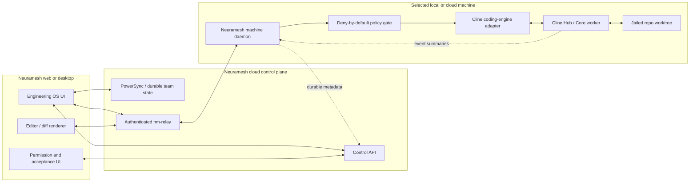
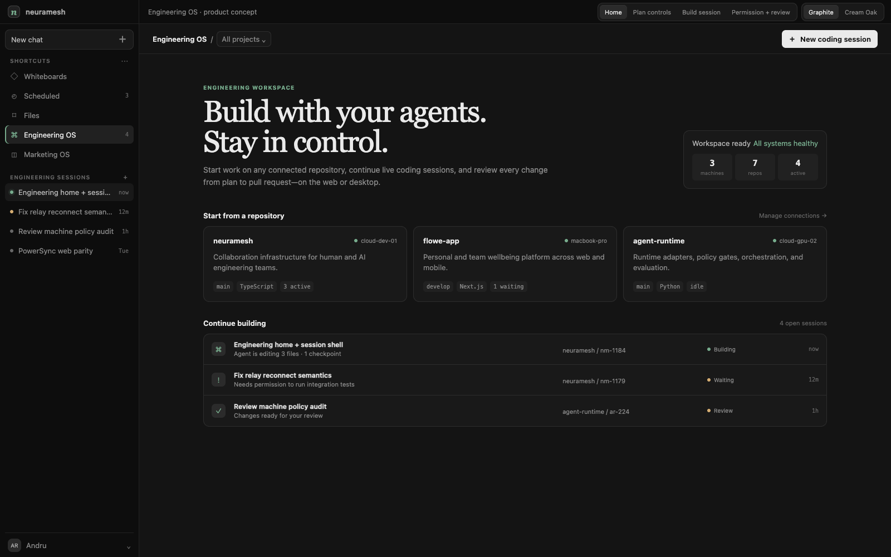
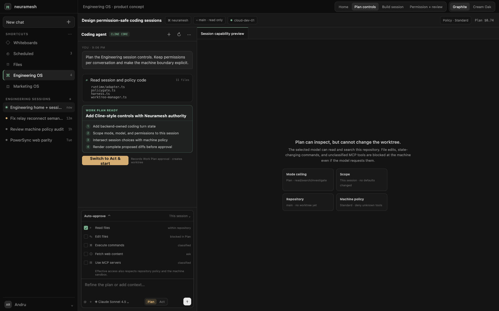
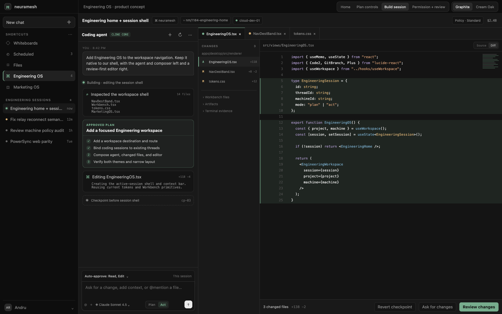
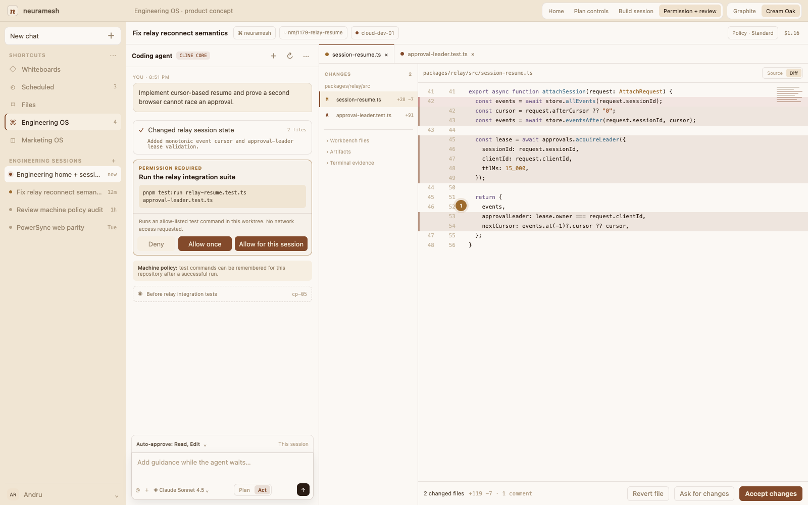

# Engineering OS — product, architecture, and feasibility review

Status: recommendation and implementation blueprint
Date: 2026-08-29
Repository baseline: `origin/main` at `70b1cdef` (`chore(fleet): roll machines to d87e14f7a0c9 (#380)`)
Cline baseline reviewed: `48d63852` on 2026-08-29

## Executive recommendation

Build Engineering OS, but define the product boundary precisely:

- **Neuramesh remains the outer operating system**: people, projects, rooms, plans, named agents, permissions, machines, worktrees, reviews, acceptance, memory, and team-visible state.
- **Cline becomes a replaceable inner coding engine**: the agent loop, provider integration, tool execution, coding-session continuity, context management, and checkpoint primitives on one selected machine.
- **The Neuramesh machine daemon remains the security boundary**. Browser and desktop clients must never connect directly to an unmediated Cline process.
- **The UI should be Neuramesh-native**, informed by the Cline interaction model but not a fork or reskin of the VS Code extension.
- **Cline's Plan/Act and approval controls should be first-class Engineering-session controls**, not hidden adapter settings. They are a meaningful part of the product value.

This is worth doing because it completes Neuramesh's core loop on the web: intent → plan → code → diff → tests → review → accept. The strongest differentiation is not “Cline in a browser.” It is Cline-class coding inside a human-owned, multi-agent, team-aware operating system.

The proposal is feasible, but it is not primarily a left-navigation change. This revision assumes the authenticated relay will be available before Engineering OS ships. The relay is therefore an integration dependency and acceptance gate, not work estimated inside this plan. A trustworthy web product remains a medium-sized systems project.

The detailed extension-code follow-up is in [`cline-harness-review.md`](./cline-harness-review.md). It changes one important recommendation from the first review: use the familiar **Plan / Act** labels, and disambiguate Neuramesh's durable artifact as **Work Plan**.

## What Neuramesh already has

| Capability | Current state | Consequence for Engineering OS |
|---|---|---|
| Team operating model | Projects, rooms, plans, tasks, named agents, permissions, beats, reviews, and acceptance are first-class | Cline must sit inside this model, not introduce a second task system |
| Runtime seam | `RuntimeAdapter` supports Claude, Codex, and Gemini with a shared permission gate | Add a Cline adapter behind this seam or a sibling coding-session service; do not let the UI call Cline directly |
| Local file access | Root-contained list/read/write IPC and Git branch/checkout APIs exist | Useful for a desktop vertical slice; the same contracts should become relay RPCs |
| File editor | A lightweight syntax-coloured textarea editor autosaves and supports Cmd-S | Good prototype substrate, but insufficient for a flagship diff/editor surface |
| Workbench | Contextual Code, Artifacts, Details, and Repos doorway with files and branch controls | Reuse as a collapsible repository drawer; avoid a permanent third navigation column |
| Work tabs | Conversation, file, terminal, browser, review, and whiteboard tabs | Engineering OS can compose existing primitives without making every global task look like an IDE |
| Web client | Shared renderer, PowerSync Web, and control API | Strong base for team state and offline metadata |
| Browser machine access | File, Git, terminal, and write methods are honest stubs until `nm-relay` is deployed | Parallel relay delivery is assumed; its authenticated reconnecting capability contract is an Engineering OS entry gate |
| Cloud machines | Cloud-first architecture assumes a machine per member and browser attachment | Excellent fit for long-running coding sessions that survive a closed browser |
| Design system | Graphite and Cream Oak themes, stable shell/navigation, Geist/Source Serif typography | Engineering OS can look native rather than like embedded VS Code |

Relevant implementation references:

- Product doctrine: [`CLAUDE.md`](../../../CLAUDE.md) and [`docs/05-engineering-philosophy.md`](../../05-engineering-philosophy.md)
- Existing editor: [`apps/desktop/src/renderer/src/wtabs/filetree.tsx`](../../../apps/desktop/src/renderer/src/wtabs/filetree.tsx)
- Local file bridge: [`apps/desktop/src/main/sync/ipc/workspace-files.ts`](../../../apps/desktop/src/main/sync/ipc/workspace-files.ts)
- Web machine stubs: [`apps/desktop/src/renderer/web/webnm-local.ts`](../../../apps/desktop/src/renderer/web/webnm-local.ts)
- Workbench: [`apps/desktop/src/renderer/src/shell/Workbench.tsx`](../../../apps/desktop/src/renderer/src/shell/Workbench.tsx)
- Navigation destinations: [`apps/desktop/src/renderer/src/shell/NavDestBand.tsx`](../../../apps/desktop/src/renderer/src/shell/NavDestBand.tsx)
- Cloud-first architecture: [`docs/design/cloud-first-2026-08/architecture.md`](../cloud-first-2026-08/architecture.md)
- Web parity ledger: [`docs/design/cloud-first-2026-08/web-parity-ledger.md`](../cloud-first-2026-08/web-parity-ledger.md)
- Theme tokens: [`apps/desktop/src/renderer/src/tokens.css`](../../../apps/desktop/src/renderer/src/tokens.css)

## One important doctrine decision

Current doctrine says the code surface “reads, reviews, and runs; never edits” and explicitly rejects an in-app editor because of editor gravity. Shipped code now contains a writable local file editor, and the proposed product makes editing central.

That is not a reason to reject Engineering OS, but it must be an explicit product decision rather than an accidental drift:

> Neuramesh is not becoming a general-purpose IDE. It is becoming the best place to direct, inspect, constrain, and accept agentic code changes. Its editor is review-first and agent-adjacent; deep human authoring can still open in a local IDE.

The durable guardrails should be:

1. No extension marketplace, debugger, or terminal multiplexer in the first product.
2. No LSP until real usage proves navigation or diagnostics are blocking adoption.
3. The primary editor actions are inspect, compare, comment, revert, accept, and ask the agent to change—not endless IDE surface area.
4. “Open locally” remains a first-class escape hatch.
5. New editor capability needs evidence that it improves the agent-review loop.

Update the doctrine before shipping the feature so engineering is not simultaneously told to build and reject the same product.

## Why Cline is a strong base—and what not to adopt

### Attractive parts

Cline currently provides:

- a mature coding-agent loop with Plan/Act-style interaction;
- broad model/provider support;
- file, shell, browser, MCP, skills, and rule tools;
- human approvals and auto-approval policy concepts;
- Git-backed checkpoints and restore;
- persistent sessions;
- an Apache-2.0 licensed monorepo;
- a Node SDK with a hub/spoke deployment model intended for attached clients.

The SDK architecture is the key fit. A hub coordinates sessions, approvals, schedules, and clients; workers run `@cline/core`; clients attach over WebSocket and advertise capabilities such as editing or diff display. That resembles Neuramesh's cloud-machine direction much more closely than the VS Code extension does.

### Do not fork the VS Code extension

The extension is tightly coupled to VS Code APIs for editors, diff views, terminals, webviews, secrets, and lifecycle. Carrying a fork would create continuous merge pressure and make Neuramesh inherit product choices meant for a single-user IDE sidebar.

### Do not depend on Cline UI as the product shell

`@cline/ui` is currently marked internal and published as a `next` package. Its components are useful implementation references, but its API, accessibility contract, and visual language are not a safe foundation for Neuramesh's primary surface.

### Pin the engine behind an adapter

The reviewed SDK is still `0.x`. Pin an exact version or commit and place all imports behind a narrow `CodingEngine` contract. Maintain replayable contract tests for session start, streaming events, approval, cancellation, resume, file mutation, checkpoint, and error recovery.

## Options considered

| Option | Time to demo | Long-term fit | Main problem | Verdict |
|---|---:|---:|---|---|
| Embed/fork the Cline VS Code extension | Medium | Low | VS Code coupling, duplicated shell, upstream merge burden | Reject |
| Rebuild Cline behavior from concepts only | Slow | Medium | Recreates mature agent-loop and provider work | Keep as fallback, not first move |
| Integrate pinned Cline Core/Hub behind Neuramesh contracts | Fast-medium | High | Requires careful policy, state, and relay boundaries | **Recommend** |

## Recommended architecture



The relay should carry framed, versioned machine capabilities rather than a special “Cline socket.” Suggested channels:

- `coding.session`: start, attach, cancel, resume, compact, complete;
- `coding.events`: ordered transcript/tool/usage/state stream with cursors;
- `coding.approval`: pending request and signed response;
- `fs`: list, read, write, stat, watch;
- `diff`: baseline, hunks, file state, revert;
- `pty`: open, data, resize, close;
- `git`: status, branch, checkpoint, commit metadata.

This gives Neuramesh a durable machine contract even if Cline is replaced later.

## Ownership boundary

| Concern | Owner |
|---|---|
| Project, room, participants, role, ACL | Neuramesh |
| Engineering thread and human transcript | Neuramesh |
| Plan approval and work-unit lifecycle | Neuramesh |
| Repo, base branch, worktree berth, PR, review, acceptance | Neuramesh |
| Machine selection, sandbox, egress, protected paths, secrets | Neuramesh |
| Audit log and policy decision | Neuramesh |
| Inner agent loop, context window, model call, tool proposal | Cline adapter |
| Engine-local context/checkpoint implementation | Cline adapter, referenced by Neuramesh |
| File contents and raw repository history | Machine; never cloud-persisted by default |
| Durable session metadata and summaries | Neuramesh cloud |

This boundary prevents the most likely failure mode: two task systems, two permission systems, two worktree managers, and two competing versions of “done.”

## Session model

One Engineering thread maps to one coding session and, while mutating, one Neuramesh-owned worktree.

Suggested durable record:

```text
engineering_sessions
  id
  thread_id unique
  project_id / room_id
  repo_id / machine_id
  engine = cline
  engine_session_id
  mode = plan | act
  turn_state = idle | streaming | awaiting_approval | awaiting_followup | resumable | completed | error
  work_state = planning | building | blocked | reviewing | complete
  permission_profile / permission_overrides
  base_ref / branch / worktree_id
  policy_version
  last_event_cursor
  input_tokens / output_tokens / estimated_cost
  created_by / created_at / updated_at
```

Cloud-persist:

- user messages and durable assistant summaries;
- plan, decisions, approvals, policy outcomes, status, usage, and cost;
- changed-file metadata, test/build summaries, artifacts, commits, and PR references;
- resumable event cursor and selected machine.

Keep machine-local by default:

- repository contents;
- full raw tool output unless attached as an artifact;
- raw diff contents after the session's retention window;
- model/provider secrets and machine credentials;
- Cline's private session database.

### Lifecycle

1. The user opens Engineering OS and chooses a project/repository and machine.
2. `+` creates an Engineering thread and a Cline session in **Plan** mode.
3. Read/search tools run within project policy; no worktree is needed yet.
4. The assistant proposes a plan. Neuramesh records and presents that plan.
5. On **Switch to Act**, Neuramesh creates or assigns the work unit and worktree, records the Work Plan approval, then switches the same session to **Act**.
6. Every mutating tool proposal crosses the machine-side policy gate.
7. The client renders an ordered event stream and live changed-file set.
8. The user can compare, comment, revert a file/checkpoint, request another change, or accept.
9. Neuramesh owns validation, review, merge/PR, and final acceptance.

Use Cline's **Plan / Act** labels in the composer. The toggle is an execution posture, not a second task type: **Plan** permits investigation and planning but no mutation; **Act** enables mutation within policy. Name Neuramesh's durable, reviewable artifact **Work Plan**. When a completed Plan switches to Act, that human gesture approves the current Work Plan and is recorded in the audit stream.

The mode and auto-approval settings should belong to the current Engineering session by default. A separate action—**Set as repository default** or **Set as workspace default**—changes inheritance. This improves on Cline's current mixed global/task persistence while preserving its fast, local interaction.

### How this coexists with normal tasks and threads

Engineering OS should be a purpose-built projection of the same durable work, not a second inbox:

- every coding session is still backed by a normal Neuramesh thread;
- an `engineering_session` binding adds repository, machine, engine, worktree, cursor, and coding state;
- the `+` in Engineering OS creates that thread and binding together;
- “continue” reattaches to the existing engine session instead of copying its transcript;
- the thread can still be found through project/room history and linked from plans, reviews, beats, and notifications;
- opening it from a generic task view shows the transcript, status, and artifacts with a clear **Open in Engineering OS** action;
- non-code discussions and orchestration remain normal tasks and never pay the editor/runtime bundle cost.

This preserves the user's current mental model—work happens in threads—while giving engineering work a cockpit optimized for code.

## Web-first implications

The new browser client is the right strategic home for Engineering OS, but current source draws a firm line between cloud collaboration state and machine capabilities. PowerSync and the control API can carry session metadata now; filesystem, Git, terminal, and editor writes intentionally return “machine unavailable” until `nm-relay` exists. This plan assumes that gap is closed by the parallel relay work.

Therefore:

- a desktop prototype can use the existing local IPC contracts;
- the web product integrates with the relay's real process, filesystem/Git/PTY edges, and browser client;
- the relay should become a general Neuramesh machine capability channel, not a one-off Cline tunnel;
- cloud machines make “close the browser while the agent continues” possible, but session resume, budgets, cancellation, and machine wake must work from the control plane;
- cached transcript and metadata can remain readable while a machine is sleeping, but source/diff panes must clearly identify whether they are live, cached artifacts, or unavailable.

The current public [Neuramesh homepage](https://neuramesh.app) still strongly emphasizes a download-first, “completely local” story in the snapshot reviewed on 2026-08-29. That message should be reconciled with the launched web/cloud product before Engineering OS marketing; otherwise the product will appear to contradict its own trust and deployment story.

## Permission and safety model

Cline's extension makes approvals unusually legible and convenient, which should be adopted. Its current implementation also exposes hazards Neuramesh should not inherit: broad command auto-approval, ambiguous global-versus-task persistence, MCP tools that are not visibly classified as read or write, and potentially unsafe defaults for tools omitted from a policy map.

Required design:

1. Enumerate every engine tool and deny unknown tools by default.
2. Translate each proposed tool into Neuramesh's existing policy vocabulary.
3. Enforce the result beside the filesystem/shell on the machine, not in React.
4. Treat the session's auto-approval choices as user preference beneath Neuramesh policy, never as authority. Effective capability is the intersection of mode, organisation policy, repository policy, session choice, and machine sandbox.
5. Preserve protected-path, sandbox, egress, and environment allow-list checks.
6. Give one client an approval-leader lease; observers can watch without racing decisions.
7. Make destructive shell/Git actions explicitly human-approved regardless of client settings.
8. Record tool, normalized arguments, policy version, actor, decision, and outcome in the audit stream.

Suggested defaults:

| Class | Default |
|---|---|
| Read/search within repository | Auto-approve when project policy allows |
| Write/create/delete | Impossible in Plan; ask or session-configurable in Act |
| Test/lint/build commands | Auto-approve from explicit command allow-list |
| Package install or network | Ask |
| Git commit/push/branch mutation | Ask or require a Neuramesh workflow step |
| Secrets, protected paths, privilege escalation | Deny |
| Unknown tool or argument shape | Deny and alert |

## Product and interaction design

### Navigation

Add **Engineering OS** to Shortcuts near Files and Marketing OS. Like Marketing OS, it is a workspace destination rather than another conversation mode.

The destination has two states:

1. **Home** — repositories, cloud/local machines, sessions needing attention, recent coding sessions, and a clear “New coding session” action.
2. **Active session** — a focused two-pane workspace.

### Active-session composition

```text
global navigation | agent transcript + composer | changed files | editor / diff
                  |       360–400 px             | 180–220 px    | flexible
```

- The inner-left pane contains Cline-style progress, tool calls, plans, approvals, checkpoints, and the composer.
- The right side is a review-first editor with file tabs, changed-files list, source/diff toggle, diagnostics, and a bottom acceptance bar.
- Repo, branch, machine, policy, usage, and connection state stay visible in a compact context bar. Plan/Act stays beside the composer where it controls the next turn.
- An **Auto-approve · This session** bar sits directly above the composer. Its collapsed label shows the effective enabled categories; the expanded drawer exposes Read files, Edit files, Execute commands, Fetch web content, and Use MCP servers, with advanced capability detail.
- The existing Workbench remains a collapsible doorway for the full tree, artifacts, details, and repository controls. Do not permanently add another broad file tree.
- On narrow screens, switch between **Agent** and **Changes**; do not compress three columns into unusable slivers.

### Editor choice

The current textarea overlay is a clever lightweight editor, but it lacks robust selections, large-file behavior, accessibility, compare semantics, inline decorations, diagnostics, and conflict handling.

For a production Engineering OS, use Monaco for source and diff views, loaded only when the destination opens. It matches the product's code-review needs and supports an eventual worker-backed language layer without committing to an IDE today. CodeMirror 6 is a valid smaller alternative if bundle and startup measurements fail the performance gate.

Do not treat the current “Diff” mode as a production baseline: for a normal file it parses the file content as if it were already a patch. Engineering OS needs real base-versus-working-tree comparisons, created/deleted/renamed states, binary handling, and checkpoint restore.

### Mockups

The interactive, self-contained mockup is at [`mockups/engineering-os.html`](./mockups/engineering-os.html). It includes:

- Engineering home;
- Plan controls with a session-scoped auto-approval drawer;
- active Cline-powered build session;
- permission and review state;
- Graphite and Cream Oak themes.

The mockup uses the current Neuramesh palette and shell conventions. It intentionally does not copy VS Code chrome or Cline branding.









## Value

### For engineers

- Start or resume coding work from any browser without reconstructing local context.
- Keep the agent, live changed-file set, terminal evidence, tests, and review in one place.
- See exactly what the agent created, changed, deleted, ran, and spent.
- Hand work between desktop, web, and teammates without losing the durable thread.
- Retain a local-IDE escape hatch for deep manual work.

### For engineering leaders and teams

- A shared view of work in progress, blocked approvals, validation, and ownership.
- Consistent policy and audit across providers and machines.
- A review/acceptance loop attached to the originating intent and plan.
- Less “AI work happened in someone's IDE sidebar and disappeared.”

### For Neuramesh

- Makes the web platform a true primary surface rather than a remote conversation viewer.
- Connects the existing plan-first outer loop to an immediately capable coding engine.
- Creates a coherent family with Marketing OS: each domain gets a focused operating surface while tasks remain the durable unit of work.
- Differentiates from Cline alone through team truth, multi-agent orchestration, machine routing, policy, memory, and acceptance.

## Risks and mitigations

| Risk | Severity | Mitigation |
|---|---:|---|
| Editor gravity turns Neuramesh into a weaker VS Code | High | Review-first charter, explicit non-goals, usage-gated capability additions |
| Relay contract is late or incomplete | High | Treat authenticated RPC, cursor resume, filesystem/Git/PTY, cancellation, and policy hooks as entry criteria; keep a desktop-only fallback behind a flag |
| Cline bypasses Neuramesh policy | Critical | Machine-side deny-by-default adapter, unknown-tool tests, no direct client-to-Cline path |
| Duplicate sessions/tasks/worktrees/checkpoints | High | One ownership table, Neuramesh worktree authority, adapter translates rather than mirrors concepts |
| SDK churn or incompatible upstream change | Medium-high | Exact pin, narrow contract, replay fixtures, upgrade lane, kill switch |
| Multi-client approval races | High | Approval-leader lease, idempotency keys, ordered event cursors |
| Cloud cost and runaway loops | High | Per-session budget, visible meter, idle timeout, cancel from control plane, model policy |
| Code or secrets leak into durable cloud state | Critical | Field-level allow-list, content classification, local-first event redaction, retention tests |
| Large editor bundle hurts startup | Medium | Lazy chunk, worker caching, measure view-switch budget, CodeMirror fallback |
| Provider credentials are duplicated | Medium | Machine credential broker; Cline receives ephemeral or existing provider configuration |
| Agent session survives but worktree does not | High | Session attach validates repo/worktree identity before resume; surface recovery, never silently recreate |

## Feasibility and phased delivery

### Phase 0 — architecture spike (1–2 engineering weeks)

- Pin and embed `@cline/core` on one development machine.
- Implement the `CodingEngine` adapter and ordered event normalization.
- Run a read → plan → edit → test → diff flow in a jailed Neuramesh worktree.
- Wrap every tool in the existing permission gate.
- Measure token, latency, memory, and overhead versus the current runtime.

Exit: prove the inner/outer ownership boundary and decide whether to continue.

### Phase 1 — session controls and desktop alpha (2–3 engineering weeks)

- Add Engineering OS navigation, home, session binding, transcript, and composer.
- Add backend-owned turn state, Plan/Act switching, mode-specific models, queued guidance, cancel/resume/retry, and session-scoped auto-approval controls.
- Reuse the current local IPC bridge and file view for the first vertical slice.
- Add real Git diff metadata, approvals, cancellation, checkpoints, and recovery.
- Hide behind a workspace feature flag.

Exit: a small internal group can complete real repository tasks without policy bypass or state duplication.

### Phase 2 — web integration and review surface (2–3 engineering weeks)

- Integrate the assumed relay's authenticated, versioned filesystem/Git/PTY/coding-session channels.
- Implement cursor resume, backpressure, presence, approval leadership, and cloud-machine wake.
- Ship changed-file diff and terminal evidence to the browser without cloud-persisting repository contents.

Exit: closing and reopening a browser safely reattaches to a running cloud-machine session.

### Phase 3 — production hardening (2–3 engineering weeks)

- Introduce lazy-loaded Monaco diff/editor.
- Harden created/deleted/renamed/binary/conflict states and checkpoint restore.
- Complete both themes, narrow-screen behavior, keyboard and screen-reader paths.
- Add observability, budgets, admin policy, retention, and upstream compatibility automation.

These phases can overlap after phase 0. With the relay delivered and meeting the entry contract, a credible Engineering OS beta is roughly **7–11 engineering weeks**. If the relay provides only a PTY tunnel rather than resumable capability RPC, its missing work returns to the critical path. The visual shell is the smallest part of the project.

## Go/no-go gates

Do not call the integration successful until it passes all of these:

1. Cline adapter overhead stays within Neuramesh's `<10%` runtime target versus direct execution.
2. No unknown engine tool can execute; permission tests are exhaustive and deny-by-default.
3. A browser can disconnect, the machine can continue, and a new client can resume from an ordered cursor.
4. Repository contents and provider secrets are absent from cloud persistence and logs by default.
5. Created, modified, deleted, renamed, and binary files render accurately and can be reverted.
6. One user action creates one authoritative thread/work unit/worktree—not mirrored Cline and Neuramesh copies.
7. Two attached clients cannot approve or mutate the same pending action inconsistently.
8. View switching remains within the current `100 ms` target after lazy loading and warm cache.
9. Existing Claude/Codex/Gemini runtimes continue to work; Cline remains replaceable.
10. Users complete real tasks faster and report higher review confidence than with normal Neuramesh tasks plus an external IDE.
11. Plan mode cannot mutate through shell, editor, browser, MCP, an unknown tool, or a second attached client.
12. Session permission changes do not silently alter another session or repository default.

## Licensing and product identity

Cline's repository is Apache-2.0. That generally permits commercial use, modification, and redistribution, including inside proprietary products, subject to license/copyright/notice obligations, marking modifications, and the license's patent terms. The license does not grant trademark rights.

Practical requirements:

- preserve the Apache-2.0 license and relevant copyright notices in distributed dependencies;
- include any upstream `NOTICE` file if one is introduced;
- mark material modifications if source is redistributed;
- call the integration “powered by Cline” only after a trademark review; prefer “Cline-compatible engine” or a factual dependency disclosure internally;
- have counsel review desktop redistribution and hosted-use details before launch.

This section is product/engineering guidance, not legal advice.

## Decision

Proceed with a phase-0 spike and design validation. Approve Engineering OS as a product direction only with these non-negotiables:

- Cline Core/Hub is an implementation dependency, not the product architecture.
- Neuramesh owns state, permissions, machines, worktrees, reviews, and acceptance.
- Cline's Plan/Act, turn-state, resume, approval, and checkpoint semantics are visible first-class controls, adapted to Neuramesh's policy hierarchy.
- Web ships only on a real authenticated relay with reconnect semantics.
- The editor remains review-first and lazy-loaded.
- Current “never edits” doctrine is deliberately amended.

If the spike fails the policy, overhead, or state-ownership gates, keep the Engineering OS shell and swap the inner engine to Neuramesh's existing runtime adapters rather than abandoning the product concept.

## Upstream sources reviewed

- [Cline overview](https://docs.cline.bot/cline-overview)
- [Cline Agent Core SDK overview](https://docs.cline.bot/sdk/overview)
- [Cline hub-and-spoke architecture](https://docs.cline.bot/sdk/architecture/hub-spoke)
- [Cline SDK permission handling](https://docs.cline.bot/sdk/guides/permission-handling)
- [Cline Plan and Act modes](https://docs.cline.bot/core-workflows/plan-and-act)
- [Cline Auto Approve](https://docs.cline.bot/features/auto-approve)
- [Cline checkpoints](https://docs.cline.bot/core-workflows/checkpoints)
- [Cline repository](https://github.com/cline/cline)
- [Apache-2.0 license at reviewed commit](https://github.com/cline/cline/blob/48d63852745460ff0fa3dfcc0457bbe2493841de/LICENSE)
- [`@cline/core` package at reviewed commit](https://github.com/cline/cline/blob/48d63852745460ff0fa3dfcc0457bbe2493841de/sdk/packages/core/package.json)
