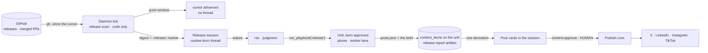
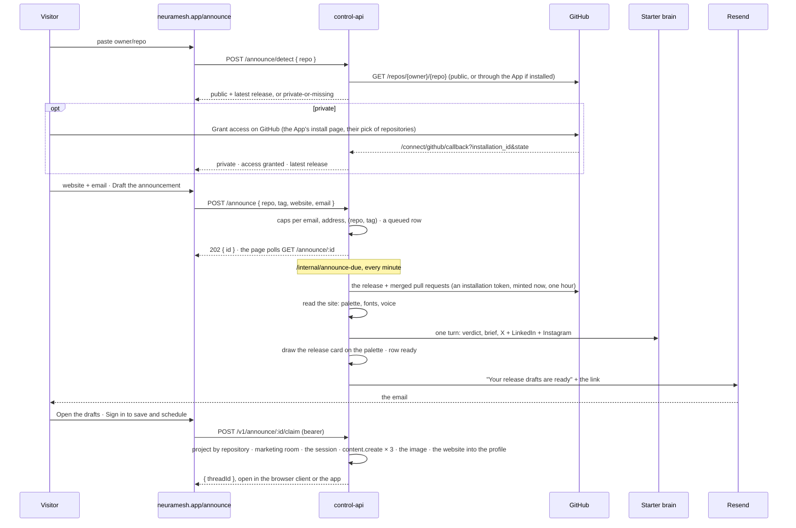

# Release drafts: the repository is a marketing source (research + design, for review)

> **Status: BUILT (2026-09-17, the same day), the feature doc is [docs/44](../../44-release-drafts.md).**
> Slices 1 to 5 landed on `claude/github-feature-marketing-c68cae`: the scan, the cursor and the tick
> (slice 1), the playbook, the repo need, the brief contract and the skill (2), the ReleaseCard and the
> session's cards (3), setup step 5 and the Routines ledger (4), the public door with the GitHub App
> client, the site read, the release card, the email and the site page (5). Live evidence in
> `evidence/` (the public door ran end to end against GitHub, hono.dev, the Starter brain, resvg and
> Resend). The GitHub App itself waits on the founder's click (`scripts/github-app-manifest.mjs`).
>
> The proposal as it was reviewed follows. **Status then: PROPOSAL (2026-09-17), design round 1, revised the same evening, nothing built.** The
> canvas [Release Drafts](https://claude.ai/artifact/WgYp6CctbDhcc6M6bw3Qnb) (version 2) holds eleven
> boards: the setup wizard's new step, the release session in graphite and cream oak, the Routines
> ledger, neuramesh.app/announce in four states (the form, a private repository's grant, the wait
> with its email, ready in paper and graphite), the architecture as two lanes, and the options
> reviewed. Version 1 (eight boards) had the public door as a paste-and-read page for public
> repositories only. George's two notes (§1) changed it. The artboards are the `*.dc.html` files beside this plan, generated by `build.mjs`
> (`node build.mjs <dir>` also writes the seeded canvas page into `<dir>`, which is not committed).
> The Claude Design server did not connect this session (`FIRST_PARTY_AUTH_REJECTED`), so the canvas
> is the repo's own artboard recipe published as an artifact page, the same as the Marketing OS desk
> round earlier today.

## 1. The ask

George (2026-09-17), two rough drafts:

> hooks to plug-into github or scm tools; connect neuramesh to your git repository and
> automatically get marketing drafts for your new released features (for projects within neuramesh,
> this should be automatic after they set up their marketing os for that project - it can be part of
> the flow to enable), as a result we arm a routine that checks for new prs getting merged and
> intelligently detect if there's a new feature being released and have marketing draft channels
> autocreated to generate idea, and have the marketing agent drafts on-brand marketing contents for
> the new feature based on the users available connections on the project (x, instagram, tiktok,
> linked in etc)
>
> should be easy to integrate with a single command, ui connect and boom, their latest release gets a
> marketing draft copy for a target platform (x, instagram, tiktok) and they get a public link to
> preview it, sign in to save and publish
>
> neuramesh schedule on neuramesh that checks the changelog (GitHub) of a project daily (by
> default), run a marketing use case analysis on it, decide demo/artifacts, generate them in draft
> mode ready for user approval based on connected social platforms, one click schedules it

George, after the first canvas (2026-09-17, later):

> when users click draft button to schedule a draft from the public page, might be nice to have a
> way to ask for their email and website so they're notified once the drafts are ready; website is
> important so we can get their brand details for our drafts, our draft should include atleast once
> post with an image; email also helps us guide against spam, if they enter their email, we publish
> an email out to them once the drafts are ready with a link to preview it / sign in to
> save/schedule
>
> private repos should require the user granting access to our neuramesh github app so it can read
> their repo (we should auto detec the repo type after they enter it)

**The one sentence.** NeuraMesh watches a project's repository. When a feature ships, the marketer
drafts the announcement for every connected account, and the human approves it in the thread.

**Litmus.** Faster: the announcement exists before anyone remembers to write it, in the voice the
brand docs already hold. Safer: nothing publishes without the human's click on the card, the scan
is code, and the platform holds no repository token. Delightful: the release session reads like a
colleague who read the changelog and came back with the posts. Clear yes.

## 2. What exists today (the seams, verified 2026-09-17)

| Fact | Where |
|---|---|
| The setup flow is data (`marketing.v1`, four steps). `setupProgress()` derives resume and completion from the profile alone, so a new step is a registry entry | `packages/shared/src/setupflows.ts` |
| `marketing.setup` merges the profile, finishes the setup task, and plants the one-shot bootstrap schedule through the internal `createSchedule`, which bypasses the plan gate on purpose | `packages/control-api/src/handler/marketing.ts:37-96` |
| Schedules are generic: `payload` jsonb, `routine: true` marks a routine, the minute tick claims through the `schedule.claim_run` CAS, `schedule.mark_result` writes `last_error` (the attention bar) | `0082` · `apps/desktop/src/main/host/schedules.ts` · `handler/schedule.ts` |
| Arming a cadence is `schedule.create`: HUMAN_ONLY, and `PLAN_LIMIT` on `free` (local mode lifts it). One-shot playbook runs are free, a cadence is Team | `handler/schedule.ts:44-51` · marketing-os plan §4.8 |
| A routine fire posts its prompt as the OWNER into a fresh thread stamped `schedule_id` (0119), and the orchestrator wakes there. Routine-born units are born approved, auto-accept on done, and take the Starter brain as the fallback | `host/schedules.ts` routine branch · docs/41 §6 · `host/starterfallback.ts` |
| Playbooks are data. `run_playbook` births a unit born approved in a conversation, a subtask in a task thread, pre-offers the room's marketer, and runs the `needs` preflight before anything is staffed | `packages/shared/src/playbooks-registry.ts` · `host/tools-playbooks.ts` · `packages/shared/src/needs.ts` |
| A marketer's content run stages the brand docs into `.nm-evidence/brand/`, writes `posts.json`, and the daemon mints `content_items(task_id)`. Images ride the designer's seat and `content.attach_media`. A post never publishes without its required image | `content-producer.ts` · the marketing-image-generation round |
| Drafts are thread-native: `content_items.thread_id` (0115), `postCardsFrom` is the one derivation, `SocialPostCard` renders in both thread renderers, `revise_posts` rewrites in place | the thread-posts round |
| `content.approve` is HUMAN_ONLY and not plan-gated. The publish cron unseals the connectors server-side | `handler/content.ts:98-117` |
| Repositories: `repos(provider, org_name, name, clone_url, local_path)` and `project_repos(is_primary)`, synced since 0106. `repoSlug(cloneUrl)`, `ghCapable()` (memoized at boot), `ghRaw` | `0001` · `0106` · `host/gh.ts` |
| Connectors are per PROJECT (0106), four providers (0125). `liveConnectors` reads `status = 'connected'` only | `packages/shared/src/needs.ts` |
| Public routes outside `/v1` already exist (`/connect/*`, `/media/:id`, `/webhooks/stripe`). The site's routes live in `apps/web/src/App.tsx` (`PATH_FOR`), copy in `copy.ts`, indexing in `seo.ts` | `packages/control-api/src/app.ts` · `apps/web/src` |
| The Starter brain is the one server-side model key, metered in credits, reached at `/v1/starter/generate` | docs/10 §15 |
| A thread is titled once by an agent (0124), carries `schedule_id` (0119) and `settled_at` (0137) | `threads` |

**Consequences.** (1) The in-app half needs **zero migrations**: the routine rides `schedules.payload`,
the step rides `channels.marketing`, the drafts ride `content_items`, the brief rides `artifacts`.
(2) The genuinely new spine is small: a pure scan module, one tick branch, one command, one playbook
entry, one skill, one card, one wizard step. (3) The public door is the only new table, and it is a
public row with no workspace, so it never enters the PowerSync publication.

## 3. The options, reviewed

### 3.1 The signal: how we learn that something shipped

| Option | Private repos | Doctrine | Verdict |
|---|---|---|---|
| **Your machine polls with `gh`** on the daemon's minute tick, with the machine's own login | yes | your compute, cloud truth. The platform holds no token. A cloud machine gets its `gh` login through the browser terminal (docs/42) | **v1, the app** |
| **Our server reads public repositories** over GitHub's REST API with our own app token, public data only | no | no user token, ever | **v1, the site** |
| **The NeuraMesh GitHub App reads a private repository** the person granted on GitHub's own page (their pick of repositories, read only). Installation tokens are minted per read, live one hour, and are never stored | yes | the platform holds the App's private key, never a user's token. The grant is explicit, scoped and revocable on GitHub. The one custody change this round makes, recorded in §5.3 | **v1, the site** |
| A GitHub Action posts the release notes to one endpoint on `release: published` | yes, the text travels | no token reaches us | v1.5 |
| `npx neuramesh announce` reads the local remote and the latest tag, posts to the same endpoint | yes | same | v1.5 |
| The App's webhooks (`release.published`) fire the in-app routine at once instead of the daily tick | yes | the same grant | v1.5 |

### 3.2 The signal's shape: what "a feature shipped" means

Sources, in order: **GitHub Releases** (an author already wrote what shipped), then **merged pull
requests** to the default branch since the cursor (the detail behind a release, and the whole
digest for a repository without releases), then a **CHANGELOG.md** diff when both are empty. A tag
without notes is a release whose notes are its pull requests.

**Detection is code, the feature call is judgment** (the stall watchdog's rule, docs/19). The scan
is a pure module: the window since the cursor, a deterministic pre-filter (pull requests labelled
`chore`, `deps`, `ci`, `docs`, bot authors, `chore:` and `fix:` prefixes unless the release notes
name them), and the digest. The agent decides in the thread whether a feature shipped and which one,
with its reasons on the brief card. A quiet window never opens a thread.

### 3.3 The object: where a release's drafts live

| Option | Verdict |
|---|---|
| A channel per release (the rough draft) | **no.** A channel is a folder of sessions and an ACL boundary, with agent registrations and a setup task. One per release fills the rail and answers no question a session does not |
| **A session per release** in the project's marketing room | **v1.** The routine's own thread, titled by the release. Drafts are thread-native cards. The needs-you queue lifts it |
| A unit anchored to that session | **v1, underneath.** The playbook unit is the work record, the brief and the acceptance. It never earns a nav row (docs/41). The thread shows its cards |

### 3.4 The engine: who drafts, and how

| Option | Verdict |
|---|---|
| rex drafts in the thread with `draft_posts` | fast, but no file tools, no image lane with the designer, no acceptance record, no lessons. **The public door uses this shape** on the Starter brain, where the visitor waits |
| **A playbook unit, born approved** | **v1.** The `release` playbook in the registry. plume on the worker lane with the brand docs staged and the skill loaded. `posts.json` and the brief attach to the unit. The routine is hands-off, the human's gate is the card |
| A content task the human plans first | no. A plan review on a canned template is a second consent for the same click (the marketing-os round 3 ruling) |

### 3.5 The doors: where it is switched on

Setup step 5 of 5 · the Marketing OS catalog row (armed cadence as its fact) · Automations ›
Routines (a routine like every other) · **neuramesh.app/announce** · the terminal and the CI (v1.5).

### 3.6 What this round changes from the rough draft

- **No channel per release.** A session per release. The rail stays a list of work.
- **The App reads, the machine polls.** In the app the tick polls with `gh`. On the site the
  GitHub App reads a private repository after an explicit grant. Its webhooks are v1.5.
- **Detection is code.** The scan, the cursor and the dedupe are code. The feature call is the
  agent's, in the thread, with its reasons.
- **One image, always.** Every draft set carries a release card drawn on the site's palette. A
  screen capture of the feature itself is phase 2.
- **Email is the gate on the public door.** The form asks for a website (the brand read) and an
  email (the link, and the spend bound). The drafts arrive by email, and the page updates itself.
- **The first draft is free.** One release drafted on the spot on every plan. A daily watch is a
  routine, and routines are Team. The funnel's deep-gate ruling extends unchanged.

## 4. The design (the rules the boards encode)

1. **One session per release, and only when there is something to read.** The tick opens the thread
   with the digest as the owner's first message and a `‹release:owner/repo@tag›` marker. The agent
   titles it once from the feature (0124). The header wears `routine`, the room chip, and `needs you`
   while cards wait. A quiet window advances the cursor and opens nothing.

2. **The cursor is the schedule's own.** `schedules.payload.release = { repo, cursor: { at, tag },
   log[] }`. The cursor advances only after a completed scan, through `schedule.set_cursor` (any
   authenticated teammate, the `mark_result` idiom). A scan that dies after the claim leaves the
   cursor, so tomorrow's window covers today's release. The thread marker is the second lock: a tag
   already heading a thread of this schedule is never fired twice.

3. **The playbook is data.** `release` joins the registry: group `campaigns`, engine `unit`, task kind
   `content`, skill `release-announcement`, inputs `{ release }` (a tag or a range, optional), `needs`
   `[{ kind: 'repo' }, { kind: 'connector', min: 1 }]`, legs `['build']`, the approach names the
   digest in the task description, the DoD names the brief and one post per connected account with
   image briefs where a network needs one. `remeasure: { cadence: 'daily', label: 'watch releases
   daily' }`, so the Marketing OS row derives its armed state from the schedule prompt as every
   other playbook does.

4. **The brief is a report with a verdict.** The unit's sole markdown deliverable lands as
   `release-report-YYYY-MM-DD.md` (the existing name contract, renamed at delivery by
   `contractDeliverables`), its head `# Release announcement · v0.134.0` and line two `Verdict:
   feature · Basis: release notes, 5 merged pull requests`. It carries `## Why`, `## Audience`,
   `## Assets` and the mandatory `## What I could not determine`. `ReleaseCard` renders it behind a
   `‹release:id›` marker: the tag, the date, the verdict chip, the feature title, the why with its
   pull requests as refs, the rows, `Open brief ↗ · Save to Files`.

5. **The session shows the cards.** An anchored content unit's `content_items` render in the origin
   thread after the completion note, through `postCardsFrom`, the same cards the peek shows. A lens
   on the rows, never a copy (the UnitCard rule). Request changes arms the composer with the card as
   a pill, exactly as today.

6. **Assets are decided and stated.** The brief names the asset choice and the reason. v1 assets: the
   copy per network, and one image where the network needs one (Instagram, TikTok) or the brief
   asks for it (X, LinkedIn): a release card drawn on the brand palette through the HTML-to-PNG lane
   (text renders exactly, the claude-design memory's recommendation), or an on-brand picture through
   the image lane. A capture of the feature itself is phase 2 and the brief says so as a gap.

7. **The doors are the existing doors.** Setup step 5 (repository from the project, the connected
   accounts, two switches). The Marketing OS catalog row (`Run for…` drafts the latest release once,
   the armed cadence is the fact). The Routines card, whose ledger gains quiet rows (`nothing new
   since v0.133.0 · checked`) and `Draft anyway ›` on a window the agent judged fixes-only, which
   posts the ask into the room and drafts that release once.

8. **The public door is the same road's first mile.** `neuramesh.app/announce`, in four states
   (boards D1 to D4):
   - **Detect.** The paste is parsed (`owner/repo`, a GitHub URL, a release URL, an ssh remote) and
     `GET /repos/{owner}/{repo}` answers at once. 200: public, and the latest release is named under
     the input. 404: private or missing (GitHub does not tell a stranger which), and the row offers
     the grant. If the App is already installed for that repository, the server reads through it
     and the row says `Private · access granted`.
   - **The grant.** The NeuraMesh GitHub App: `metadata: read`, `contents: read` (README and
     CHANGELOG), `pull_requests: read`. The button opens GitHub's own install page, the person picks
     the repositories, the callback (`/connect/github/callback?installation_id=…&state=…`) stores
     the installation and re-runs the detect. Installation tokens are minted per read from the
     App's private key, live one hour, and are never stored. Revocable on GitHub.
   - **The form.** Two fields and one button. The **website**, prefilled from the repository's
     `homepage`, is the brand read: the palette and the fonts from its CSS, the voice from its
     copy, the same read the marketing bootstrap makes (`siteDesignTokens`, ported to the server).
     The **email** is where the link goes, and the spend bound: one draft set per `(repo, tag)`
     per email, caps per address and per IP. No double opt-in in v1 (§9).
   - **The job.** `POST /announce` writes a queued row. The minute cron `/internal/announce-due`
     works it: read the release and the merged pull requests (public, or through the App), read
     the site, one Starter turn (the verdict, the brief, X, LinkedIn, Instagram), draw the release
     card on the site's palette, mark ready, send the email. The page polls `GET /announce/:id` and
     shows the first-run card's status rows (docs/33 §8) while it waits.
   - **The email.** The docs/28 voice: it opens on the scene (three drafts, the feature, the
     networks, the card), one button `Open the drafts`, one line about sign in, and the honest
     closer for a stranger's address. Sent through the existing Resend lane (`mail.ts`, the
     outbox, the suppression rules).
   - **Ready.** The page shows the release, the verdict, the feature title and three posts.
     Instagram carries the release card, so every set has at least one image. `Sign in to save and
     schedule` imports them: the project by repository, its marketing room, the session from board
     B with its cards and the image, the website into the marketing profile, and the setup flow
     prefilled with the repository. One endpoint, three doors: the app, the terminal, the CI.

9. **Enforced, not prompted.** Publishing stays `content.approve`, HUMAN_ONLY. The routine can never
   publish. The scan never runs a model. The cursor and the marker make a double fire impossible.
   `needs: repo` stops a run in a room whose project has no repository, with the attach flow on the
   card. The public endpoint requires an email, is rate limited per email, per address and per
   repository, serves one draft set per `(repo, tag)` per email, and is capped per day on the
   platform's credit budget. The App's permissions are read only by registration, so a write is
   impossible, not merely avoided. Installation tokens are minted per read and never written to a
   row.

10. **Every string is STE.** No em dashes, no semicolons, no `-ing` verbs. `Draft the latest release
    now` · `Watch the repository daily` · `A feature shipped in v0.134.0` · `Draft anyway ›` ·
    `Grant access on GitHub` · `Please wait…` · `Sign in to save and schedule`.

## 5. Architecture

### 5.1 In the app

The tick, in order (the sequence is the contract):

1. A row with `payload.release` is due. `ghCapable()` must hold and the room's project must resolve
   a primary repository, or the row stays due (after ten minutes past the slot, `schedule.mark_result`
   says `no machine with a GitHub login can read <repo>`, and the attention bar shows it).
2. `schedule.claim_run`, the CAS. One machine wins.
3. The scan: `gh api repos/{slug}/releases?per_page=10` and `gh pr list --state merged --search
   "merged:>=<cursor>" --json number,title,body,labels,mergedAt,url,author` (a `local` repository
   reads `git log` and tags on its checkout). `scanWindow({ releases, prs, cursor })` is pure and
   returns `{ candidates, digest, cursor }`.
4. Dedupe: a tag whose marker already heads a thread of this schedule is dropped (a replica read).
5. Empty: `schedule.set_cursor`, and the ledger gains a quiet row. Not empty: `POST /v1/messages` as
   the owner with `scheduleId` and a fresh `threadId`, the digest and the marker as the body (the
   existing routine path), then `schedule.set_cursor`.
6. rex wakes in the thread. A feature: `run_playbook('release', { release: tag })`, born approved.
   Nothing to announce: one line, the thread settles.
7. plume works the unit on the worker lane: the `release-announcement` skill, the digest from the
   task description, the staged brand docs. It writes the brief and `posts.json` (one post per
   connected account, the `{coverage}` runtime slot, image briefs where a network needs one). The
   content producer mints the items, the image lane draws, the completion note lands, the unit
   auto-accepts (a routine's unit). The session shows the cards.
8. The human approves, schedules or asks for changes on a card. The publish cron posts.

### 5.2 The public door

The terminal and the CI doors post `{ repo, tag, notes, website?, email }` to the same queue with
the notes inline, so a private repository also works without the App when the CI holds the text.

### 5.3 Custody and cost, said plainly

- The platform never stores a repository token. In the app the machine's `gh` reads. On the site
  the server reads public data with its own identity, and a private repository through the
  NeuraMesh GitHub App after the person's explicit grant: read-only permissions by registration,
  their pick of repositories, installation tokens minted per read and never written down, revocable
  on GitHub. This is the custody change George asked for on 2026-09-17, and the App is also the
  phase-2 door CLAUDE.md #5 already names for remote agents.
- The Starter key stays server-side (docs/10 §15). The public door spends platform credits before a
  sign in. That is a founder budget: one generation per `(repo, tag)` ever, a per-day cap, and the
  ledger says what it cost.
- Social tokens stay sealed server-side, the one written-down BYOK deviation, unchanged.

## 6. Contract (what actually changes)

**Migrations.** In-app: none. The public door: `0139_announcements.sql`: `announcements (id, repo,
tag, website, email, status queued|reading|drafting|ready|failed, digest jsonb, brand jsonb, brief
text, posts jsonb, image bytea null, image_mime, error, created_at, ready_at, claimed_by uuid null,
claimed_thread_id uuid null)`, a unique index on `(repo, tag, email)`, and `github_installations
(installation_id bigint primary key, account, repos text[], state, workspace_id uuid null,
created_at)`. Not in the publication, no sync rule, no client schema.

**Shared.** `shared/releasescan.ts` (pure: `scanWindow`, the pre-filter, `releaseMarker`,
`parseReleaseRef`, the digest text) · `shared/setupflows.ts` (step `releases`, optional, `writes:
'releases'`) · `shared/playbooks-registry.ts` (the `release` entry) · `shared/needs.ts` (`RepoNeed`,
the card's `Attach a repository` action) · `shared/reports.ts` (an unscored head with `Verdict:`) ·
`shared/releasecard.ts` (`releaseFrom(artifact)`, the ArticleCard idiom).

**Commands.** `schedule.set_cursor { schedule, cursor, note? }` (any authenticated teammate, merges
`payload.release`, both stores, a pg test) · `marketing.setup` gains `releases?: { repoId, now,
watch }` and plants the one-shot through the internal `createSchedule` and the daily row through the
plan-gated path only when `watch` is true · `setup.step` accepts the `releases` value · `announce.claim`
(HUMAN, bearer).

**Host.** `host/releasewatch.ts` (the tick branch, called from `runDueSchedules` before the routine
branch, with `NM_GH_FAKE` release fixtures for the echo lane) · the `release-announcement` skill in
the marketing-os pack (hand-authored, ours) · one sentence in the orchestrator's `marketingNote`: a
thread that opens with a release digest is answered with the release playbook.

**Server.** `announce.ts`: `POST /announce/detect`, `POST /announce`, `GET /announce/:id`,
`GET /announce/:id/image` (public, above the `/v1` guard, rate limited), the cron
`/internal/announce-due` (the job: the reads, the Starter turn, the card, the email), and
`POST /v1/announce/:id/claim` (the import). `github-app.ts`: the App JWT from
`GITHUB_APP_PRIVATE_KEY`, `GET /repos/{o}/{r}/installation`, installation tokens minted per read,
`/connect/github/start` and `/connect/github/callback` on the existing `CONNECT_FLOWS` pattern.
`siteread.ts`: the server port of `siteDesignTokens` (HTML, the linked CSS, the palette, the fonts,
the title and description). `releasecard.ts`: an SVG template on the palette rendered to PNG with
`@resvg/resvg-wasm` and the bundled NeuraMesh Sans (the model image stays an option, §9). The email
template `announce-ready` in `packages/shared/src/email/` with a `pnpm mail:preview` entry.

**Renderer.** `MarketingSetupCard` step 5 (the repository from `nm:channel-meta`, the accounts from
`nm.connectors`) · `ReleaseCard` behind `‹release:id›` in `ThreadMessage` · the anchored unit's cards
in `ConvoThread` after the completion note · the Routines ledger's quiet rows and `Draft anyway ›` ·
the needs-you derivation reads unanswered cards on a routine thread (verify in `needsyou.ts`).

**Site.** `apps/web/src/announce.tsx` (`/announce`, `/announce/:id`) in four states (detect, the
grant, the wait with polling, ready), `copy.ts`, `seo.ts`, the sitemap and `llms.txt`, the footer
link. Both themes.

**Docs.** docs/39 (the step), docs/33 §8 (the ReleaseCard and the wizard's switch rows), the
marketing-os plan §4 (the playbook), docs/09 (the tick's release branch), and a `docs/44-release-drafts.md`
that this plan becomes when built.

## 7. Slices (each shippable, evidence named)

1. **The scan and the routine.** `releasescan.ts` with tests (the window, the pre-filter, the dedupe,
   the marker, a repository without releases), `schedule.set_cursor` in both stores with a pg test,
   the tick branch, the `NM_GH_FAKE` fixtures, the attention-bar reason. *Evidence:* the echo lane on
   the dev stack: a fixture release opens one thread with the digest, a quiet day moves the cursor and
   opens nothing, a second tick never fires twice, a machine without `gh` leaves the row due and the
   bar says why.
2. **The playbook and the skill.** The registry entry, `needs: repo`, the skill, the verdict head in
   `reports.ts`, the orchestrator sentence, the ratchets and the registry manifest test. *Evidence:* a
   live run on the dev stack against `neuramesh-ai/neuramesh-oss`, a public repository with real
   releases: the unit born approved, plume's `posts.json` minted as items on the unit, the brief named
   per contract, one post per connected account.
3. **The session shows it.** `ReleaseCard`, the anchored unit's cards in the origin thread, the header
   chip, the needs-you honesty. *Evidence:* harness screenshots in both themes matching board B, the
   peek and the thread agree on every card, request changes on a card rewrites it in place.
4. **The doors.** Setup step 5, `marketing.setup` planting, the Free path (the one-shot runs, the daily
   switch opens the Team sheet), the Routines ledger's quiet rows and `Draft anyway ›`, the catalog
   row's fact. *Evidence:* the wizard resumes at step 5 after an abandon, Free arm → 402 → the upgrade
   sheet, the ledger rows read from `payload.release.log`.
5. **The public door, public repositories.** `0139`, the detect, the form, the queue and the cron
   job, the site read, the Starter turn, the email template, the page in both themes, the claim and
   the import. *Evidence:* a real public repository end to end on the dev stack, the email delivered
   through Resend's dry run and one real send to the founder, the caps refuse the fourth set for one
   email, the claim lands the session in a fresh workspace with the cards and the website in the
   profile, the page indexes.
6. **The public door, the image and the App.** The release card renderer (`resvg-wasm`, the bundled
   face, the site's palette), `/announce/:id/image`, the image carried into `content_media` on the
   claim. The GitHub App: registration (founder), `github-app.ts`, the connect routes, the detect's
   private branch, the grant card. *Evidence:* a private test repository granted through the App
   reads its release, the token is never written to a row (a store test asserts the schema has no
   column for it), revoking the installation on GitHub makes the next read fail honestly, the card
   renders the exact version and title in both palettes.
7. **v1.5.** `npx neuramesh announce`, the `neuramesh-ai/announce` action, and the App's
   `release.published` webhook firing the in-app routine at once. *Evidence:* the action on the
   public repository's next release comments the link, a webhook delivery opens the session within
   a minute.

**Phase 2, named:** the GitHub App (webhooks, and repository access for cloud machines) · screen
captures and GIF demos of the feature · GitLab and other hosts · a weekly digest that bundles a busy
repository's releases into one announcement.

## 8. Budgets

| Moment | Budget |
|---|---|
| The tick's scan | ≤ 3 s of `gh` per fire, one fire per repository per day |
| Thread birth to drafts | the existing content run, about 3 to 4 minutes with images, no human waits |
| The public door, the detect | ≤ 1 s to public or private under the input |
| The public door, the job | p50 ≤ 90 s from the button to the email (the reads, one Starter turn, the card), the page ≤ 2 s |
| The public door, ready | ≤ 200 ms for a page that is ready |
| The public door's spend | one draft set per `(repo, tag)` per email, caps per address, a daily cap the founder sets |

## 9. Open decisions (confirm or correct, then I proceed)

1. **The source order and the pre-filter** (§3.2): releases, then merged pull requests, then the
   changelog. Bot authors and `chore` / `deps` / `ci` / `docs` labels dropped by code. Recommended.
2. **The default cadence:** daily at 09:00 in the arming client's time zone (drawn). Weekly is one pick
   away and batches a busy repository.
3. **Zero connected accounts in the app:** refuse at preflight with `Connect` on the card (drawn), or
   draft previews anyway. Recommended: refuse. The public door already gives the no-account preview.
4. **The public door's budget:** a daily cap of generations and one per `(repo, tag)`. Recommended:
   start at 200 a day and read the ledger.
5. **The public page before sign in:** X and LinkedIn as text (drawn). Images after sign in.
6. **The brief's card:** a new `ReleaseCard` (drawn) or the ReportCard's unscored variant (cheaper,
   less specific). Recommended: `ReleaseCard`, it is the object the human scans.
7. **One noun.** The boards say `Release drafts` for the feature, the step and the routine, and
   `Release announcement` for the playbook and the unit. Recommended: `Release drafts` everywhere, and
   the card's kicker reads `Release brief`.
8. **Private repositories on the public door:** the CI door in v1.5 (the notes travel), the GitHub App
   in phase 2. Recommended as written.
9. **The flow id:** keep `marketing.v1` and append the optional step (progress is profile-derived, and a
   finished room reads complete through `setup_at`), or bump to `marketing.v2`. Recommended: keep.
10. **The email is required** on the public door (drawn), or optional with an on-page-only preview
    when absent. Recommended: required. It is the spam gate and the way back to the page.
11. **No double opt-in in v1:** the job runs on the button, and the caps bound a stranger's spend.
    Flip to a confirm link first if abuse shows up in the ledger. Recommended as written.
12. **The image on the public door:** the release card from an SVG template on the site's palette
    (exact text, no model spend, `resvg-wasm`), or a model-drawn picture on a platform image key.
    Recommended: the card on the public door, the model image after sign in through the existing
    designer lane.
13. **The App as an in-app source:** the machine's `gh` stays the in-app scan in v1. The App's
    webhooks fire the routine at once in v1.5. A server-side scan through the App for a workspace
    without a `gh` machine is a later decision, not this round's.

## 10. Assumptions I proceed on unless corrected

- A machine that runs the release routine has `gh` signed in, the same requirement the PR flow has.
  A cloud machine signs in through the browser terminal.
- George registers the NeuraMesh GitHub App (read-only permissions, the install callback on
  `api.neuramesh.app`) and sets its id, slug and private key on Vercel. The code is written against
  those envs and no-ops without them, the `providerConfigured` idiom.
- `neuramesh-ai/neuramesh-oss` is the live test target: public, real releases, our own voice.
- The daily watch is a routine and rides the Team gate like every cadence. The one-shot draft is free.
- Instagram and TikTok posts get their image from the existing lanes, and the hold rule keeps an
  imageless post from publishing.
- The public page is indexable and carries the site's copy rules. It is a growth surface.
- The desktop and the browser client ship first. The phone shows the session and its cards as it
  shows every thread today, nothing more in v1.

## 11. Deploy notes preview

- `0139_announcements` auto-applies on the prod deploy. No PowerSync work: the table is never
  published, and `schedules.payload` already syncs.
- New public routes on the control-api and one cron entry (`/internal/announce-due`, every minute)
  in `packages/control-api/vercel.json`. Vercel env: `GITHUB_APP_ID`, `GITHUB_APP_SLUG`,
  `GITHUB_APP_PRIVATE_KEY`, `GITHUB_APP_WEBHOOK_SECRET` (v1.5), `GITHUB_READ_TOKEN` (optional, the
  public read limit), `ANNOUNCE_DAILY_CAP`. The email rides `RESEND_API_KEY`, already set.
- `@resvg/resvg-wasm` joins the control-api's dependencies, so `build:vercel`'s externals list
  gains it (the mail.ts precedent).
- The marketing-os pack gains a skill, so the control-api bundle regenerates. Watch the bundle bot's
  commit before the merge (the bundle race, PR #296).
- The site gains a route: the sitemap, `llms.txt` and `seo.ts` in the same PR.
- Backend before desktop, as always. The desktop's release carries the step, the card and the tick.
