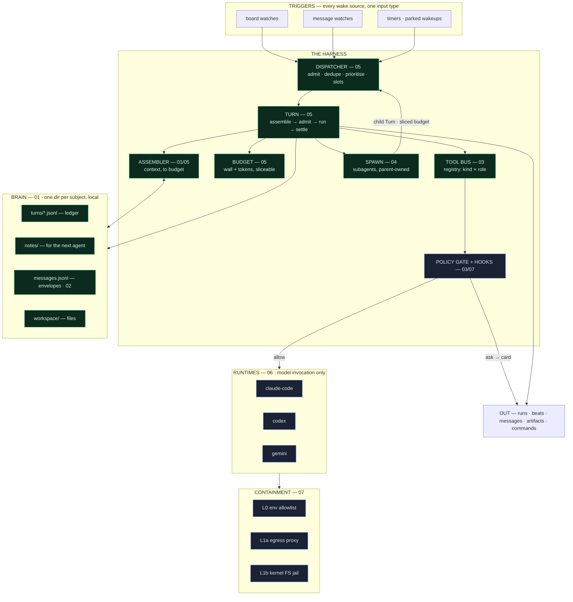

# 00 — Overview

**Status:** ✅ shipped — v0.73.0 (PR #226); this overview now describes the system as **built**
**Read this first.** Everything else in the handbook elaborates one box in §3's diagram.

---

## 1. Scope

What the harness is, what it is not, the subsystems it decomposes into, the invariants it holds, and
the vocabulary the rest of the handbook uses.

---

## 2. Motivation

An agent turn has to answer five questions. Before the harness, each was answered independently, at
roughly thirty call sites, inside one 7,800-line module:

| Question | Answered by, before | Consequence |
|---|---|---|
| What wakes an agent? | 25 `db.watch` registrations + 4 timers, deduped by 5 in-memory `Set`s | dedupe dies with the process; no priority, no concurrency ceiling |
| What can it do? | whichever tools its **runtime** happened to support | a Codex-seated worker silently cannot record a lesson or park a backlog item |
| What may it touch? | a policy gate wired into **1 of 3** runtimes | a workspace `deny` rule was law on Claude, fiction elsewhere |
| What does it cost? | 11 hardcoded wall-clock literals; no token budget | no policy, only accidents |
| What does it remember? | a `limit 24` transcript tail per call site | an agent arriving in a thread inherits nothing |

The harness is **not a new capability layer**. Six of the seven subsystems below already existed; they
were each wired per-call-site rather than behind a seam. The harness is the coordination that makes
them uniform — which is why it can be built mostly by extraction, and why it must not cost latency
(§5).

Full audit with citations: [docs/37 §§1–2](../37-harness.md).

---

## 3. The architecture

**Two structural facts the diagram encodes.** Every path to a runtime goes through the bus and the gate,
so a runtime cannot skip a permission check — it never receives one as an optional argument. And `spawn`
re-enters the **dispatcher**, so a subagent is an ordinary turn that queues for a slot and a sliced
budget rather than a privileged side channel.

---

## 4. The subsystems

| # | Subsystem | Doc | What ships today |
|---|---|---|---|
| 1 | **Dispatcher** — triggers → admission | [05](05-execution.md) | ❌ 25 independent watches |
| 2 | **Turn** — one execution lifecycle | [05](05-execution.md) | ❌ 9 bespoke flows |
| 3 | **Brain** — state, ledger, notes | [01](01-brain.md) | 🟡 summary log only, split roots |
| 4 | **Tool bus** — registry, gate, hooks | [03](03-tools.md) | 🟡 per-runtime tool sets |
| 5 | **Subagents** — spawn, ownership | [04](04-subagents.md) | 🟡 6 legs, one level, one model, gate bypassed |
| 6 | **Communication** — the envelope | [02](02-communication.md) | ❌ six ad-hoc text protocols |
| 7 | **Runtimes** — the provider matrix | [06](06-runtimes.md) | ✅ three adapters, BYOK + subscription |
| — | **Security** — policy + containment | [07](07-security.md) | 🟡 excellent engine, applied to 1 of 3 |
| — | **Observability** — runs, beats | [08](08-observability.md) | ✅ synced, cross-machine |

---

## 5. The constraint that shapes every design decision

[Doctrine §6](../05-engineering-philosophy.md): **agent wall-clock overhead vs. raw Claude Code < 10%**
— the *wrapping tax* gate, named after T3 Code, which wrapped agent CLIs and added 3× to real tasks.

A harness is precisely the shape of change that breaks this budget. Three rules keep it honest:

1. **In-process on the default path.** The bus adds no transport for `claude-code`; the CLI runtimes
   reuse the already-measured loopback bridge, whose cost is dwarfed by CLI spawn time.
2. **Pure functions over rows already in the replica.** Assembly, dispatch, and budgeting add no
   network hop and no vendor to the hot path.
3. **Each phase carries a measured before/after**, in its doc, as a number. A phase that regresses the
   tax does not land.

---

## 6. Invariants

Elaborated with enforcement points in the doc named. These are the claims the harness must make true.

| # | Invariant | Where enforced | Doc |
|---|---|---|---|
| I1 | A tool an agent may not use is one it is never handed — and, for board actions, a command the server refuses | bus registry **+** server | [03](03-tools.md) |
| I2 | A subagent has no board identity: no `agents` row, so it cannot be actor, assignee, or reviewer | absence of a row | [04](04-subagents.md) |
| I3 | A subtree cannot exceed its root's budget | harness budget slicing | [04](04-subagents.md) |
| I4 | Every tool call passes the gate — every runtime, every depth | bus is the only path | [03](03-tools.md), [07](07-security.md) |
| I5 | A `deny` is physically binding | kernel (L0/L1a/L1b) | [07](07-security.md) |
| I6 | The brain is a working set; the cloud is truth | tiering + promotion rule | [01](01-brain.md) |
| I7 | Credentials never travel | export allowlist + tests | [01](01-brain.md), [07](07-security.md) |
| I8 | Every turn settles, in a `finally` | turn lifecycle | [05](05-execution.md) |
| I9 | The board FSM is untouched | server + Postgres trigger, unchanged | [../09](../09-system-architecture.md) |

**On I9, said plainly:** the harness changes how an agent *executes*, never what the board *permits*.
No state transition is added, removed, or relaxed by anything in this handbook. If a harness change
appears to need an FSM change, that is a signal the design is wrong.

---

## 7. Glossary

| Term | Meaning |
|---|---|
| **Turn** | one unit of agent execution: a chat reply, a work attempt, a review, a sweep, a subagent leg. `turnId === runId`. |
| **Turn kind** | what the turn *is* — `chat · triage · design · plan · work · review · ship · sweep · deep · leg`. Determines toolset and budget. |
| **Trigger** | anything that can cause a turn: a board row, a message, a timer, a parked wakeup. |
| **Subject** | a thread or a task — what a brain is keyed on, and what outlives the agents working it. |
| **Level-1 agent** | a rostered teammate with an `agents` row: channel-registered, offerable, retireable. |
| **Subagent** | a unit of a parent's execution. No `agents` row. Owned by, and answered for by, its parent. |
| **Seat** | the resolved (agent, model, prompt) triple for a turn — from the project's model pack, with per-thread overrides. |
| **Brain** | the local state root, and a per-subject directory inside it. |
| **Ledger** | the append-only JSONL record of one turn; what makes resume and runtime-swap possible. |
| **Bus** | the single tool registry and the only path from a model to a tool. |
| **Gate** | the deterministic policy evaluation on a tool call: `allow` / `ask` / `deny`. |
| **Park** | ending a turn cleanly with a wake condition, so it costs nothing while it waits. |
| **Wrapping tax** | harness overhead vs. running the model's own CLI directly. Budgeted under 10%. |

---

## 8. Open questions

Tracked per component; the cross-cutting ones live in [docs/37 §12](../37-harness.md). At the time of
writing: whether turn budgets are fixed or configurable, whether `park` needs a server-side row,
whether the orchestrator should author code, and whether the ledger touches the code-surface ruling.

---

## 9. Change log

| Date | Change |
|---|---|
| 2026-07-31 | Created from the [docs/37](../37-harness.md) design. |
| 2026-08-02 | Status → shipped: v0.73.0 built P0–P5; v0.74.0–v0.74.2 hardened the field regressions (profile isolation, the stranded-profile boot, the silent boot stall). |
