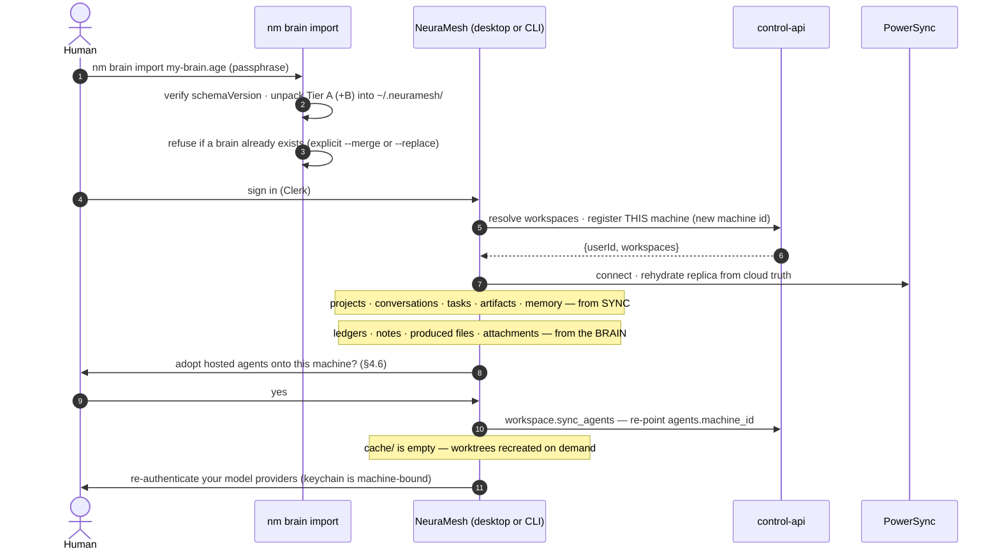

# 01 — Brain & State

**Status:** 🟡 shipped v0.73.0 (P2) — **export/import (§4) is unbuilt**, so the copy-the-brain portability promise is not yet real
**Owns:** the local state root · per-subject brains · the turn ledger · portability · retention
**Depends on:** nothing (this is the foundation layer)
**Depended on by:** [02 Communication](02-communication.md) · [04 Subagents](04-subagents.md) · [05 Execution](05-execution.md) · [09 CLI](09-cli.md)

---

## 1. Scope

The brain is **all local state a NeuraMesh machine owns**: the replica of cloud truth, the per-subject
working memory agents build up, the files they produce, the ledgers that make a turn resumable, and the
machine's own settings. This document defines its layout, its durability model, its portability
protocol, and what deliberately does *not* live in it.

It does **not** cover team memory — `facts`, lessons, `memory_blocks`, the pgvector recall spine. That
is cloud truth, specified in [docs/03](../03-protocol-and-memory.md). The relationship between the two
is §5, and it is the most important section here.

---

## 2. Motivation

### 2.1 Nothing owns "local state" today

Local state is split across two unrelated roots, which is why it is hard to answer simple questions
about it:

| Root | Holds |
|---|---|
| Electron `userData`<br/>(`~/Library/Application Support/NeuraMesh*`) | `neuramesh.db` (the PowerSync replica) · `agent-logs.db` · `attachments/` · `replica.json` (workspace identity marker) · `clerk-session.json` / `session.json` · the sandbox toggle · the orchmcp shim |
| `~/.neuramesh/` | `worktrees/nm-<n>` · `deliverables/nm-<n>` · `chats/nm-<threadId>` · `repos/<repoId>` · `design/nm-<n>` · `plan/nm-<n>` |

Consequences: there is no answer to "where is my NeuraMesh data", no way to back it up, no way to move
it, and — because `userData` is Electron's — **no path a non-Electron process can rely on**, which
blocks the headless CLI ([09](09-cli.md)) entirely.

### 2.2 A conversation loses what it knew

`agent-logs.db` is keyed by *agent + run*. A thread's files are in `chats/`. A task's files are in a
worktree. There is no place keyed by **the subject** — so when a second agent is woken in a thread, or
the orchestrator hands a designer a conversation, or a subagent needs its parent's findings, the
arriving agent gets a `limit 24` transcript tail and nothing else. Not what the previous agent
*learned*, *decided*, or *wrote down*.

### 2.3 A turn cannot be resumed

`agent-logs.db` is a summary feed: `detail` is capped at 8 KB and it is written for humans to read.
Nothing records a turn's steps in a form that could be replayed, so a turn killed mid-flight restarts
from zero (`resumeFlow`), and a turn capped by a usage limit re-seats and starts over instead of
continuing where it stopped.

---

## 3. Design

### 3.1 One root

```
~/.neuramesh/                     # THE BRAIN ROOT — the single local state root
```

Everything local lives here, including the databases formerly in Electron's `userData`. The root
resolves `NM_BRAIN` → `<NM_USERDATA>/brain` → `~/.neuramesh`: an explicit `NM_BRAIN` wins, a profile
gets its own root **automatically**, and only the installed app (no profile) uses the copyable
default. The profile leg is not optional sugar — v0.73.0 shipped without it, every profile collapsed
onto one root, and two apps shared one `state/replica.db` whose PowerSync checkpoint (`ps_buckets`)
and outbound queue (`ps_crud`) they kept invalidating for each other: the SYNCING… flicker. A
launcher that must remember a second variable is a launcher that will forget one, so the resolution
lives in `brainRoot()`, guarded by tests, not in the launch scripts.

Choosing `~/.neuramesh/` rather than `userData` is what makes the harness **runtime-agnostic**: the
desktop app, the CLI, and a future daemon all find the same state at a path none of them owns.

### 3.2 The layout

```
~/.neuramesh/
  brain.json                  # root manifest: schemaVersion, brainId, createdAt, workspaces[]
  identity/
    workspaces.json           # last-synced workspace identity (today: replica.json)
    machine.json              # this machine's id + display name
  state/
    replica.db                # the PowerSync replica (today: userData/neuramesh.db)
    activity.db               # the human-readable activity feed (today: agent-logs.db)
    harness.db                # durable dispatch: dedupe keys, slots, parked turns
  subjects/                   # ── the per-subject brains ──
    thread-<threadId>/
      subject.json            # kind, title, participants seen, created/updated
      index.json              # the assembler's manifest: what exists, how fresh, how big
      turns/<turnId>.jsonl    # the canonical ledger — replayable, resumable
      messages.jsonl          # AgentMessage envelopes (see 02)
      notes/*.md              # durable notes written FOR THE NEXT AGENT
      workspace/              # files the conversation produced (today: chats/nm-…)
    task-<number>/            # same shape; workspace/ = the scratch deliverable dir
  attachments/                # chat attachment bytes (today: userData/attachments)
  settings/
    machine.json              # sandbox toggle, sticky UI prefs
  cache/                      # ── rebuildable, never in a portable copy; ONE owner: the berth
                              #    sweep (docs/40 — boot · 6h · post-reclaim · Reclaim-now)
    worktrees/nm-<n>/         # git worktrees (absolute-path bound — see §4.3); BERTHS: class
                              #    derives from the board, evicted warm / removed dead (docs/40)
    repos/<repoId>/           # bare/shallow clones; dropped when over budget with no open tasks
    donors/<repoId>/<hash>/   # CoW dependency donors keyed by lockfile hash (docs/40) — newest
                              #    per repo survives any budget
    design/nm-<n>/  plan/nm-<n>/
  .secrets-never-here         # a marker file documenting §4.4, and a test asserts it
```

**Why per *subject*, not per agent or per turn.** A subject outlives every agent that touches it. Key
the brain on the agent and a handoff loses everything; key it on the turn and there is nothing to
inherit. Keyed on the subject, *every* agent that works a thread — including subagents and agents that
arrive later — reads and writes the same place. That is the whole design, and it is what
[docs/37 §6.1](../37-harness.md) was asked to deliver.

> **Amendment, 2026-08-02 — "every agent" has to include the orchestrator and its subagents.**
> The layout shipped keyed on the subject, and then only two paths used it: a worker read task notes
> into its prompt, and a worker's fan-out wrote them. On a **conversation** the brain held ledgers and
> nothing else — no notes were written, no result envelopes were filed, its files lived in a different
> directory (§8.1), and the orchestrator that owns the thread had no tool that could open any of it.
> So the design's own claim was true for one turn kind out of several. Four changes make it true:
>
> | | |
> |---|---|
> | `list_workspace` / `read_workspace_file` | the orchestrator can read its subject's files, notes, subagent results and turn count. The file name is model-supplied **data**, so it is resolved and checked to be inside the workspace (`resolveInWorkspace`) rather than matched against a blocklist |
> | the `notes` + `results` blocks | the assembler declared both from the start; the triage turn filled neither. A re-woken orchestrator now arrives knowing what earlier agents established and what its own legs already reported |
> | `recordLegResult(subject, …)` | was task-shaped, which silently excluded the case that needed it most — an orchestrator's fan-out in a conversation filed nothing, so five legs finished and everything they read and decided evaporated with the turn |
> | `brainBriefing` | both spawn sites said *"in your working directory"* and stopped. A child now arrives told what is already in the shared directory, which notes exist, and what its siblings have filed — a **listing**, not the contents, because inlining n notes into n sibling prompts is how a fan-out's context cost turns quadratic |
>
> The read order the orchestrator is given, stated in its prompt so it is a habit rather than a tool it
> might remember: **this subject's workspace → the room's library → a checked-out repo → memory → the
> open web.**

### 3.3 The ledger

`turns/<turnId>.jsonl` is the canonical record of one turn: one JSON object per line, append-only,
flushed at every committed step.

```ts
type LedgerEntry =
  | { t: 'turn.open';    turnId: string; kind: TurnKind; agent: string; seat: Seat; budget: Budget; at: string }
  | { t: 'context';      block: string; tokens: number; source: 'notes' | 'recall' | 'transcript' | 'dod' | 'skills' }
  | { t: 'model.event';  role: 'assistant' | 'thinking'; text: string; tokens?: number }
  | { t: 'tool.call';    id: string; name: string; input: unknown }
  | { t: 'gate';         id: string; action: PolicyAction; verdict: PolicyVerdict; reason: string }
  | { t: 'tool.result';  id: string; ok: boolean; output: string }
  | { t: 'spawn';        childTurnId: string; role: AgentRole; budget: Budget }
  | { t: 'checkpoint';   step: number; note: string }        // the resume point
  | { t: 'turn.settle';  state: RunTerminalState; summary: string; at: string };
```

Three properties follow from it, and only from it:

- **Resume.** A turn resumes from its last `checkpoint` instead of restarting.
- **Runtime swap.** A turn capped mid-flight ([docs/22](../22-capacity-failover.md)) continues on
  another runtime from the same ledger.
- **Audit.** Every gate verdict is recorded next to the call it judged, so "why did the agent do that"
  is answerable ([08](08-observability.md)).

`activity.db` is unchanged and stays the **human-readable summary feed** the runs UI reads. The ledger
is the **machine-readable canonical record**. Two artefacts, two audiences; neither replaces the other.

---

## 4. Portability — the durability tiers

> **The founder ask, stated as a requirement:** *copy the brain directory to another computer, sign in,
> and have my projects, conversations, agents, artifacts restored.*

This is achievable, but it decomposes into two things that are worth separating precisely, because one
of them **already works** and conflating them leads to building machinery we do not need.

### 4.1 What sign-in already restores (no copying required)

Projects, channels, conversations, tasks, agents, artifact metadata, memory, and beats are **cloud
truth**, mirrored to each machine by PowerSync ([docs/09 §4](../09-system-architecture.md)). Signing in
on a fresh machine rehydrates all of it from Postgres with no file transfer at all. That is the
existing "local compute, cloud truth" promise, and it is not what the brain is for.

**So the brain's job is not to carry what sync already carries.** It carries what sync *cannot*:
per-subject working memory, turn ledgers, notes, produced files, attachment bytes, and machine
settings — the difference between *the team's record of the work* and *your agents' memory of doing it*.

### 4.2 The three tiers

| Tier | Contents | In a portable copy? | If lost |
|---|---|---|---|
| **A — irreplaceable** | `subjects/` (ledgers, notes, envelopes, `workspace/`), `attachments/`, `settings/`, `brain.json` | **yes — this is the point** | gone forever; no cloud copy exists |
| **B — rebuildable** | `state/replica.db`, `state/activity.db` | optional (a warm start) | rebuilt from Postgres on next sync |
| **C — machine-bound** | `cache/` (worktrees, clones), sessions, keychain credentials, runtime CLI logins, `identity/machine.json` | **never** | recreated on the new machine |

`nm brain export` produces **Tier A (+ optionally B)** as a single encrypted archive; `nm brain import`
restores it. The plain directory remains copyable disk-to-disk for the same user, but the *supported*
path is the export, for the reason in §4.4.

### 4.3 Why worktrees cannot travel (a hard technical constraint)

A git worktree is bound to its parent repository by **absolute path**: the worktree's `.git` file
contains `gitdir: /abs/path/to/repo/.git/worktrees/<name>`, and the repo side points back. Copied to a
machine where the repo lives elsewhere, it is broken — not degraded, broken. Clones under
`cache/repos/` are also large and re-fetchable.

So worktrees and clones live under `cache/`, are excluded from every export, and are **recreated on
demand** — which is already how `worktreeRun` behaves when a worktree is missing. Nothing is lost that
was committed and pushed, and by [docs/09 §10](../09-system-architecture.md) a submitted task has
already pushed its branch.

> **The one real loss to be honest about:** uncommitted work in a live worktree at the moment you move
> machines. This is the same exposure as any local checkout, and the mitigation is the same — the
> harness pushes at submit, so the window is one in-flight turn.

### 4.4 Credentials never travel — and why that makes the ask *better*

[Doctrine §5.4](../05-engineering-philosophy.md): *inference keys live in the machine keychain; the
platform never holds them.* A portable brain must not become a portable credential bundle.

Excluded from the brain and from every export, without exception:

- **Provider keys (BYOK)** — OS keychain, never a file in the brain.
- **Auth sessions** — `clerk-session.json` / `session.json` stay machine-bound. This is why the ask
  says *"sign in to my account"*: signing in is the security boundary being crossed deliberately, and a
  brain that carried a live session would silently remove it.
- **Runtime CLI logins** — `~/.claude`, `~/.codex`, `~/.gemini` are those tools' own state, outside the
  brain, and remain per-machine.

A `.secrets-never-here` marker documents this at the filesystem, and a test asserts no export path
emits a keychain item or a session file. The restore flow therefore ends with **re-authenticating
providers** on the new machine — one step, stated up front, rather than a surprise.

**Encryption.** Tier A contains turn ledgers — file contents, command output, possibly secrets the
agent saw (the locked 2026-06-13 privacy decision). FileVault protects the disk but **not a copy on
external media**, which is exactly the transfer this feature invites. So `nm brain export` writes an
**encrypted archive with a user passphrase**; there is no unencrypted export path.

### 4.5 The restore protocol



### 4.6 Machine adoption — the wrinkle that makes "my agents restored" true

An agent is hosted where `agents.machine_id` says it is. So a copied brain plus a sign-in gives you a
**new** machine row, with the old machine still owning the agents — and the daemon on the new machine
watches `where a.machine_id = ?` ([agents.ts:2241](../../apps/desktop/src/main/agents.ts)) and finds
nothing. The agents would appear in the roster and never act.

Restore therefore includes an explicit **adoption** step that re-points this workspace's hosted agents
at the new machine. The command already exists as a recovery action (`workspace.sync_agents`, surfaced
today when `agent_channels` is orphaned); restore reuses it rather than inventing a second path.

Adoption is **explicit and human-confirmed**, never automatic — two machines legitimately share a
workspace, and silently stealing agents from a machine that is still running is the worse failure.

---

## 5. The relationship to team memory

Three layers, distinct scopes, deliberately not merged:

| Layer | Scope | Survives machine loss | Where specified |
|---|---|---|---|
| **brain** — ledgers, notes, envelopes, workspaces | one machine, one subject | only via export (§4) | this doc |
| **thread** — synced `messages` | every machine | yes | [docs/09](../09-system-architecture.md) |
| **memory spine** — `facts`, lessons, `memory_blocks` | every machine, recallable | yes | [docs/03](../03-protocol-and-memory.md) |

**The promotion rule.** A note that matters beyond this machine does not stay a note: it is promoted to
a `fact` or a lesson, which is the existing spine doing its existing job (`memory.record_lesson`,
extract→reconcile). The brain is a **working set with a promotion path**, not a second source of truth.

> This is a correction to [docs/37 §6.1](../37-harness.md), which described the brain as a working set
> that simply does not survive machine loss. With §4 it *can* survive, by export — but the promotion
> rule still stands, because an export is a deliberate act and durable learning must not depend on
> someone having remembered to run it.

---

## 6. Invariants

| # | Invariant | Enforced where |
|---|---|---|
| B1 | One local state root; no component reads Electron `userData` directly | harness structure — a single `brainPath()` resolver, asserted by a lint test |
| B2 | Credentials, sessions, and runtime logins are never in the brain or an export | export allowlist + a test asserting no keychain/session artefact is emitted |
| B3 | No unencrypted export path exists | `nm brain export` has no `--plain` flag; test asserts archive magic bytes |
| B4 | `cache/` is excluded from every export and rebuildable from cloud + git | export denylist; worktree recreation on demand |
| B5 | A brain records its `schemaVersion`; an import refuses a newer one | `brain.json` check on import, with a stated upgrade path |
| B6 | Machine adoption is explicit and human-confirmed | the restore flow; `workspace.sync_agents` is a command, not a boot side effect |
| B7 | A subject's brain is reclaimed with its task on `accepted`/`closed` | the existing reclaim watch, extended to `subjects/task-<n>` |
| B8 | The ledger is append-only within a turn | writer opens `a` mode; no update path exists |

---

## 7. Interfaces

```ts
// harness/brain.ts
export function brainRoot(): string;                   // NM_BRAIN ?? <NM_USERDATA>/brain ?? ~/.neuramesh
export function subjectPath(s: SubjectRef): string;    // subjects/thread-<id> | task-<n>

export interface Brain {
  open(s: SubjectRef): Promise<SubjectBrain>;
  reclaim(s: SubjectRef): Promise<void>;
}

export interface SubjectBrain {
  readonly path: string;
  index(): Promise<BrainIndex>;                        // what exists, how fresh, how big
  ledger(turnId: string): Ledger;                      // append + replay + lastCheckpoint
  notes(): Promise<Note[]>;
  writeNote(name: string, body: string): Promise<void>;
  messages(): Promise<AgentMessage[]>;                 // see 02
  appendMessage(m: AgentMessage): Promise<void>;
  workspaceDir(): string;
}

export interface Ledger {
  append(e: LedgerEntry): Promise<void>;
  replay(): AsyncIterable<LedgerEntry>;
  lastCheckpoint(): Promise<{ step: number; note: string } | null>;
}
```

---

## 8. Migration from today's split roots

A one-time, **app-closed** migration — the hard-won rule from the `NM_USERDATA` profile work is that a
live replica must never be moved under a running app:

| From | To |
|---|---|
| `userData/neuramesh.db` | `state/replica.db` |
| `userData/agent-logs.db` | `state/activity.db` |
| `userData/attachments/` | `attachments/` |
| `userData/replica.json` | `identity/workspaces.json` |
| `~/.neuramesh/chats/nm-<tid>` | `subjects/thread-<tid>/workspace/` |
| `~/.neuramesh/deliverables/nm-<n>` | `subjects/task-<n>/workspace/` |
| `~/.neuramesh/{worktrees,repos,design,plan}` | `cache/{worktrees,repos,design,plan}` |
| `userData/{clerk-session,session}.json` | **stays** — machine-bound, never in the brain (§4.4) |

Migration rules: **copy-then-verify-then-remove**, never move; idempotent, so an interrupted run
resumes; a `brain.json` written only on success, so a partial migration is detected and retried rather
than mistaken for a finished one. If migration fails, the app runs on the old paths and says so —
degradation, not a wedge.

### 8.1 The conversation row is lazy, and has to be (2026-08-02)

`chats/nm-<tid>` → `subjects/thread-<tid>/workspace/` is in the table above, and it is the one row the
v0.73.0 migration did not carry — `chatWorkspaceDir` kept writing to `chats/`, so a conversation had
**two homes**: its ledgers, notes and result envelopes under `subjects/`, and the files it actually
produced somewhere else. An agent asked *"what have we got here"* could reach half the answer at most.
This is the failure mode `cachePath` already exists to prevent, in the one place a helper had not been
written.

It cannot be a `planMigration` step, for an arithmetic reason: the legacy name kept **12 characters**
of the de-hyphenated thread id and `subjectSlug` keeps **16**, so the mapping is one-way and a bulk
sweep would have to guess which thread each directory belonged to. The caller opening a workspace
already holds the exact id, so adoption happens **there, lazily, on first use** — `adoptLegacyDir`,
under the same three rules as the bulk migration, with an existing non-empty destination winning
outright rather than being merged into (two half-histories in one conversation is the worse outcome).

**And a sweep for the rest.** Lazy adoption only reaches a conversation somebody reopens, so older
threads would keep their pre-merge directory forever and `chats/` would never empty. The mapping *is*
recoverable with the thread ids — which the **daemon** has and the boot migration does not, since it
runs before the replica is open. So `planChatAdoption` (pure) matches directories to threads and the
daemon runs it once, 45s after boot, costing one `existsSync` afterwards.

Three outcomes, and only the first one touches disk:

| | |
|---|---|
| matched | adopted, same copy-verify-remove |
| unmatched | a thread that has not synced yet, or something we did not write — **named, never deleted**, and retried next boot |
| ambiguous | 12 hex characters is 48 bits, so two ids *can* share a prefix and produce one directory name. Vanishingly unlikely; the failure mode is handing one conversation's files to another, so a name claimed by more than one thread is left alone and reported rather than guessed |

The ambiguous case was found by a test written to assert the opposite — that distinct threads never
collide. They usually don't; the assertion was still wrong, and the map was silently last-write-wins
until it failed.

> This is a **deploy-notes-bearing change** ([docs/11](../11-releases.md)): the first launch after it
> ships moves user data on disk. It must be called out in the PR under `## Deploy notes`.

---

## 9. Failure modes

| Failure | Behaviour |
|---|---|
| brain root unwritable (permissions, full disk) | the app runs **read-only-brain**: sync and reads work, turns refuse to start with a named reason, rather than running unrecorded |
| a ledger is corrupt mid-turn | replay stops at the last valid line; the turn resumes from that checkpoint; the corrupt tail is preserved as `.bad` for diagnosis |
| an import carries a newer `schemaVersion` | refused with the version pair and an upgrade instruction (B5) — never a best-effort partial import |
| an import lands on an existing brain | refused unless `--merge` or `--replace` is explicit; the default cannot destroy data |
| adoption is declined | agents stay on the old machine, this machine hosts none, and the UI says so plainly |
| `cache/` is deleted while a turn runs | the turn fails and is retried; worktrees recreate on the next attempt |

---

## 10. Open questions

1. **Is a Tier-B replica worth including in an export?** It makes a restored machine instantly warm
   instead of waiting on a first sync, but a stale replica plus an identity change is exactly the
   2026-07-10 wipe incident's shape. *Leaning: exclude by default, `--with-cache` for the impatient.*
2. **Per-workspace brains, or one brain with workspace-scoped subjects?** One root is simpler and
   matches sync; per-workspace roots would make "export just this client's work" trivial. *Leaning:
   one root, `--workspace` filter on export.*
3. **Does the ledger's content change the [docs/09 §13](../09-system-architecture.md) code-surface
   ruling?** It records file contents and command output per subject. It is local-only and now
   optionally exportable-encrypted. *Believed compatible; flagged for founder confirmation rather than
   assumed.*
4. **Should promotion be automatic?** A note that survives N turns could be auto-proposed as a lesson.
   Cheap to add later, easy to make annoying. *Deferred until we have watched real notes accumulate.*

---

## 11. Change log

| Date | Change |
|---|---|
| 2026-07-31 | Created. Establishes the single root, the per-subject layout, the ledger schema, and the three-tier portability model. **Corrects [docs/37 §6.1](../37-harness.md)**, which had the brain as non-portable; adds the export/import protocol, the machine-adoption step, and the credentials-never-travel boundary. |
| 2026-08-02 | §3.2 amended and §8.1 added: the per-subject promise held for workers and not for conversations. A thread's files lived outside its brain (`chats/`, the one un-carried §8 row — now adopted lazily, because a 12-character legacy name cannot yield a 16-character slug); its notes and result envelopes were never written at all; and the orchestrator had no tool that could open any of it. Adds the workspace tools, the `notes`/`results` context blocks, subject-keyed leg recording, and the subagent brain briefing. Also found in passing: `src/main/harness/*.test.ts` was absent from the desktop `test` glob, so **ten harness test files — 183 tests — had never run in CI**, including the brain's own. |
| 2026-08-02 | Status → shipped (v0.73.0): root, subjects, ledger class, migration. §2 corrected: profile isolation is automatic in `brainRoot()` (v0.74.0) after the one-root collapse shipped in v0.73.0. Two field lessons now invariants: the app **creates `state/` before opening either database** (neither better-sqlite3 nor PowerSync mkdirs; a profile v0.73.0 had swept clean booted against a missing directory and hung with no error, v0.74.2), and only `brain.ts` may spell the root (a source-grep test fails on any hardcoded `.neuramesh` elsewhere — four call sites had bypassed `brainRoot()` unnoticed). §4 export/import remains unbuilt. |
