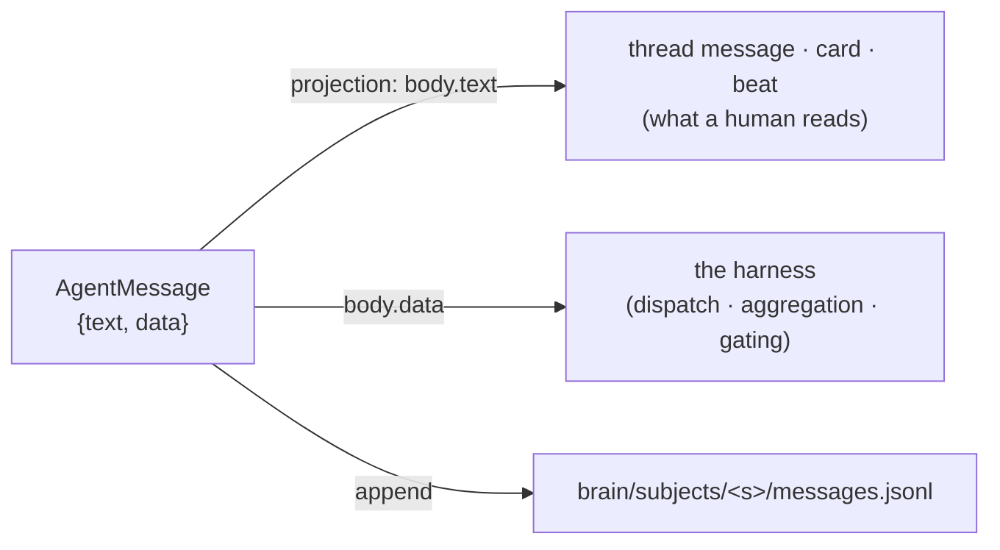

# 02 — Communication

**Status:** ✅ shipped — v0.73.0 (P2)
**Owns:** the `AgentMessage` envelope · agent↔agent and parent↔subagent transport · the projection to human-readable messages
**Depends on:** [01 Brain](01-brain.md) (`messages.jsonl` is the log)
**Depended on by:** [04 Subagents](04-subagents.md) · [08 Observability](08-observability.md)

---

## 1. Scope

How agents say things to each other, and to their subagents, in a form the harness can act on. Covers
the envelope, its transports, and the rule that keeps human-readable threads unchanged.

**Not in scope:** human↔agent chat content (that is [docs/34](../34-chat-mode.md)), and the synced
`messages` table (that is [docs/09](../09-system-architecture.md)). This document is careful about that
boundary — §4 exists specifically to avoid inventing a second cross-machine messaging plane.

---

## 2. Motivation

### 2.1 There are six ad-hoc text protocols in production

Agent-to-agent and agent-to-harness communication is carried today by **markers embedded in prose**:

| Protocol | Carries | Parsed by |
|---|---|---|
| ` ```nmq ` fence | decision + permission cards | `cards.ts`, the renderer, the daemon's answer watcher |
| ` ```nms ` fence | suggested follow-ups | the renderer |
| `NM_BEAT_DONE` in stdout | progress beats on CLI runtimes | `beatMarkerSink` / `stripBeatMarkers` |
| `SKILL_MARKER` | a human's `/`-attached skill | `parseSkillMarker` |
| mode divider marker | chat/tasks mode change | `parseModeMarker` |
| `**question** → answer` reply line | a card answered from mobile | the daemon's reply parser |

Each was locally reasonable. Together they are a parser surface with no schema, no versioning, and no
validation — and one of them (`NM_BEAT_DONE`) makes a **progress-tracking system depend on the model's
willingness to echo a magic string**, which [doctrine §1.3](../05-engineering-philosophy.md) exists to
forbid.

### 2.2 Subagent results are string concatenation

Today a fan-out collects results by building markdown:

```ts
findings.push(`### ${leg.name}\n\n${out.trim()}`);   // agents.ts:1993
```

So a parent cannot ask *did this leg succeed*, *what did it produce*, *which file*, *how confident* —
only re-read prose it generated itself. With [subagents](04-subagents.md) becoming unbounded and
nested, prose aggregation stops being merely lossy and becomes unworkable.

---

## 3. Design — one envelope

```ts
// packages/shared/src/harness.ts
export interface AgentMessage {
  id: string;                       // ULID — ordered
  v: 1;                             // envelope version; unknown major → ignored, logged, never crash
  from: { kind: 'agent' | 'subagent' | 'human' | 'harness'; id: string; turnId?: string };
  to:   { kind: 'agent' | 'subagent' | 'parent' | 'thread'; id?: string };
  kind: MessageKind;
  subject: { workspaceId: string; channelId: string; threadId?: string; taskId?: string };
  body: {
    text?: string;                  // prose — what a human reads
    data?: unknown;                 // structured — what the harness reads
  };
  refs?: Ref[];                     // artifacts, brain-relative paths, turn ids
  causedBy?: string;                // the message this answers — the causal chain
  at: string;                       // ISO
}

export type MessageKind =
  | 'request'    // parent → subagent: do this
  | 'result'     // subagent → parent: here is the outcome (data is typed per turn kind)
  | 'progress'   // a beat, a step line — replaces NM_BEAT_DONE
  | 'question'   // needs an answer before proceeding (a card, when it reaches a human)
  | 'answer'     // resolves a question — replaces the `**question** → …` reply line
  | 'handoff'    // agent → agent: you are taking this over, here is the state
  | 'failure';   // something did not work, with a reason

export type Ref =
  | { kind: 'artifact'; id: string }
  | { kind: 'file'; path: string }        // brain-relative, never absolute
  | { kind: 'turn'; id: string }
  | { kind: 'task'; number: number };
```

### 3.1 The projection rule

> **A human-readable message is a *projection* of an envelope, not a separate thing.**

Every envelope that a human should see renders to prose from `body.text`; the harness reads `body.data`.
This is the same discipline as `events` → projected `tasks`: one write, two readers, no divergence
possible. It also means **adopting the envelope changes nothing about what anyone reads** — threads look
identical, cards look identical — which is what makes this safe to land in one phase.



### 3.2 Typed result payloads

`kind: 'result'` carries a payload typed by the producing turn kind, so a parent aggregates data rather
than parsing its own markdown:

```ts
export type ResultData =
  | { kind: 'design';  rounds: Array<{ file: string; title: string }>; note?: string }
  | { kind: 'review';  verdict: 'approve' | 'changes'; points: string[]; ciChecked: boolean }
  | { kind: 'research'; findings: Array<{ claim: string; source?: string; confidence: 'high'|'medium'|'low' }> }
  | { kind: 'work';    files: string[]; validated: string[]; incomplete?: string[] }
  | { kind: 'generic'; summary: string };
```

Note `incomplete` on `work` results: it makes "I could not finish this part" a **field** rather than a
sentence a parent might miss — the structural version of the honesty rule already in the worker prompt.

---

## 4. Transports — and the plane we are *not* building

| Transport | Carries | Crosses machines? |
|---|---|---|
| **in-process** | parent ↔ subagent, within one turn tree | no |
| **brain** (`messages.jsonl`) | every envelope, durably, per subject | only via export ([01 §4](01-brain.md)) |
| **thread** (synced `messages`) | the projection a human reads | **yes** — unchanged |
| **board commands** (`/v1/commands`) | anything enforced | **yes** — unchanged |

**The boundary, stated so it cannot drift:** the envelope is the **in-turn / in-brain** transport.
Cross-team, cross-machine communication stays exactly what it is today — synced `messages` plus
server-authorized commands. A subagent result never travels the wire; it travels its parent's brain.

We are not building a second network. An agent on machine A cannot send an envelope to an agent on
machine B; if it needs to, that is a **thread message or a board command**, and the fact that those are
enforced server-side is the reason.

---

## 5. Invariants

| # | Invariant | Enforced where |
|---|---|---|
| C1 | Every envelope validates against the zod schema before it is appended or acted on | `AgentMessageSchema.parse` at the single append point |
| C2 | An unknown `v` is ignored and logged, never fatal | version check in the reader |
| C3 | `refs` file paths are brain-relative, never absolute | schema refinement — an absolute path fails validation, so a leaked host path cannot ride along |
| C4 | A human-visible envelope has non-empty `body.text` | schema refinement per `kind` |
| C5 | The envelope never carries a credential | the redaction pass that `activity.db` already applies, run at append |
| C6 | Envelopes do not cross machines | no transport exists that could — enforced by absence |

---

## 6. Interfaces

```ts
// harness/messages.ts
export function send(m: Omit<AgentMessage, 'id' | 'at' | 'v'>): Promise<AgentMessage>;
export function inbox(turnId: string): Promise<AgentMessage[]>;        // addressed to this turn
export function project(m: AgentMessage): string | null;                // → prose, or null if internal
export function collect(parentTurnId: string): Promise<AgentMessage[]>; // a subtree's results
```

---

## 7. Migration — what each protocol becomes

| Today | After | Phase |
|---|---|---|
| `NM_BEAT_DONE` stdout markers | `kind: 'progress'` from the `advance_beat` bus tool | **P0** — mechanism and its tests deleted together |
| leg-result string concatenation | `kind: 'result'` with typed `ResultData` | P2 |
| `**question** → answer` reply line | `kind: 'answer'`, projected the same way | P2 |
| ` ```nmq ` / ` ```nms ` fences | **kept as the projection format** | — |

The fences stay. They are the *rendering* of a `question`/`suggestion` envelope, they work, and every
client parses them. Replacing a working projection would be churn; replacing the marker protocols that
have no schema is the point.

---

## 8. Failure modes

| Failure | Behaviour |
|---|---|
| a subagent emits no `result` | the parent sees the leg settle with no envelope and reports it as incomplete — never silently succeeds |
| `messages.jsonl` unwritable | envelopes still flow in-process; the turn logs the degradation; aggregation still works within the turn tree, and is lost across a resume |
| malformed envelope from a model-driven tool | rejected at C1 with the validation error returned **to the model**, so it can correct — the same shape as a rejected tool input |
| a projection is empty for a human-visible kind | C4 fails at validation, not at render time, so a blank thread message is impossible |

---

## 9. Open questions

1. **Should `question` envelopes reaching a human always become `nmq` cards?** In a chat thread,
   [docs/34](../34-chat-mode.md) says a conversation asks in prose and files nothing in the needs-you
   queue. So the projection is mode-dependent. *Leaning: `project()` takes the thread mode, and chat
   threads project a `question` as prose.*
2. **Do we need `kind: 'handoff'` in P2?** Nothing uses it yet; agent→agent handoff is a thread message
   today. *Leaning: define it, do not implement it, until a real handoff wants it.*
3. **Ordering across a turn tree.** ULIDs order by time, which is enough for aggregation but not a
   causal order. `causedBy` gives the chain. *Believed sufficient; revisit if a parent ever needs a
   strict merge order.*

---

## 10. Change log

| Date | Change |
|---|---|
| 2026-07-31 | Created. Envelope, projection rule, typed result payloads, and the explicit "no second network" boundary. |
| 2026-08-02 | Status → shipped (v0.73.0). A leg result lands as BOTH the `AgentMessage` envelope and a subject note, and the notes are read back into the parent's next turn — structure for the harness, prose for the human. |
