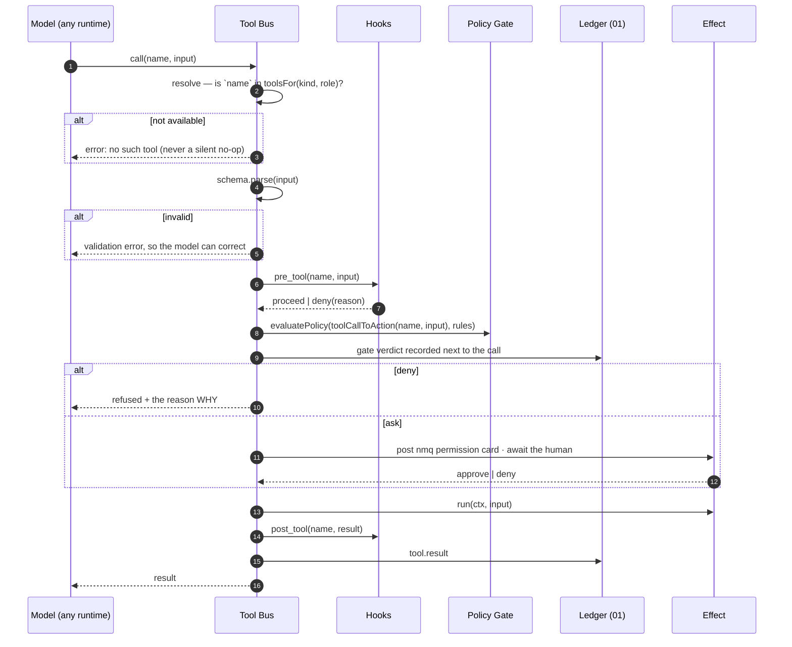

# 03 — Tools

**Status:** ✅ shipped — v0.73.0 (P0), verified E2E on all three runtimes over the loopback bridge
**Owns:** the tool registry · resolution by turn kind × role · the gate choke point · hooks · per-runtime delivery
**Depends on:** [07 Security](07-security.md) (the policy engine it calls)
**Depended on by:** every other component — this is the only path from a model to an effect

---

## 1. Scope

Every capability an agent has, how it is declared, how availability is decided, and how a call is
checked before it runs. The tool bus is the harness's **single choke point**: if a model causes an
effect, it went through here.

---

## 2. Motivation

### 2.1 The gate protects one runtime out of three

`packages/shared/src/policy.ts` is a deterministic permission engine with capabilities, scopes, glob
selectors, and `locked` workspace invariants. Its own header states the goal: *"an agent's intent is
governed by rules the agent cannot talk its way past."*

It is called from two places, both on the Claude path. The other runtimes:

- `runtime/gemini.ts:121` — `_permissionGate?: PermissionGate` — accepted and **discarded**
- `runtime/codexsdk.ts:107` — the parameter is **not in the signature**
- `deepWorkQuery` legs — `permissionMode: 'bypassPermissions'` (`agents.ts:1946`)

So a workspace rule `shell.exec / destructive → deny` is **law on Claude and fiction on Codex, Gemini,
and every subagent**. This is a [doctrine §1.3](../05-engineering-philosophy.md) violation and, by
[§5.4](../05-engineering-philosophy.md)'s "agent access = explicit machine-owner grants", stop-ship
class. It is the reason tools are phase P0 and not later.

### 2.2 Abilities follow the runtime instead of the role

`RuntimeAdapter.runQuery` takes **19 positional parameters** (`runtime/adapter.ts:86`); six are tools,
and the CLI adapters ignore all six. The source says so:

> `record_lesson` — *"Claude-tool only today; CLI runtimes get their lessons mined host-side after
> approval instead."*
> `declare_beats` — *"CLI runtimes ignore it in v1."*

A Codex-seated worker therefore cannot record a lesson, park a backlog item, or declare its plan —
silently, with no error and nothing in the thread. The human sees a worse teammate and cannot know why.

---

## 3. Design

### 3.1 One registry; the runtime is not an input

```ts
// harness/toolbus.ts
export interface ToolDef<I = unknown> {
  name: string;
  description: string;                     // what the model reads
  schema: z.ZodType<I>;                    // validated before run(); errors return to the model
  kinds: TurnKind[] | '*';                 // which turn kinds may call it
  roles: AgentRole[] | '*';                // which seats may call it
  capability: PolicyCapability | null;     // null = an nm command, gated by role not by policy
  run: (ctx: ToolCtx, input: I) => Promise<ToolResult>;
}

export function registerTool<I>(def: ToolDef<I>): void;
export function toolsFor(kind: TurnKind, role: AgentRole): ToolDef[];   // ← no runtime parameter
```

The absence of a `runtime` parameter in `toolsFor` is the design. Availability is a property of **what
this turn is** and **who is doing it**; delivery is the adapter's only remaining concern (§3.4).

Example — the tool that a Codex worker cannot call today:

```ts
registerTool({
  name: 'add_backlog_item',
  description: 'Park an out-of-scope discovery on the channel backlog. It stays parked until a human or the orchestrator promotes it.',
  schema: z.object({ title: z.string().min(3), description: z.string().optional(), parent: z.boolean().optional() }),
  kinds: ['work', 'review', 'chat', 'triage'],   // not 'design', not 'plan'
  roles: '*',
  capability: null,                               // an nm command
  run: (ctx, input) => ctx.command('task.create', { ...input, backlog: true }),
});
```

### 3.2 The call path — one sequence, all runtimes



Two details that matter more than they look:

- **A denial returns its reason to the model.** A model told *why* adapts; a model handed a bare failure
  retries the same call. The reason text comes from the rule's `rationale`.
- **An unavailable tool is an error, not an absence.** If a model somehow names a tool outside its
  toolset, it gets a hard error rather than silence, which is how we find registry mistakes.

### 3.3 Hooks

`pre_tool` / `post_tool`, machine-local, from workspace configuration. They ride the same choke point, so
a hook cannot be bypassed either. Phase **P5** — but the seam is the bus, so it costs nothing now.

Uses worth having: lint after `Edit`, refuse a diff that looks like a committed secret, run a type check
after a write, log every `shell.exec` to a machine audit file.

Hooks are **advisory-to-deny only**: a hook may block a call, never grant one the policy denied.
Otherwise a hook becomes a privilege-escalation path.

### 3.4 Delivery per runtime — the adapter's only job

| Runtime | Delivery | Cost |
|---|---|---|
| `claude-code` | in-process SDK tools | none added — the default path stays in-process |
| `codex` | per-thread MCP config → the loopback bridge | one loopback call per tool call |
| `gemini` | the existing stdio shim → the loopback bridge | one loopback call per tool call |

**The mechanism already exists and is proven.** `runtime/orchmcp.ts` exposes in-process tool closures to
`agy` over a loopback HTTP endpoint guarded by a per-turn secret, with an inert-outside-a-turn stdio
shim registered once in agy's MCP config. The harness **generalises its scope** — from one turn kind on
one runtime to every kind on every runtime — rather than inventing a transport. This is the single
largest piece of reuse in the harness plan.

Latency: a loopback round trip is microseconds against a CLI spawn measured in seconds, so the
[wrapping-tax budget](00-overview.md) is unaffected on CLI runtimes and untouched on Claude. Measured
figure lands here in P0.

### 3.5 The catalogue

| Tool | Kinds | Capability | Today |
|---|---|---|---|
| `declare_beats` / `advance_beat` | all working kinds | null | Claude only; stdout markers elsewhere |
| `record_lesson` | work, review | null | Claude only |
| `add_backlog_item` | work, review, chat, triage | null | Claude only |
| `add_subtask` | work, triage | null | Claude only |
| `load_skill` | all | null | Claude only |
| `propose_skill` | work, review | null | Claude only |
| `screenshot` | work, design | null | Claude only |
| `recall` | all | null | Claude only |
| `spawn` | all except `leg`-at-budget-floor | null | ❌ deep-work only ([04](04-subagents.md)) |
| `park` | work, review, ship, deep | null | ❌ does not exist ([05](05-execution.md)) |
| `Read`/`Write`/`Edit`/`Bash`/`WebFetch`… | per kind | `fs.read`, `fs.write`, `shell.exec`, `net.egress` | native per runtime, **gated on Claude only** |
| board commands (`submit`, `accept`, `approve_*`) | **never in a `leg`** | null, role-gated | server-enforced |

---

## 4. Invariants

| # | Invariant | Enforced where |
|---|---|---|
| T1 | A tool absent from `toolsFor(kind, role)` is never handed to the model | the toolset is *built*, so there is nothing to call |
| T2 | For board actions, T1 is doubled: the server also rejects the command | `handler.ts` role + FSM guards, unchanged |
| T3 | Every **bus** tool call is evaluated — every runtime, every depth | the bus is the only path; no adapter receives an optional gate |
| T3b | Per-call policy over a runtime's **native** tools holds only where `capabilities.gatesNativeTools` is true (today: `claude-code`) | the vendor SDK — see the correction below |
| T4 | Input is schema-validated before `run()` | `schema.parse` at the single entry |
| T5 | A hook may deny, never grant | hook result is intersected with the policy verdict, never unioned |
| T6 | Every call, verdict, and result is written to the ledger | the bus writes; `run()` cannot skip it |
| T7 | A `leg` turn's registry contains no board command | `kinds` on every board tool excludes `'leg'` |

> ### Correction, 2026-07-31 — what the gate can and cannot reach
>
> An earlier draft of this document stated as an invariant that "every tool call passes the gate, on
> every runtime." **That is not achievable with the current vendor SDKs**, and it was written before
> they were checked. Verified against the installed versions:
>
> | Runtime | Per-call hook over its own tools? |
> |---|---|
> | `claude-code` | **yes** — `PreToolUse` fires for every tool even under `bypassPermissions` |
> | `codex` (`@openai/codex-sdk@0.141.0`) | **no** — `approvalPolicy` is a policy *string* (`never \| on-request \| on-failure \| untrusted`) and the `ThreadEvent` union carries **no approval event**, so a host has nothing to answer |
> | `gemini` (`agy`) | **no** — the argv must stay exactly `--print <prompt>`; there is no hook and no toolset restriction available |
>
> So the honest split, which is what the code now implements and `capabilities.gatesNativeTools`
> declares:
>
> - **Bus tools** (the nm catalogue) are resolved, validated and gated by the bus on **all three**
>   runtimes. This is real, and it is what `toolbus.test.ts` and `bus-e2e.test.ts` prove.
> - **Native tools** (a runtime's own Read/Write/Bash) are gated per call **only on `claude-code`**.
>   On `codex` the floor is its native Seatbelt `workspace-write` plus L0/L1a; on `gemini` it is our
>   L1b Seatbelt jail.
>
> **The consequence, stated so a workspace can act on it:** a team that needs per-call policy over
> shell and filesystem access must seat its agents on a runtime that has it. Because this is a
> *declared capability* rather than an undocumented difference, the product can surface it — which is
> strictly better than the previous state, where the gate silently applied to one seat in three.

> ### Correction, 2026-08-01 — the orchestrator turn had no positive fence
>
> §3.1 says availability is decided by the registry. The **orchestrator's** turn
> (`anthropicOrchestratorTurn`) set only `allowedTools`, which the vendor SDK documents as the
> *auto-approve* list — *"To restrict which tools are available, use the `tools` option instead."*
> With no `tools`, it inherited the CLI's entire default surface. Measured on one machine,
> 2026-08-01:
>
> | | tools exposed | session init | a one-tool turn |
> |---|---|---|---|
> | as shipped | **81** | 3582ms | 7671ms · 3 turns · `ToolSearch` → `nm.list_repos` |
> | fenced | **28** | 611ms | 4339ms · 2 turns · `nm.list_repos` |
>
> `Bash`, `Workflow`, `CronCreate`, `NotebookEdit`, `PushNotification` and 25 more, on a turn whose
> whole job is to route work — and a `ToolSearch` round trip before it could reach the first board
> tool, because with that many tools the nm catalogue is deferred behind tool search.
>
> Two details that decided the fix, both verified rather than assumed:
>
> - **`tools` gates MCP tools too**, not just built-ins. So `tools: []` would have silently stripped
>   the workspace's own connectors — the opposite of a fix, and invisible until someone asked for a
>   document that used to be reachable. The turn keeps **`tools: ['ToolSearch']`**: built-ins gone,
>   connectors still reachable on demand (`ToolSearch → mcp__claude-design__list_projects`,
>   confirmed live).
> - **`alwaysLoad: true` on the nm server** puts the catalogue in the turn-1 prompt, so the round
>   trip leaves the hot path entirely and is paid only when a connector is genuinely reached for.
>
> `disallowedTools` was measured too and rejected: it left 26 built-ins standing. That is the
> whack-a-mole `researchComplete` already learned to avoid — the fence has to be positive.

> ### Amendment, 2026-08-01 — the orchestrator can read the room's own record
>
> A live failure: asked to research a product, the orchestrator fanned out five research legs, and
> the report came back about **two unrelated products of the same name**. The room's brand docs sat
> in its own library the whole time. Nothing was broken — the capability never existed: the
> orchestrator's registry had no way to reach `artifacts` at all, and a research leg had `Read`
> with nothing but a temp dir to point it at. Asked directly whether it had checked the library,
> the orchestrator blamed workspace memory and a disconnected Drive connector, which is the worse
> half of the failure: it could not name the tool it did not have.
>
> | Tool | Kinds | Capability | Reads |
> |---|---|---|---|
> | `list_library` | triage | null | names + sizes of the room's docs |
> | `read_library_doc` | triage | null | one doc's `inline_content`, capped at 24k chars |
> | `list_workspace` | triage | null | THIS subject's brain: its files, notes, subagent results, turn count ([01 §3.2](01-brain.md)) |
> | `read_workspace_file` | triage | null | one file from that workspace, path-jailed by `resolveInWorkspace` |
>
> Both read the **local replica** — `artifacts.inline_content` already syncs, and the marketing
> bootstrap already read a doc out of it by name — so this generalizes an existing read rather than
> adding a sync surface. `list_repos` gained `checked_out_at` for the same reason: `repos.local_path`
> was already there and already resolved elsewhere.
>
> Research legs get the library as **files**: `stageBrief` writes the room's docs into the leg's
> working directory, which `Read`/`Grep`/`Glob` already reach, so no new tool plumbing crosses the
> `deepWorkQuery` seam. Names are sanitized (`briefFileName`) because a library name is *data* an
> agent wrote — traversal has to be impossible, not discouraged. The staging dir is removed in a
> `finally`, and an empty library returns `null` so the no-docs path is byte-identical.
>
> The prompt states the precedence explicitly — library, then a checked-out repo, then memory, then
> the open web — because the failure was not the model reaching for the web, it was the web being
> the only thing it could reach.

**On T1 and T2 — the double-enforcement pattern.** This is [docs/34](../34-chat-mode.md)'s design
generalised: chat mode is safe because the chat turn is built from a registry with no `create_task` in
it *and* the server rejects a `task.create` naming a chat thread. Two independent mechanisms, either
sufficient. Every turn kind now works this way.

---

## 5. Interfaces

```ts
export interface ToolCtx {
  turn: Turn;
  brain: SubjectBrain;                                   // 01
  command(type: string, payload: unknown): Promise<ToolResult>;   // POST /v1/commands as the OWNING agent
  send(m: Omit<AgentMessage, 'id'|'at'|'v'>): Promise<void>;      // 02
  spawn(spec: SpawnSpec): Promise<AgentMessage>;                  // 04
  log: LogFn;
}

export type ToolResult = { ok: true; output: string } | { ok: false; error: string };
```

**`ctx.command` posts as the owning level-1 agent**, never as a subagent — there is no subagent actor to
post as ([04](04-subagents.md) I2). A subagent's `ctx` simply has no board commands registered, so the
question does not arise in a `leg`.

---

## 6. Failure modes

| Failure | Behaviour |
|---|---|
| the loopback bridge is unreachable mid-turn | the tool call returns an error to the model, which can adapt; the turn does not die. Repeated failures fail the turn with a named reason |
| a tool's `run()` throws | caught, returned as `{ok:false}` with the message, recorded in the ledger; the model continues |
| a policy rule row is malformed | dropped at `rowsToRules` (already the behaviour) — the gate never crashes on bad data |
| a human never answers an `ask` card | the call blocks to the turn's wall-clock budget, then the turn settles `failed` with "permission not answered" |
| the registry has two tools with one name | startup assertion fails loudly — a duplicate is a bug, not a last-write-wins |

---

## 7. Open questions

1. **Does `ask` on a CLI runtime feel acceptable?** A loopback call that blocks for a human turns a CLI
   turn into a long-lived process. `park` ([05](05-execution.md)) is the better answer — park on the
   card, resume on the answer — but that is P4 and this is P0. *Leaning: block within budget in P0,
   convert to park in P4.*
2. **Should `capability: null` tools be policy-gated at all?** They are nm commands, already role- and
   server-gated. Adding a `tool.mcp`-style capability would let a workspace deny `add_backlog_item`.
   *Leaning: no — the board's own authorization is the right layer; revisit if a workspace asks.*
3. **Per-workspace tool disabling.** Not the same as policy: "this team does not use skills." *Deferred
   — no demand yet.*

---

## 8. Change log

| Date | Change |
|---|---|
| 2026-07-31 | Created. Registry keyed by kind × role, the single call path, hook rules, per-runtime delivery via the generalised loopback bridge, and the T1/T2 double-enforcement pattern. |
| 2026-08-02 | Status → shipped (v0.73.0). Field lesson worth the whole doc: a capability granted on the BUS can still be undelivered by a flow's own registry — `TOOL_KINDS.spawn` listed `triage` from day one while `buildOrchestratorTools` never delivered it, so the orchestrator could not fan out. Granting a tool means checking both layers; fixed in both, plus a triage procedure in the orchestrator prompt. |
