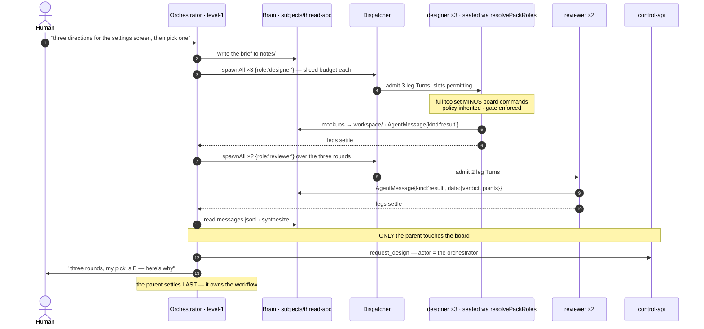

# 04 — Subagents

**Status:** ✅ shipped — v0.73.0 (P3): `spawn` on all three runtimes, nesting verified live
**Owns:** `spawn` · the ownership contract · role seating · budget slicing · subtree settle
**Depends on:** [05 Execution](05-execution.md) (dispatcher + sliceable budget) · [01 Brain](01-brain.md) (shared context) · [02 Communication](02-communication.md) (typed results)
**Founder ruling:** 2026-07-31 — subagents are first class, unbounded in count and depth

---

## 1. Scope

How an agent decomposes its own work by fanning out helpers, and the contract that makes unbounded
fan-out safe.

**The boundary this document defends:** subagents are **how an agent does its own work**. The board is
**how work is assigned and accepted**. Both are real; conflating them is what an earlier draft of
[docs/37](../37-harness.md) got wrong.

---

## 2. Motivation

### 2.1 The founder ruling, and why the previous position was wrong

The first draft of the harness design capped subagents at depth 1, reasoning that recursive fan-out is
what the board is for, since a board task gets a reviewer, a Definition of Done, and a human accept.

That confused two different things. *Work assignment* must stay on the board — a deliverable reaching a
human without a reviewer would break the product's core mechanic. But *how an agent decomposes its own
work* is not ours to cap: it is the agent's own execution, inside its own accountability envelope.

The correcting principle is the founder's, and it is the whole design:

> **If an agent fans out subagents, it owns that workflow.**

Ownership gives us every invariant the depth cap was protecting, without the cap. §4 makes it
structural.

### 2.2 What ships today is barely a fan-out

`startDeepWork` (`agents.ts:1959–2046`) is a real subagent engine that only deep research can use:

| Dimension | Today | Consequence |
|---|---|---|
| count | `MAX_LEGS = 6` | a 12-item sweep cannot fan out |
| depth | 1 | a leg cannot decompose |
| model | **the parent's own model for every leg** | heterogeneous seating is impossible, not merely unbuilt |
| tools | `WebSearch/WebFetch/Read/Grep/Glob` only | a leg cannot write a file |
| permissions | `permissionMode: 'bypassPermissions'` | **legs are ungated** — [03 §2.1](03-tools.md) |
| results | markdown string concatenation | a parent cannot ask whether a leg succeeded |
| callers | deep research only | the orchestrator, architect, and reviewer cannot fan out at all |

### 2.3 Roles are configuration, not a permission tier

A role already means exactly two things in this codebase, and neither is a boundary:

1. **Which model** — `resolvePackRoles(packId) → Record<AgentRole, string>`
   (`packages/shared/src/model-packs.ts:231`), with per-thread exceptions via `BrainOverride`
   ([docs/10](../10-model-packs.md)).
2. **Which system prompt.**

So `spawn({ role: 'designer' })` means *"seat this subagent with the model the active pack assigns to
`designer`, and the designer's prompt."* An orchestrator spawning three designers and two reviewers is
**seating five model configurations**, not granting anyone authority.

**This needs no new configuration surface**, which is the strongest evidence the design is right: it
reads the exact same seat-resolution path a level-1 agent reads.

---

## 3. Design

### 3.1 What a subagent is

| | Level-1 agent (a teammate) | Subagent (a unit of execution) |
|---|---|---|
| row in `agents` | **yes** — rostered, channel-registered, offerable, retireable | **no, by design** |
| appears in a room roster | yes | no |
| can be offered board work | yes | no |
| issues board commands | yes, as itself | **never** — the parent is the actor |
| lives in | the workspace | its parent's run tree (`runs.parent_run_id`) + brain |
| has a seat (model + prompt) | yes | yes — resolved identically |
| accountable for its output | itself | **its parent** |

**The absence of an `agents` row is the enforcement.** No row → no identity → cannot be a command actor,
an assignee, `offered_agent_id`, or a reviewer. The board FSM needs **not one new guard**: there is no
identity for it to guard against. This is the strongest form of enforcement available — not a rejected
attempt, an impossible one.

### 3.2 The API

```ts
export interface SpawnSpec {
  role: AgentRole;              // → model + prompt via resolvePackRoles (§2.3)
  prompt: string;               // the request
  model?: string;               // explicit override; must pass the server's allow-list
  budget?: Partial<Budget>;     // a request, intersected with what the parent can afford
  kinds?: TurnKind;             // defaults to 'leg'
}

// available to every turn kind (03 catalogue); returns when the child settles
ctx.spawn(spec): Promise<AgentMessage>;             // the child's `result` envelope
ctx.spawnAll(specs: SpawnSpec[]): Promise<AgentMessage[]>;   // concurrent, slot-limited
```

`spawn` **re-enters the dispatcher** ([05](05-execution.md)) rather than calling a runtime directly. A
subagent is an ordinary turn: it queues for a slot, gets a sliced budget, passes the same gate, and
writes to the same brain. That is what makes unbounded fan-out safe instead of a privileged side channel.

### 3.3 Budget is the recursion terminator

Unbounded *count* must not mean unbounded *resource*, or one runaway orchestrator spawns two hundred CLI
processes and the machine dies.

- A child's budget is a **slice of its parent's remaining** wall-clock and context.
- `spawn` **fails** when the parent's remaining budget cannot fund a viable child — so recursion
  terminates because budget is finite, at whatever depth that happens to be.
- **Concurrency is a machine resource**, owned by the dispatcher's slot pool, not a per-feature constant.
  `MAX_LEG_CONCURRENCY = 3` becomes that pool; **`MAX_LEGS = 6` is deleted** — a count limit standing in
  for a resource limit.

**Why this is better than a depth cap, precisely.** A depth cap says *"you may not decompose further"* —
a statement about permission, which is not ours to make. A budget says *"this is what the machine has"* —
a statement about physics, which is exactly what [doctrine §2](../05-engineering-philosophy.md) asks us
to reason from.

### 3.4 The ownership contract

Five rules. Each is a sentence, and each is enforced somewhere structural:

1. **The parent's turn does not settle until its whole subtree settles.** Already the de-facto pattern in
   `startDeepWork` (`mapCapped` → synthesis → `parent.settle`); the harness makes it structural for
   every kind.
2. **The parent inherits authorship.** If the orchestrator spawns developer-subagents that write code,
   the *orchestrator* authored that code — and authorship still owes the board everything it owed
   before: a task, a submit with artifacts, a reviewer who is not the author, a human accept. Subagents
   make an author faster. They do not make one exempt.
3. **A subagent's policy is its parent's, and can only narrow.** Rules are inherited; `spawn` may pass a
   *more* restrictive set, never a broader one. A `locked` workspace rule is locked all the way down.
4. **A subagent's toolset is its parent's minus every board command.** `toolsFor('leg', role)`; there is
   no `task.submit` in the registry to call ([03](03-tools.md) T7).
5. **A failed subagent is reported, never hidden.** Today's leg-failure path already does this — *"a dead
   leg is REPORTED, not hidden: partial research the human can see the holes in beats a tidy report that
   quietly covered four angles instead of five"* — and it becomes the rule.

### 3.5 A fan-out, end to end



Depth is not special: any of those subagents may spawn its own, and the same four things hold — sliced
budget, inherited policy, no board tools, parent settles last.

---

## 4. Invariants

| # | Invariant | Enforced where |
|---|---|---|
| S1 | A subagent has no board identity | **absence of an `agents` row** — nothing to be an actor with |
| S2 | A `leg` registry contains no board command | `kinds` on every board tool excludes `'leg'` ([03](03-tools.md) T7) |
| S3 | A subtree cannot exceed its root's wall-clock or context | budget slicing; `spawn` fails at the floor |
| S4 | Concurrency is bounded by the machine, not by depth | the dispatcher's slot pool |
| S5 | A parent settles only after its subtree settles | the turn lifecycle's `finally` awaits children |
| S6 | A subagent's effective policy ⊆ its parent's | rules intersected at spawn; `locked` rules unoverridable |
| S7 | Every subagent's tool calls pass the gate | the bus, unchanged by depth ([03](03-tools.md) T3) |
| S8 | A subagent's model must pass the server's allow-list | the same validation `BrainOverride` already applies |

---

## 5. What changes to build it

| Piece | Today | Change | Phase |
|---|---|---|---|
| leg permissions | `bypassPermissions` | the gate, inherited | **P0** |
| leg progress reporting | stdout markers | `progress` envelopes | **P0** |
| budget slicing | none | `Budget.slice()` | P1 |
| shared context | per-call prompt strings | the subject brain | P2 |
| typed results | markdown concatenation | `ResultData` | P2 |
| count cap | `MAX_LEGS = 6` | deleted | P3 |
| concurrency | `MAX_LEG_CONCURRENCY = 3` | the dispatcher's pool | P3 |
| per-leg seating | parent's model for all | `resolvePackRoles(role)` | P3 |
| leg tools | research only | full bus toolset for the kind | P3 |
| depth | 1 | unbounded, budget-bounded | P3 |
| runs UI | **one-level** `legsBy` map; `!parent_run_id` = root (`App.tsx:1944`) | recursive grouping, collapsed past depth 2 | P3 |

The last row is a real UI change, not a no-op: the renderer groups legs one level deep today, so a
grandchild would have no place to render.

---

## 6. Failure modes

| Failure | Behaviour |
|---|---|
| a subagent fails | reported to the parent as `kind:'failure'`; the parent decides whether to continue with partial results or fail — never silently omitted (S5, §3.4.5) |
| the subtree exhausts the root budget | remaining spawns fail at S3 with "budget exhausted"; already-running children finish; the parent reports what it got |
| a subagent hangs | its own wall-clock slice expires; it settles `failed`; the parent proceeds |
| the parent is aborted (task cancelled) | abort propagates down the tree; every child settles `stopped`; nothing keeps running orphaned |
| a subagent tries a board command | no such tool → hard error to the model; and no actor identity exists server-side even if it forged one |
| a cycle (A spawns B spawns A) | not prevented structurally, but budget-bounded, so it terminates. Depth and total-spawn counters are recorded in the ledger for diagnosis |

---

## 7. Open questions

1. **Should the orchestrator author code at all?** §3.4.2 makes it *legal*. Legal is not the same as
   wanted: a room where the orchestrator writes code is a different product from one where it routes.
   This is a product call, not a harness call, so the harness permits it and the *prompt* decides.
   *Recommendation: permit structurally, keep the orchestrator's prompt pointed at routing, and revisit
   after watching it happen in this repo.*
2. **Should a subagent be able to `park`?** A parked child holding a parent's turn open for hours is a
   new failure shape. *Leaning: no in P3 — only level-1 turns park; a child that needs to wait fails and
   lets its parent decide.*
3. **Do subagent results feed the memory spine?** A leg that learns something durable should arguably
   `record_lesson`. It has the tool by role, but the lesson's provenance would be the parent's task.
   *Leaning: allow it; provenance is the parent, which is consistent with ownership.*
4. **Naming in the UI.** Three concurrent `designer` legs need distinguishable labels. *Leaning: the
   spawn prompt's first clause, as `normalizeLegs` already does for research angles.*

---

## 8. Change log

| Date | Change |
|---|---|
| 2026-07-31 | Created following the founder ruling. Replaces the depth-1 position in the first [docs/37](../37-harness.md) draft with the ownership contract, no-`agents`-row enforcement, role seating via the existing pack seam, and budget-as-terminator. |
| 2026-08-02 | Status → shipped (v0.73.0). Fan-out verified in the live app (`leg | parent=8aba8df8…`); budgets slice from the parent's remainder (`sliceBudget` is the recursion terminator); a leg has no `agents` row and no board tool in its registry, by construction. |
| 2026-08-02 | **A child is now briefed on the brain it inherits.** Both spawn sites told a subagent it had "a working directory" and nothing else — not what was already in it, not the notes earlier agents left, not what its siblings had filed. So a fan-out re-read the same sources n times and wrote n unrelated files beside each other, which is the cost §3's shared-subject design exists to avoid. `brainBriefing` appends a listing (never the contents — n notes inlined into n sibling prompts is a quadratic context bill) plus the instruction to edit what is there rather than write a near-duplicate. Paired with subject-keyed `recordLegResult`, so the directory a child is told about is one that actually accumulates: an orchestrator's fan-out in a conversation previously filed nothing at all ([01 §3.2](01-brain.md)). |
