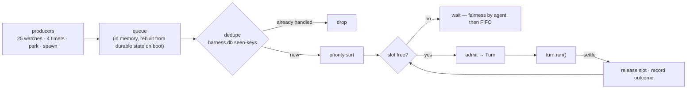

# 05 — Execution: triggers, the dispatcher, the turn, budgets

**Status:** 🟡 shipped v0.73.0 — P1 (dispatcher, admission, budgets, turn records) is live; `park` (P4) is fully wired and swept every 60s but **not yet observed live**; `assemble()` runs the chat and triage turns while the reply path still hand-rolls its `limit 8`
**Owns:** trigger normalisation · admission · dedupe · priority · concurrency · the turn lifecycle · budgets · `park`
**Depends on:** [01 Brain](01-brain.md) (ledger, `harness.db`)
**Depended on by:** [04 Subagents](04-subagents.md) (spawn re-enters the dispatcher)

---

## 1. Scope

Everything between "something happened" and "an agent turn is running or has settled". This is the
component that replaces the largest amount of existing code, and the one whose refactor carries the most
risk — so P1 is specified as **behaviour-preserving**.

---

## 2. Motivation

### 2.1 There is no dispatcher — there are 29 independent triggers

`agents.ts` is **7,798 lines**; `startAgentHost` opens at line 1721, so about **6,077 of them are one
closure**. Inside it: **25 `db.watch` registrations** and **4 `setInterval` timers**, each its own
reactive path, coordinated by process-local `Set`s — `claimed`, `reviewed`, `merged`, `reclaimed`,
`markedOnline`, plus `wakeStarted`/`wakeEnded` gating.

Four consequences, all structural:

- **Dedupe dies with the process.** Only two guards survive a restart: the server's atomic claim and the
  `0060` partial unique reply index. Everything else is memory. We have paid for this twice — the
  wake-vs-sweep double-triage race and the cross-process duplicate reply, each fixed by replacing an
  in-memory guard with a durable one.

  > **Correction, 2026-07-31 (found while adopting this).** Not every one of those Sets *should* be
  > durable, and `claimed` must not be. The **resume watch** exists to pick up *"in_progress tasks that
  > THIS PROCESS isn't executing — host crashed/restarted mid-task"*, and it decides that by testing
  > `claimed`. A durable `claimed` would strand every task whose host died mid-execution, **permanently**
  > — turning a crash-recovery mechanism into a data-loss one. Its ephemerality is load-bearing.
  >
  > The real split is **in-flight state vs. already-handled facts**: `claimed` and `markedOnline` are
  > in-flight and stay Sets; `merged` and `reclaimed` are facts and are now durable (`DurableSet` over
  > `harness.db`). And durability must record *successfully handled*, never *attempted* — the merge watch
  > does not clear `merged` on failure, so persisting it without also releasing it on the failure paths
  > would have converted a transient merge failure into a permanent one. Both paths now release it.
- **No concurrency ceiling.** Five offers landing in one sync tick start five flows, each able to spawn a
  ~220 MB runtime CLI. Nothing says "this machine runs at most N turns."
- **No priority, no fairness.** A human's chat message and a stall-watchdog re-offer compete by arrival
  order. The human should win; nothing encodes that.
- **A flow cannot be unit-tested.** Every flow closes over `db`, `post`, `apiUrl`, `agents`, and forty
  sibling functions, so only the pure helpers beside them have tests.

### 2.2 Eleven hardcoded budgets, and no token budget at all

Distinct wall-clock literals in production: 60s (channel block, checklist), 4m (chat, orchestrator,
thread), 6m (deep-work synthesis), 7m (research legs), 8m (deep-work leg), 10m (decision await), 12m
(chat-mode turn, CI wait), 15m (worker exec), 25m (release verify). Each was locally sane; together they
describe no policy. **Token budgets do not exist.**

Context has the same shape: each flow hand-rolls a transcript with an arbitrary SQL cap — `limit 8`,
`limit 14`, `limit 24` — chosen per call site, with no notion of what fits or what it costs.

### 2.3 A turn cannot outlive itself, and we say so in the prompt

From the shipped worker prompt (`runtime/adapter.ts:281`):

> *"YOUR TURN IS THE EXECUTION. Nothing you start survives it: there are no background agents that keep
> working after you stop, no scheduled check-in that calls you back, no later turn to finish in."*

True, well written, and the clearest possible statement of a missing primitive. It is why a worker that
needs to wait six minutes for CI either burns a 15-minute wall or gives up, and why `waitForCi` had to be
reimplemented as host-side polling outside the model's reach.

---

## 3. Design

### 3.1 Triggers — one input type

Every wake source normalises to one shape. The 25 watches do not disappear; they stop being *flows* and
become *producers*.

```ts
export interface Trigger {
  id: string;                  // the DEDUPE KEY — durable, see §3.3
  kind: TurnKind;
  cause: 'board' | 'message' | 'timer' | 'park' | 'spawn';
  subject: SubjectRef;
  agentId: string;             // who should act
  priority: Priority;          // §3.4
  payload?: unknown;           // the row / message / wake reason
  at: string;
}
```

### 3.2 The dispatcher



Its core is a **pure function**, which is what makes the untestable testable:

```ts
export function nextTurn(
  queue: readonly Trigger[],
  running: readonly RunningTurn[],
  caps: { slots: number; perAgent: number },
  seen: ReadonlySet<string>,
): Trigger | null;
```

Given a queue, what is running, the caps, and the durable seen-set, it returns the one trigger to admit —
or null. No database, no clock, no model. Unit tests cover priority ordering, the slot cap, per-agent
fairness, and dedupe across a simulated restart.

### 3.3 Dedupe that survives a restart

`harness.db` (in [the brain](01-brain.md)'s `state/`) holds the seen-keys with the outcome and a
timestamp. Keys are **derived from the cause**, so the same event cannot be handled twice:

| Cause | Key |
|---|---|
| board offer | `offer:<taskId>:<state>:<offeredAgentId>` |
| message wake | `wake:<messageId>:<agentId>` |
| review dispatch | `review:<taskId>:<submittedSha>` |
| timer sweep | `sweep:<kind>:<flooredInterval>` |
| park wakeup | `park:<parkId>` |
| spawn | `spawn:<parentTurnId>:<index>` |

This **complements, never replaces**, the server-side guarantees: the atomic claim and the `0060` reply
index remain the cross-machine truth. `harness.db` stops one *machine* from doing the same work twice
across a restart; the server stops *two machines* from doing it at all. Both are needed, for different
reasons.

Retention mirrors the brain: keys older than the retention window are pruned, since a board row that old
cannot legitimately re-fire.

### 3.4 Priority

Highest first. The ordering encodes a product judgment that is currently accidental:

| Priority | Triggers | Why |
|---|---|---|
| 1 **human-blocking** | a human's chat message; a permission-card answer; an approved gate | a person is waiting |
| 2 **board progress** | claim, resume, review dispatch, ship | the loop is the product |
| 3 **spawned** | subagent legs | inherits its parent's urgency, but never starves the parent's own progress |
| 4 **background** | digests, sweeps, watchdog triage, schedules | nothing is waiting |

Fairness: at most `perAgent` concurrent turns per agent, so one busy agent cannot hold every slot.

### 3.5 The turn lifecycle

Nine bespoke flows (`claimFlow`, `executeFlow`, `reviewFlow`, `architectFlow`, `designerFlow`,
`shipperFlow`, `wake`, `orchestratorTurn`, `chatTurn`) become one lifecycle over ten kinds.

| Phase | Does | Fails how |
|---|---|---|
| **assemble** | resolve seat + credential; open the [brain](01-brain.md) + ledger; build context to budget (§3.6); open the `runs` row | credential blocked → auth card, no run opened |
| **admit** | the slot was already reserved by the dispatcher; stamp presence through the existing status pump | does not fail here |
| **run** | `runtimeFor(seat.runtime)` invoked with the bus toolset, under one `AbortController` and one wall | timeout / abort / cap → settle `failed` or `stopped`; the ledger keeps the partial |
| **settle** | terminal run state, clear presence, flush ledger, **await subtree** ([04](04-subagents.md) S5), release the slot | **`finally`, always** |

The `finally`-settle discipline that `wake` gets right today (`agents.ts:7789`) becomes structural for all
ten kinds instead of nine separate chances to forget. An unsettled run is an eternal spinner **on every
machine**, because runs are synced — which is why I8 is an invariant and not a nicety.

### 3.6 Budgets

One table, replacing eleven literals. Wall-clock values stay close to today's, because each was
individually reasonable — this is codification, not re-tuning.

| Kind | Wall | Context | Notes |
|---|---|---|---|
| `chat` | 12m | 40k | may research, write, and run code |
| `triage` | 4m | 24k | deliberately tight — it is a routing budget |
| `design` | 20m | 32k | mockup rounds are generative |
| `plan` | 15m | 48k | read-only study workspace |
| `work` | 15m + **park** | 64k | park removes the reason to raise the wall |
| `review` | 10m | 48k | diff + Definition of Done + CI |
| `ship` | 10m | 32k | |
| `sweep` | 4m | 16k | |
| `deep` | 30m | 64k | the parent of a fan-out |
| `leg` | **a slice of the parent's remaining** | slice | [04](04-subagents.md) §3.3 |

```ts
export interface Budget {
  wallMs: number;
  contextTokens: number;
  spentMs(): number;
  remaining(): { wallMs: number; contextTokens: number };
  slice(n: number): Budget | null;   // null when the remainder cannot fund a viable child
}
```

`slice()` returning `null` is the recursion terminator for subagents. It is the only mechanism bounding
depth, and it is deliberately the *only* one.

### 3.7 The context assembler

`assemble(turn, budget)` — one function replacing per-call-site `limit N` SQL. Fills in priority order
until the token budget is spent:

1. the turn's system contract (kind + seat)
2. task / thread facts — Definition of Done, requirements, state
3. rework notes, if this is a re-attempt
4. **brain notes** written by previous agents on this subject ([01](01-brain.md))
5. **result envelopes** from this subject's earlier turns and subagents ([02](02-communication.md))
6. channel lessons
7. memory recall hits
8. the transcript tail
9. skills, attachments manifest

**The transcript is trimmed first**, because it is the only input that degrades gracefully — losing the
oldest chat turn costs little; losing the Definition of Done costs the task. Pure and unit-testable:
given rows and a budget, the output is fixed.

### 3.8 `park` — ending a turn without ending the work

```ts
park({ afterSeconds?: number; untilSignal?: 'ci' | 'subagents' | 'answer'; prompt: string })
```

The turn **ends cleanly**. Its run settles into `parked` — a new **non-terminal** state, so every
existing `isRunOpen` consumer keeps painting it live, which is exactly right. A durable row in
`harness.db` records the wake condition, and the dispatcher's existing tick (the
[stall watchdog](../19-stall-watchdog.md)'s 5-minute and 15-minute sweeps) re-admits it as a fresh turn
whose assembled context is its own ledger plus the wake reason.

**Why it matters more than it sounds:** it is the difference between a 15-minute ceiling and work that
takes as long as it takes, at zero token cost while waiting. And the payoff is a *deletion* — when park
ships, the "nothing you start survives it" paragraph comes out of the worker prompt, because it stops
being true.

`RUN_STATES` gains `parked`; `RUN_TERMINAL_STATES` does **not**.

---

## 4. Invariants

| # | Invariant | Enforced where |
|---|---|---|
| E1 | Every turn settles | the lifecycle's `finally` |
| E2 | A trigger is handled at most once per machine | `harness.db` seen-keys (durable) |
| E3 | Cross-machine single-handling remains the server's | atomic claim + `0060` index, unchanged |
| E4 | Concurrent turns ≤ slot cap; per agent ≤ `perAgent` | the dispatcher is the only admitter |
| E5 | No wall-clock or token literal exists at a call site | the budget table; a lint test greps for `_MS`/`60_000` in flow code |
| E6 | A parked run is open, not terminal | `RUN_TERMINAL_STATES` excludes it |
| E7 | Aborting a turn aborts its subtree | one `AbortController` per tree, propagated at spawn |

---

## 5. Failure modes

| Failure | Behaviour |
|---|---|
| `harness.db` unwritable | the dispatcher falls back to in-memory dedupe and **logs the degradation loudly** — today's behaviour, but named as degraded rather than normal |
| the queue grows faster than slots drain | background-priority triggers are shed with a log naming the count; human-blocking and board triggers are never shed |
| a turn hangs past its wall | the `AbortController` fires, the run settles `failed`, the ledger keeps the partial, the slot releases |
| the process dies mid-turn | on boot, runs owned by this machine that say `running` are settled `stopped` (already the behaviour via `settleOrphanedRuns`); resumable turns re-enter from their ledger checkpoint |
| a park signal never fires | the stall watchdog flags it by absolute age — a parked turn with no progress is a stall, which is the existing mechanism doing its existing job |
| clock skew moves a floored timer key | the sweep runs twice at worst; sweeps are idempotent by design |

---

## 6. Open questions

1. **Fixed budgets or a workspace setting?** Fixed keeps the product honest and the support surface
   small; a team with a 40-minute test suite will ask. Now load-bearing, since the root budget bounds a
   subtree. *Recommendation: fixed in P1, per-project overrides only when asked for.*
2. **What is the slot cap?** It should derive from the machine (cores, memory) rather than a constant,
   since each CLI runtime is heavy. *Leaning: `min(4, cores - 2)`, measured before fixing.*
3. **Does `park` need a server-side row?** Machine-local is simpler and respects local compute;
   server-side would let *another* machine resume a parked turn. *Recommendation: `runs.state='parked'`
   is already synced and descriptive; the wake condition stays local. Cross-machine resume is a later
   question, not a P4 blocker.*
4. **Should priority 3 (spawned) ever pre-empt priority 2?** A parent blocked on children while board
   work queues behind it is a potential deadlock shape. *Believed avoided by per-agent fairness; needs a
   loop-level test before P3.*

---

## 7. Change log

| Date | Change |
|---|---|
| 2026-07-31 | Created. Trigger normalisation, the pure `nextTurn`, durable dedupe keys, the four-tier priority, the unified lifecycle, the budget table with `slice()`, the assembler's fill order, and `park`. |
| 2026-08-02 | Status → shipped (v0.73.0): HostQueue admission (priority + per-agent fairness + durable guards) verified live at 1/4→2/4 slots; TURN_BUDGETS at 13 call sites; turn records durable. `assemble()` adopted at 2 of 3 transcript sites (chat `limit 24` ceiling + triage `limit 14` — the budget decides what survives); the reply path's `limit 8` is the holdout. Boot invariant added after a live hang (v0.74.2): the state directory is created before either database opens, and a boot that cannot reach the API surfaces the stall on the splash (~5 failed 1.5s polls) instead of retrying silently forever. |
