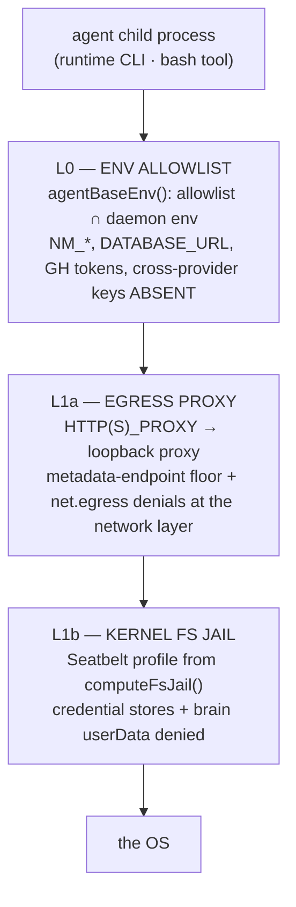

# 07 — Security

**Status:** 🟡 partial — the engine and the kernel floor ship; **application is incomplete** (§2)
**Owns:** the policy engine · the gate · containment L0/L1a/L1b · the credential boundary
**Depends on:** [03 Tools](03-tools.md) (the choke point that calls it)

---

## 1. Scope

What an agent is allowed to touch, how that is decided, and how a decision is made physically binding.

Three layers, and the distinction between them is the whole subject:

| Layer | Question | Mechanism |
|---|---|---|
| **Policy** | *should* this action be allowed? | `evaluatePolicy` — deterministic, pure |
| **Gate** | is it allowed *right now*, and who says so? | the bus: allow / ask-a-human / deny |
| **Containment** | can it happen *at all*? | kernel: env allowlist, egress proxy, FS jail |

Policy decides. Containment makes a decision binding. **A policy without containment is advice**, which
is why both exist and why neither is optional.

---

## 2. The state of things — an honest assessment

### 2.1 The engine is good

`packages/shared/src/policy.ts` is pure, deterministic, and well-designed: seven capabilities
(`fs.read`, `fs.write`, `shell.exec`, `net.egress`, `pkg.install`, `tool.mcp`, `vcs.push`), five scopes
ordered by specificity, three verdicts ordered by restrictiveness, a ReDoS-free selector DSL, and
`locked` workspace invariants evaluated first and unoverridable.

Its header states the invariant precisely: *"an agent's intent is governed by rules the agent cannot talk
its way past. A prompt-injected agent still cannot exceed its policy, because `evaluatePolicy()` is
deterministic and the rules came from context the attacker never controlled."*

`policygate.ts` around it is equally careful: action mapping, risk tiering, permission cards, and
**intent elicitation** — asking the agent's own model to state, in one sentence, why it needs the action,
so the human reads a real reason instead of a canned label.

### 2.2 It protects one runtime out of three

The gate is called from two places, both on the Claude path:

- `runtime/gemini.ts:121` — `_permissionGate?: PermissionGate` — accepted and **discarded**
- `runtime/codexsdk.ts:107` — the parameter is **not in the signature**
- `deepWorkQuery` legs — `permissionMode: 'bypassPermissions'` (`agents.ts:1946`)

**So a workspace rule `shell.exec / destructive → deny` is law on Claude and fiction on Codex, Gemini,
and every subagent.** The kernel floor still holds — a Codex agent cannot read `~/.ssh` — so this is not
an open door; but *policy is not enforcement today*, it is enforcement-if-you-drew-the-Anthropic-seat.

By [doctrine §1.3](../05-engineering-philosophy.md) and [§5.4](../05-engineering-philosophy.md) this is
stop-ship class, and it is why [tools](03-tools.md) is phase **P0** rather than a later slice.

**What P0 actually fixes, and what it cannot** (corrected 2026-07-31, after checking the SDKs). Every
tool the harness mediates is now gated on all three runtimes, because an adapter no longer receives a
gate it could ignore. But per-call policy over a runtime's *own* Read/Write/Bash needs a vendor hook,
and only `claude-code` has one. So:

- the **capability drift closes completely** — a Codex or Gemini worker gains the full nm toolset;
- the **policy gap narrows but does not close** — native-tool policy stays Claude-only, and is now
  *declared* (`capabilities.gatesNativeTools`) rather than silently absent.

Closing it further needs either a vendor hook we do not control, or routing shell and filesystem access
through bus tools while removing the runtime's native ones — which neither CLI permits today.

---

## 3. Containment — the three floors

**L0 — environment allowlist** (`runtime/adapter.ts:119`). A child's env is *built from an allowlist*,
not inherited. NeuraMesh's own secrets and every cross-provider key are absent **by construction**, not
by remembering to strip each one. `HOME` stays real so a subscription CLI can read its own login; the
single provider key an agent legitimately needs is injected explicitly by `providerEnv`.

**L1a — egress proxy** (`sandbox/egress.ts`). Agent HTTP(S) traffic routes through a loopback proxy, so
the metadata-endpoint floor and `net.egress` denials bind at the network layer rather than at the tool
call. **Fail-open by design**: if the proxy never came up, agents run un-proxied rather than losing all
egress. It also declines to override a user's own corporate proxy.

**L1b — kernel FS jail** (`sandbox/fsjail.ts`, `sandbox/seatbelt.ts`). Default-on, with `NM_SANDBOX_FS`
as an ops override above a per-machine UI toggle. `computeFsJail` carries a structural credential-store
floor and absorbs whatever else a workspace chose to jail — derived from its own `fs.read` deny rules via
`protectedPathsFromRules`, which is what unifies the tool gate with the sandbox. Fail-open on non-macOS
or setup error.

### 3.1 Why fail-open is the right default here, said explicitly

A fail-*closed* sandbox that cannot initialise would take the whole agent loop down — no work, no
replies, no visibility — for every user on a platform we have not covered. Fail-open keeps the product
working and leaves the *policy* layer intact, since the gate is independent of the sandbox.

The honest cost: on a machine where the sandbox failed, a `deny` is a decision rather than a wall. That is
acceptable **only because** L0 already removed the secrets worth stealing and L1a already constrains
exfiltration — three independent floors, each individually incomplete, and the argument depends on all
three. It would not be acceptable for L0, which is why L0 has no fail-open path.

### 3.2 The credential-store heuristic, and its honest limit

`credStorePath` maps a shell command reaching into `~/.ssh` or `~/.aws` to the `fs.read` it effectively
is, so `cat ~/.ssh/id_rsa` cannot slip past as an ordinary shell command. Its own comment is correct:
**heuristic, not a boundary** — an obfuscated path evades it, and L1b is the evasion-proof backstop.

This is the right layering and worth stating as a pattern: *a heuristic at the policy layer improves the
human-facing signal; the kernel layer is what makes the rule true.* Never the reverse.

---

## 4. The credential boundary

| Secret | Where it lives | Travels? |
|---|---|---|
| provider keys (BYOK) | OS keychain / `provider_credentials`, **excluded from the PowerSync publication** | never — not to a client, not into [the brain](01-brain.md) |
| auth sessions | `clerk-session.json` / `session.json`, machine-local | **never in a brain export** ([01 §4.4](01-brain.md)) |
| runtime CLI logins | `~/.claude`, `~/.codex`, `~/.gemini` — those tools' own state | never |
| repo write access | the machine's own `git`/`gh` credentials | the platform holds no repo token |

**Two properties worth naming because they are unusual and deliberate.** `provider_credentials` is
excluded from the sync publication, so secrets cannot replicate to any client even in principle. And the
platform never holds a repo write token: code reaches `main` through a daemon watch using *the machine's
own* `gh` credentials, on a human accept.

**The portability consequence** ([01 §4.4](01-brain.md)): a brain that carried a live session would
silently remove the security boundary the restore flow depends on. This is why the founder ask says
*"sign in to my account"* — signing in is the boundary being crossed deliberately — and why there is no
unencrypted export path, since a Tier-A archive contains turn ledgers with file contents and command
output.

---

## 5. Invariants

| # | Invariant | Enforced where |
|---|---|---|
| SEC1 | Every **bus** tool call is evaluated — every runtime, every depth | the bus is the only path ([03](03-tools.md) T3) |
| SEC1b | Per-call policy over a runtime's **native** tools holds only where `capabilities.gatesNativeTools` is true (today: `claude-code`) | vendor SDK limit, verified 2026-07-31 — see [03](03-tools.md)'s correction |
| SEC2 | A `locked` rule cannot be overridden by any scope | `evaluatePolicy` evaluates locked rules first |
| SEC3 | A subagent's effective policy ⊆ its parent's | rules intersected at spawn ([04](04-subagents.md) S6) |
| SEC4 | A hook may deny, never grant | verdicts intersected, never unioned ([03](03-tools.md) T5) |
| SEC5 | No NeuraMesh secret or foreign provider key reaches an agent child | L0 allowlist (no fail-open path) |
| SEC6 | Credentials are never in the brain or an export | export allowlist + a test asserting no session/keychain artefact |
| SEC7 | Daemons are outbound-only; no listening port is exposed | the loopback bridge binds `127.0.0.1` with a per-turn secret |
| SEC8 | Every privileged action lands in the append-only `events` log | server-side, unchanged |
| SEC9 | A malformed policy row is dropped, never crashes the gate | `rowsToRules` validates per row |

**On SEC7.** The tool bus introduces a local HTTP listener, which brushes *"no listening ports on user
machines"* ([doctrine §5.4](../05-engineering-philosophy.md)). It binds loopback only, is guarded by a
per-turn secret, and is inert outside a turn — the same posture `orchmcp.ts` already ships with. Recorded
here as a deliberate, bounded exception rather than left for a reviewer to notice.

---

## 6. Failure modes

| Failure | Behaviour |
|---|---|
| the egress proxy fails to start | agents run un-proxied; logged as degraded; policy still evaluated (§3.1) |
| the FS sandbox is unavailable (non-macOS, setup error) | the turn runs un-jailed with a warning in the activity log; `deny` remains a decision |
| a human never answers an `ask` card | the call blocks to the turn's budget, then the turn settles `failed` with "permission not answered" — never auto-approved |
| a policy row arrives malformed from sync | dropped (SEC9); the remaining rules still apply; the baseline defaults are always merged in |
| the loopback bridge's secret leaks to another local process | that process could call the turn's tools while the turn is live. Mitigations: per-turn secret, loopback bind, turn-scoped lifetime. **Residual risk, accepted** — a hostile local process on a developer machine already has broader access |

---

## 7. Open questions

1. **Should containment ever fail closed?** A workspace handling regulated data may prefer "no sandbox,
   no agent." *Leaning: a per-workspace `requireSandbox` flag, after P0 — fail-open stays the default.*
2. **Linux and Windows containment.** L1b is macOS Seatbelt. Landing another platform needs a different
   mechanism (bubblewrap / AppContainer) or an honest statement that L1b is absent there. *Currently
   absent and fail-open; the statement is this sentence.*
3. **Does the ledger widen the secret surface?** It records command output that may contain secrets. The
   `activity.db` redaction pass is applied, but redaction is a regex, not a guarantee. *Mitigated by
   local-only storage, 7-day retention, and encrypted-only export; flagged as a real residual.*
4. **Egress allowlisting per workspace.** `net.egress` rules exist and the proxy can enforce them, but
   nothing authors them today. *Deferred until a workspace asks.*

---

## 8. Change log

| Date | Change |
|---|---|
| 2026-07-31 | Created. Documents the shipped engine and the three containment floors, states the one-of-three gate gap as stop-ship-class, records the fail-open rationale, the heuristic-vs-boundary layering, the credential boundary including brain portability, and the loopback-listener exception to SEC7. |
| 2026-08-02 | The bus's T1/T2 double enforcement went live in v0.73.0 (registry + server rejection, the docs/34 pattern generalised). Native-tool gating remains `claude-code` only (see 06 §capabilities); L1a/L1b containment stays fail-open as designed. |
