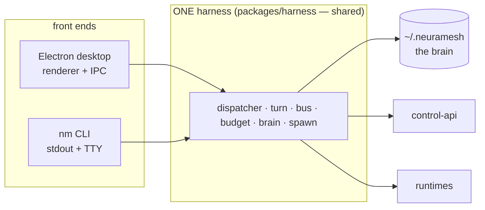

# 09 — The CLI: the harness without a UI

**Status:** 🔭 exploratory — shape only, no phase assigned
**Owns:** the headless harness surface
**Depends on:** [01 Brain](01-brain.md) (a runtime-agnostic state root is the precondition)

> **This document is deliberately the least settled in the handbook.** It is written now because the CLI
> is what proves the harness is a real layer rather than a refactor of the Electron app — and because it
> is the forcing function behind [01](01-brain.md)'s single-root design. It is not a commitment to ship.

---

## 1. Scope

Running the harness as a process with no window: `nm` on a developer's machine, in CI, on a server, or in
a container. Same brain, same policy, same board, no renderer.

---

## 2. Motivation

### 2.1 The harness is already almost independent of Electron

Everything the harness needs is Node: the PowerSync replica (`better-sqlite3`), the runtime adapters
(in-process SDKs and spawned CLIs), git and `gh`, the loopback tool bridge, the sandbox wrappers. Electron
supplies exactly three things — `app.getPath('userData')`, the renderer, and `electron-updater`.

[01](01-brain.md)'s single root removes the first. What remains is a UI the harness never needed and an
updater the CLI would handle differently. **So a headless harness is a small step from where P1–P3 lands,
provided we do not accumulate new Electron dependencies while building it.** That constraint is the main
practical reason this doc exists now: it is a design guardrail, not a roadmap item.

### 2.2 What it would unlock

| Use | Why it needs headless |
|---|---|
| **an agent on a server** | a machine that hosts agents 24/7 with no desktop session — the natural home for a shared team runner |
| **CI as a teammate** | a review or ship turn running in a GitHub Action, against the same policy and board |
| **debugging** | `nm turn replay` on a ledger, without launching an app ([08](08-observability.md)) |
| **containers** | a reproducible agent environment; also the honest path to Linux containment ([07](07-security.md) OQ2) |
| **the docs promise** | a published harness spec is far more credible when the harness runs on its own |

### 2.3 What it must not become

A second implementation. The moment the CLI has its own dispatcher, its own tool registry, or its own
policy path, the harness has failed at being a layer — and we would have two behaviours to keep in sync,
which is the exact failure mode ([docs/37 §2](../37-harness.md)) this whole project exists to end.

**The CLI is a front end.** Its only job is to construct the harness, hand it a brain and a session, and
render events as text.

---

## 3. Shape



**The packaging consequence, and the real cost of this doc.** A shared harness has to move out of
`apps/desktop/src/main/` into `packages/harness`. That is a bigger move than P1's extraction and should not
be smuggled into it: P1 extracts *within* the desktop app, and a later phase relocates the package once the
seams have proven themselves. Doing both at once would make a behaviour-preserving refactor
unverifiable.

## 4. Command surface (sketch)

```bash
nm login                      # Clerk device flow → session (machine-bound, never in the brain)
nm status                     # workspace, machine, agents hosted here, live runs

nm brain export out.age       # Tier A (+ --with-cache) encrypted            (01 §4.2)
nm brain import in.age        # restore; refuses to clobber without --merge/--replace
nm brain migrate              # the one-time move off the split roots         (01 §8)
nm brain gc                   # retention prune — SHIPPED as the daemon's berth sweep (docs/40),
                              # not a CLI: boot + 6h + Reclaim-now; a CLI verb stays open here

nm agents adopt               # re-point hosted agents at this machine       (01 §4.6)
nm run                        # run the harness in the foreground; stream events
nm run --once                 # drain the queue and exit — the CI shape
nm turn replay <turnId>       # step through a ledger                       (08)
nm policy check '<cmd>'       # evaluate a command against effective rules — dry run, no execution
```

Two of these are worth more than the rest. `nm run --once` is what makes CI a teammate: drain, act, exit.
`nm policy check` makes the policy engine **inspectable** — a workspace owner can ask "would this be
denied?" without running it, which is the difference between a policy people trust and one they guess at.

## 5. Invariants it must not break

| # | Invariant | Note for the CLI |
|---|---|---|
| CLI1 | One harness implementation | the CLI constructs, never reimplements (§2.3) |
| CLI2 | Credentials stay machine-bound | `nm login` writes a session outside the brain ([01](01-brain.md) B2) |
| CLI3 | Outbound-only | the loopback bridge binds `127.0.0.1`; a server deployment must not expose it ([07](07-security.md) SEC7) |
| CLI4 | The same policy and gate apply | an `ask` with no human is a **deny**, not an auto-approve (§6) |
| CLI5 | Human-only board gates stay human-only | a CLI actor is a machine; `approve_design`, `accept`, `approve_ship_plan` remain `HUMAN_ONLY` server-side |

**CLI4 and CLI5 are the interesting ones,** because a headless harness is exactly where someone would be
tempted to relax them. A CI runner cannot answer a permission card, so an `ask` must fail closed — and the
workspace's rules, not a flag, decide what a CI-hosted agent may do. There is deliberately **no
`--yes` flag**: it would be a permission-escalation switch, and the correct way to let a CI agent run
`pnpm build` unattended is a workspace `allow` rule for that shell class.

## 6. Open questions

1. **Does a server-hosted runner break "local compute"?** [Doctrine §1.4](../05-engineering-philosophy.md)
   says the user's code and keys stay on their machines. A team runner *is* one of their machines — but a
   *hosted-by-us* runner would not be. *Position: the CLI ships for machines the user controls; a NeuraMesh-hosted
   runner is a separate product decision with a separate security model, and this doc does not authorise it.*
2. **How does a CI turn authenticate to a provider?** BYOK in CI secrets is the obvious answer and also the
   one that puts a key in a place we do not control. *Unresolved, and a genuine blocker for the CI use case.*
3. **Does the CLI need the replica at all?** It could read the API directly and skip PowerSync. Simpler for
   `--once`; loses offline and re-implements read paths. *Leaning: keep the replica — CLI1.*
4. **Is `packages/harness` extraction worth its cost?** It is the largest structural move in the plan and
   buys nothing for the desktop app on its own. *Only if the CLI is actually wanted; otherwise the harness
   stays in `apps/desktop/src/main/harness/` and this document stays exploratory.*

## 7. Change log

| Date | Change |
|---|---|
| 2026-07-31 | Created as an exploratory shape. Records the guardrail that P1–P3 must not add Electron dependencies, the one-implementation rule, and the fail-closed permission posture for headless turns. |
| 2026-08-02 | Still unbuilt, by design. The nearest real dependency is 01 §4 brain export/import — the portability half a CLI would front; nothing else blocks on this doc. |
